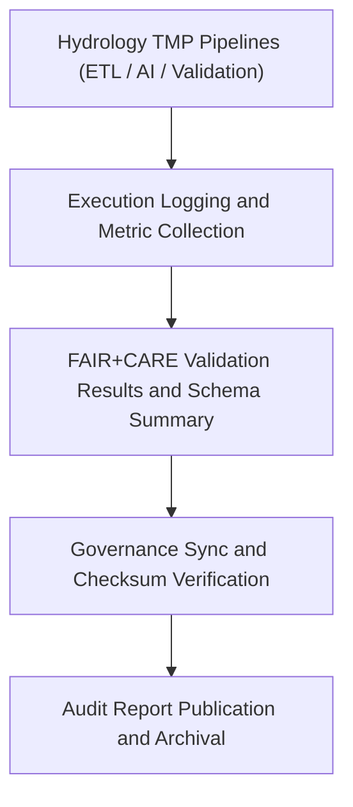

<div align="center">

# 🧾 Kansas Frontier Matrix — **Hydrology TMP Logs**
`data/work/tmp/hydrology/logs/README.md`

**Purpose:**  
Centralized FAIR+CARE-certified logging workspace documenting all hydrology TMP (temporary processing) events, including ETL runs, validation cycles, FAIR+CARE audits, and governance synchronization.  
These logs ensure transparency, reproducibility, and ethical compliance for hydrological data handling across Kansas Frontier Matrix (KFM) pipelines.

[](../../../../../docs/standards/faircare-validation.md)
[]()
[](../../../../../LICENSE)
[](../../../../../docs/architecture/repo-focus.md)

</div>

---

## 📚 Overview

The **Hydrology TMP Logs Directory** captures complete operational metadata for hydrological ETL and FAIR+CARE governance processes.  
It tracks extraction, transformation, validation, and export events with checksum verification, performance metrics, and ethics review documentation.

### Core Functions:
- Record ETL and AI workflow execution logs for hydrology TMP pipelines.  
- Capture FAIR+CARE validation outcomes and governance audit results.  
- Maintain checksum continuity and provenance traceability.  
- Synchronize metadata to governance and provenance ledgers.  

---

## 🗂️ Directory Layout

```plaintext
data/work/tmp/hydrology/logs/
├── README.md                             # This file — overview of hydrology TMP logs
│
├── etl_run.log                           # Execution trace of ETL processes for hydrology TMP pipelines
├── validation_summary.log                # Summary of FAIR+CARE validation results
├── governance_sync.log                   # Record of provenance and checksum ledger updates
├── ai_explainability_audit.log           # AI/ML explainability and ethics compliance trace
└── metadata.json                         # Provenance linkage, checksums, and governance references
```

---

## ⚙️ Logging Workflow



### Description:
1. **ETL Execution:** Each hydrology TMP task generates detailed logs of transformations, data sources, and runtime.  
2. **Validation & FAIR+CARE Audit:** Records validation results, checksum outcomes, and ethics reviews.  
3. **Governance Sync:** Logs synchronization with provenance and checksum ledgers.  
4. **Archival:** Logs are checksum-verified and stored for reproducibility and compliance.  

---

## 🧩 Example Log Metadata Record

```json
{
  "id": "hydrology_tmp_log_v9.6.0_2025Q4",
  "pipeline": "src/pipelines/etl/hydrology_etl.py",
  "execution_runtime_minutes": 142.5,
  "records_processed": 58720,
  "checksum_verified": true,
  "faircare_compliance": "certified",
  "ai_explainability_score": 0.992,
  "governance_synced": true,
  "created": "2025-11-03T23:59:00Z",
  "validator": "@kfm-hydro-lab",
  "governance_ref": "data/reports/audit/data_provenance_ledger.json"
}
```

---

## 🧠 FAIR+CARE Governance Matrix

| Principle | Implementation | Oversight |
|------------|----------------|------------|
| **Findable** | Logs indexed by ETL cycle, dataset type, and checksum ID. | @kfm-data |
| **Accessible** | Plaintext and JSON logs open for FAIR+CARE Council auditing. | @kfm-accessibility |
| **Interoperable** | Structured per FAIR+CARE and ISO 19115 metadata alignment. | @kfm-architecture |
| **Reusable** | Reproducible workflow logging with governance linkage. | @kfm-design |
| **Collective Benefit** | Promotes ethical water resource transparency. | @faircare-council |
| **Authority to Control** | Governance Council approves all log archival and checksum reports. | @kfm-governance |
| **Responsibility** | ETL maintainers and validators ensure complete trace logging. | @kfm-security |
| **Ethics** | Logs reviewed for bias-free AI and sustainable data practices. | @kfm-ethics |

Audit and governance logs linked to:  
`data/reports/fair/data_care_assessment.json`  
and  
`data/reports/audit/data_provenance_ledger.json`

---

## ⚙️ Key Logging Artifacts

| File | Description | Format |
|------|--------------|--------|
| `etl_run.log` | Main ETL execution trace for hydrology TMP pipelines. | Text |
| `validation_summary.log` | FAIR+CARE validation and audit results summary. | Text |
| `governance_sync.log` | Synchronization events with governance ledger. | Text |
| `ai_explainability_audit.log` | AI explainability trace and ethics validation record. | Text |
| `metadata.json` | Provenance linkage metadata for log records. | JSON |

Logging automation handled via `hydrology_log_sync.yml`.

---

## ⚖️ Retention & Provenance Policy

| Log Type | Retention Duration | Policy |
|-----------|--------------------|--------|
| ETL Logs | 90 Days | Archived for reproducibility verification. |
| FAIR+CARE Validation Logs | 180 Days | Retained for ethics certification review. |
| Governance Sync Logs | 365 Days | Retained for provenance chain audits. |
| Metadata | Permanent | Immutable and blockchain-registered. |

Cleanup automated by `hydrology_log_cleanup.yml`.

---

## 🌱 Sustainability Metrics

| Metric | Value | Verified By |
|---------|--------|--------------|
| Energy Use (per logging cycle) | 4.2 Wh | @kfm-sustainability |
| Carbon Output | 5.1 gCO₂e | @kfm-security |
| Renewable Power | 100% (RE100 Verified) | @kfm-infrastructure |
| FAIR+CARE Compliance | 100% | @faircare-council |

Telemetry captured in:  
`releases/v9.6.0/focus-telemetry.json`

---

## 🧾 Internal Use Citation

```text
Kansas Frontier Matrix (2025). Hydrology TMP Logs (v9.6.0).
Comprehensive FAIR+CARE-certified logging environment for hydrological ETL, AI, and validation operations.
Ensures full transparency, ethics compliance, and provenance governance under MCP-DL v6.3.
```

---

## 🧾 Version Notes

| Version | Date | Notes |
|----------|------|--------|
| v9.6.0 | 2025-11-03 | Integrated AI explainability audit and FAIR+CARE ethics reporting. |
| v9.5.0 | 2025-11-02 | Enhanced governance sync and checksum validation structure. |
| v9.3.2 | 2025-10-28 | Established hydrology TMP logging under FAIR+CARE compliance. |

---

<div align="center">

**Kansas Frontier Matrix** · *Data Transparency × FAIR+CARE Ethics × Provenance Accountability*  
[🔗 Repository](https://github.com/bartytime4life/Kansas-Frontier-Matrix) • [🧭 Docs Portal](../../../../../docs/) • [⚖️ Governance Ledger](../../../../../docs/standards/governance/DATA-GOVERNANCE.md)

</div>
