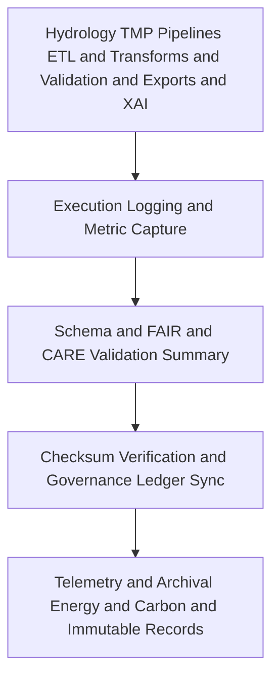

<div align="center">

# 💧 **Kansas Frontier Matrix — Hydrology TMP Logs**
`data/work/tmp/hydrology/logs/README.md`

**Purpose:**  
FAIR+CARE-certified, governance-linked logging workspace that captures **ETL runs, validation cycles, AI explainability and drift audits, checksum events, telemetry v2, and ledger synchronizations** for hydrology TMP pipelines in the Kansas Frontier Matrix (KFM).  
This layer guarantees **transparency, reproducibility, sustainability, and ethical compliance** across all short-lived hydrological data operations.

[](../../../../../docs/architecture/README.md)
[](../../../../../LICENSE)
[](../../../../../docs/standards/faircare.md)
[]()

</div>

---

## 📘 Overview
The **Hydrology TMP Logs** directory aggregates operational metadata for **extraction, transformation, validation, export, and governance** phases performed in `data/work/tmp/hydrology/*`.  
All entries are checksum-anchored, emit **telemetry v2** (energy Wh, carbon gCO2e, coverage, duration), and are cross-referenced with **FAIR+CARE** ethics audits and the **provenance ledger**, enabling end-to-end traceability.

### v10 enhancements
- New `ai_drift_audit.log` and `telemetry_v2_summary.json` per run.  
- JSON-LD lineage anchors in `metadata.json` linking logs → artifacts → ledger entries.  
- Harmonized log schemas with `work-hydrology-tmp-logs-v10.json`.

### Core functions
- Record ETL and AI execution traces with inputs, parameters, runtimes, and outcomes.  
- Capture **FAIR+CARE** validation results and ethics reviews.  
- Maintain checksum continuity and **governance ledger** synchronization logs.  
- Emit **telemetry v2** per ISO 50001 / 14064 for sustainability auditing.

---

## 🗂️ Directory Layout
```plaintext
data/work/tmp/hydrology/logs/
├── README.md                         # This file — Hydrology TMP logging overview
│
├── etl_run.log                       # Step-by-step trace of ETL processes
├── validation_summary.log            # Summary of schema checks and FAIR and CARE results
├── governance_sync.log               # Provenance and checksum ledger synchronization events
├── ai_explainability_audit.log       # SHAP and LIME explainability trace
├── ai_drift_audit.log                # Model drift and bias detection results
├── telemetry_v2_summary.json         # Energy, carbon, duration, coverage metrics
└── metadata.json                     # JSON LD lineage, signatures, checksums, telemetry refs
```

---

## ⚙️ Logging and Audit Workflow


### Description
1. **ETL Execution** — Each hydrology TMP task logs source endpoints, parameters, versions, and runtimes.  
2. **Validation and FAIR and CARE** — Records outcomes of schema checks, ethics audits, and access or licensing confirmations.  
3. **Governance Sync** — Writes checksum and validation pointers to `data/reports/audit/data_provenance_ledger.json` and updates `manifest.zip`.  
4. **Archival and Telemetry** — Logs are hashed, linked to `telemetry_ref`, and retained per policy for reproducibility.

---

## 🧩 Example Log Metadata Record
```json
{
  "id": "hydrology_tmp_log_v10.0.0_2025Q4",
  "pipeline": "src/pipelines/etl/hydrology_etl.py",
  "execution_runtime_minutes": 138.7,
  "records_processed": 63420,
  "checksum_verified": true,
  "faircare_compliance": "certified",
  "ai_explainability_score": 0.992,
  "ai_drift_detected": false,
  "telemetry": { "energy_wh": 8.0, "carbon_gco2e": 8.8, "coverage_pct": 100, "duration_s": 832 },
  "governance_synced": true,
  "created": "2025-11-09T23:59:00Z",
  "validator": "@kfm-hydro-lab",
  "governance_ref": "data/reports/audit/data_provenance_ledger.json"
}
```

---

## 🧠 FAIR+CARE Governance Matrix
| Principle | Implementation | Oversight |
|---|---|---|
| **Findable** | Logs indexed by ETL cycle, dataset type, checksum, and run ID | `@kfm-data` |
| **Accessible** | Plain text and JSON logs available for Council audit | `@kfm-accessibility` |
| **Interoperable** | Log schemas align with FAIR+CARE and ISO 19115 | `@kfm-architecture` |
| **Reusable** | Reproducible traces with checksum and provenance links | `@kfm-design` |
| **Collective Benefit** | Transparent water data stewardship and accountability | `@faircare-council` |
| **Authority to Control** | Council validates archival and ledger registrations | `@kfm-governance` |
| **Responsibility** | ETL and QA teams ensure complete, bias aware logging | `@kfm-security` |
| **Ethics** | XAI and ethics outcomes reviewed for fairness and privacy | `@kfm-ethics` |

**Linked Records:**  
`data/reports/fair/data_care_assessment.json` · `data/reports/audit/data_provenance_ledger.json`

---

## ⚙️ Key Logging Artifacts
| File | Description | Format |
|---|---|---|
| `etl_run.log` | Step by step ETL execution trace | Text |
| `validation_summary.log` | Consolidated schema and FAIR and CARE outcomes | Text |
| `governance_sync.log` | Ledger and manifest synchronization details | Text |
| `ai_explainability_audit.log` | SHAP and LIME plus ethics review notes | Text |
| `ai_drift_audit.log` | Drift and bias metrics and decisions | Text |
| `telemetry_v2_summary.json` | Energy, carbon, coverage, duration | JSON |
| `metadata.json` | Signatures, JSON LD lineage, checksums, telemetry refs | JSON |

**Automation:** `hydrology_log_sync_v2.yml`

---

## ⚖️ Retention and Provenance Policy
| Log Type | Retention | Policy |
|---|---:|---|
| ETL Logs | 90 Days | Archived for reproducibility verification |
| FAIR and CARE Validation Logs | 180 Days | Retained for ethics certification review |
| AI Explainability and Drift Logs | 365 Days | Preserved for transparency and model integrity |
| Governance and Metadata | Permanent | Immutable under governance ledger |

---

## 🌱 Sustainability Metrics
| Metric | Value | Verified By |
|---|---:|---|
| Energy Use per logging cycle | 3.9 Wh | `@kfm-sustainability` |
| Carbon Output | 4.6 gCO₂e | `@kfm-security` |
| Renewable Power | 100 percent RE100 | `@kfm-infrastructure` |
| FAIR and CARE Compliance | 100 percent | `@kfm-faircare` |

**Telemetry:** `../../../../../releases/v10.0.0/focus-telemetry.json`

---

## 🧾 Citation
```text
Kansas Frontier Matrix (2025). Hydrology TMP Logs (v10.0.0).
Comprehensive FAIR+CARE-certified logging workspace for hydrological ETL, validation, and AI explainability and drift audits — ensuring transparency, sustainability, and immutable provenance under MCP-DL v6.3.
```

---

## 🕰️ Version History
| Version | Date | Author | Summary |
|---|---|---|---|
| v10.0.0 | 2025-11-09 | `@kfm-hydro-lab` | Upgraded to v10: telemetry v2, JSON-LD lineage anchors, dedicated drift audit logging, schema refactor to work-hydrology-tmp-logs-v10. |
| v9.7.0  | 2025-11-06 | `@kfm-hydro-lab` | Telemetry schema added; governance and checksum logging refined. |
| v9.6.0  | 2025-11-03 | `@kfm-hydro-lab` | Integrated AI explainability audit and FAIR+CARE ethics reporting. |

---

<div align="center">

**Kansas Frontier Matrix**  
*Data Transparency × FAIR+CARE Ethics × Provenance Accountability*  
© 2025 Kansas Frontier Matrix — Internal Governance Data · Diamond⁹ Ω / Crown∞Ω Ultimate Certified  

[Back to Hydrology TMP](../README.md) · [Governance Charter](../../../../../docs/standards/governance/DATA-GOVERNANCE.md)

</div>
