<div align="center">

# 💧 Kansas Frontier Matrix — **Hydrology TMP Logs**
`data/work/tmp/hydrology/logs/README.md`

**Purpose:**  
FAIR+CARE-certified, governance-linked logging workspace that captures **ETL runs, validation cycles, AI explainability audits, checksum events, and ledger synchronizations** for hydrology TMP (temporary processing) pipelines in the Kansas Frontier Matrix (KFM).  
This layer guarantees **transparency, reproducibility, and ethical compliance** across all short-lived hydrological data operations.

[](../../../../../docs/architecture/README.md)
[](../../../../../LICENSE)
[](../../../../../docs/standards/faircare-validation.md)
[]()

</div>

---

## 📘 Overview

The **Hydrology TMP Logs** directory aggregates operational metadata for **extraction, transformation, validation, export, and governance** phases performed in `data/work/tmp/hydrology/*`.  
All entries are checksum-anchored and cross-referenced with **FAIR+CARE** ethics audits and the **provenance ledger**, enabling end-to-end traceability.

### Core Functions
- Record ETL & AI execution traces with inputs, parameters, runtimes, and outcomes.  
- Capture **FAIR+CARE** validation results and ethics reviews.  
- Maintain checksum continuity and **governance ledger** synchronization logs.  
- Emit **telemetry (energy/carbon)** per ISO 50001/14064 for sustainability auditing.

---

## 🗂️ Directory Layout

```plaintext
data/work/tmp/hydrology/logs/
├── README.md                    # This file — Hydrology TMP logging overview
│
├── etl_run.log                  # Execution trace of ETL processes for hydrology TMP pipelines
├── validation_summary.log       # Summary of schema checks & FAIR+CARE validation results
├── governance_sync.log          # Provenance & checksum ledger synchronization events
├── ai_explainability_audit.log  # XAI (SHAP/LIME) and ethics compliance trace
└── metadata.json                # Provenance linkage, signatures, checksums, telemetry refs
```

---

## ⚙️ Logging & Audit Workflow

```mermaid
flowchart TD
    A["Hydrology TMP Pipelines (ETL · Transforms · Validation · Exports · XAI)"]
      --> B["Execution Logging & Metric Capture"]
      --> C["Schema/FAIR+CARE Validation Summary"]
      --> D["Checksum Verification & Governance Ledger Sync"]
      --> E["Telemetry & Archival (Energy/Carbon + Immutable Records)"]
```



### Description
1. **ETL Execution** — Each hydrology TMP task logs source endpoints, parameters, versions, and runtimes.  
2. **Validation & FAIR+CARE** — Records outcomes of schema checks, ethics audits, and access/licensing confirmations.  
3. **Governance Sync** — Writes checksum & validation pointers to `data/reports/audit/data_provenance_ledger.json` and updates `manifest.zip`.  
4. **Archival & Telemetry** — Logs are hashed, linked to `telemetry_ref`, and retained per policy for reproducibility.

---

## 🧩 Example Log Metadata Record

```json
{
  "id": "hydrology_tmp_log_v9.7.0_2025Q4",
  "pipeline": "src/pipelines/etl/hydrology_etl.py",
  "execution_runtime_minutes": 144.2,
  "records_processed": 61240,
  "checksum_verified": true,
  "faircare_compliance": "certified",
  "ai_explainability_score": 0.991,
  "telemetry": {
    "energy_wh": 8.6,
    "carbon_gco2e": 9.2
  },
  "governance_synced": true,
  "created": "2025-11-06T23:59:00Z",
  "validator": "@kfm-hydro-lab",
  "governance_ref": "data/reports/audit/data_provenance_ledger.json"
}
```

---

## 🧠 FAIR+CARE Governance Matrix

| Principle | Implementation | Oversight |
|---|---|---|
| **Findable** | Logs indexed by ETL cycle, dataset type, checksum & run ID | @kfm-data |
| **Accessible** | Plain-text & JSON logs available for Council audit | @kfm-accessibility |
| **Interoperable** | Log schemas align with FAIR+CARE & ISO 19115 | @kfm-architecture |
| **Reusable** | Reproducible traces with checksum & provenance links | @kfm-design |
| **Collective Benefit** | Transparent water-data stewardship & accountability | @faircare-council |
| **Authority to Control** | Council validates archival and ledger registrations | @kfm-governance |
| **Responsibility** | ETL/QA teams ensure complete, bias-aware logging | @kfm-security |
| **Ethics** | XAI and ethics outcomes reviewed for fairness & privacy | @kfm-ethics |

**Linked Records:**  
`data/reports/fair/data_care_assessment.json` · `data/reports/audit/data_provenance_ledger.json`

---

## ⚙️ Key Logging Artifacts

| File | Description | Format |
|---|---|---|
| `etl_run.log` | Step-by-step ETL execution trace | Text |
| `validation_summary.log` | Consolidated schema & FAIR+CARE outcomes | Text |
| `governance_sync.log` | Ledger/manifest synchronization details | Text |
| `ai_explainability_audit.log` | SHAP/LIME & ethics review notes | Text |
| `metadata.json` | Signatures, checksums, provenance, telemetry links | JSON |

**Automation:** `hydrology_log_sync.yml`

---

## ⚖️ Retention & Provenance Policy

| Log Type | Retention | Policy |
|---|---:|---|
| ETL Logs | 90 Days | Archived for reproducibility verification |
| FAIR+CARE Validation Logs | 180 Days | Retained for ethics certification review |
| Governance Sync Logs | 365 Days | Retained for provenance chain audits |
| Metadata & Signatures | Permanent | Immutable under governance ledger |

---

## 🌱 Sustainability Metrics

| Metric | Value | Verified By |
|---|---:|---|
| Energy Use (per logging cycle) | 4.1 Wh | @kfm-sustainability |
| Carbon Output | 5.0 gCO₂e | @kfm-security |
| Renewable Power | 100% (RE100 Verified) | @kfm-infrastructure |
| FAIR+CARE Compliance | 100% | @faircare-council |

**Telemetry:** `../../../../../releases/v9.7.0/focus-telemetry.json`

---

## 🧾 Citation

```text
Kansas Frontier Matrix (2025). Hydrology TMP Logs (v9.7.0).
Comprehensive FAIR+CARE-certified logging workspace for hydrological ETL, validation, and AI explainability—ensuring transparency, ethics compliance, and immutable provenance under MCP-DL v6.3.
```

---

## 🕰️ Version History

| Version | Date | Author | Summary |
|---|---|---|---|
| v9.7.0 | 2025-11-06 | `@kfm-hydro-lab` | Upgraded to v9.7.0; telemetry schema added; governance & checksum logging refined. |
| v9.6.0 | 2025-11-03 | `@kfm-hydro-lab` | Integrated AI explainability audit & FAIR+CARE ethics reporting. |

---

<div align="center">

**Kansas Frontier Matrix**  
*Data Transparency × FAIR+CARE Ethics × Provenance Accountability*  
© 2025 Kansas Frontier Matrix — Master Coder Protocol v6.3 · FAIR+CARE Certified · Diamond⁹ Ω / Crown∞Ω Ultimate Certified  

[Back to Hydrology TMP](../README.md) · [Governance Charter](../../../../../docs/standards/governance/DATA-GOVERNANCE.md)

</div>