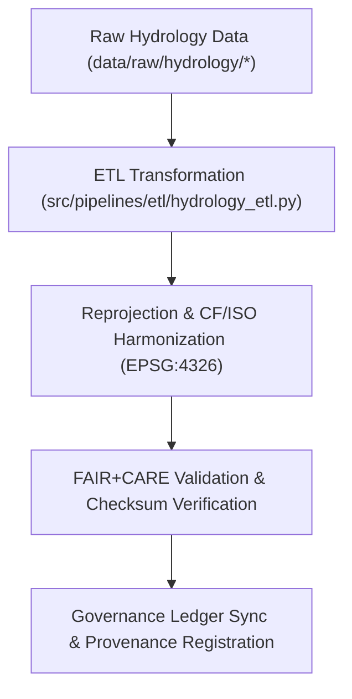

<div align="center">

# 🔄 Kansas Frontier Matrix — **Hydrology TMP Transformations**
`data/work/tmp/hydrology/transforms/README.md`

**Purpose:**  
Temporary FAIR+CARE-governed workspace for schema harmonization, reprojection, and CF/ISO-compliant transformations of hydrological datasets within the Kansas Frontier Matrix (KFM).  
This layer ensures all data transformations are traceable, ethical, and reproducible prior to promotion to staging.

[](../../../../../docs/standards/faircare-validation.md)
[]()
[](../../../../../LICENSE)
[](../../../../../docs/architecture/repo-focus.md)

</div>

---

## 📚 Overview

The **Hydrology TMP Transformations** directory manages transient data transformations that prepare hydrological datasets for analysis, FAIR+CARE validation, and publication.  
These transformations include reprojection, schema harmonization, and FAIR+CARE audits for aquifers, watersheds, and streamflow data.

### Core Functions:
- Perform CRS normalization (EPSG:4326 / ISO 19115 lineage alignment).  
- Apply schema mapping for FAIR+CARE, CF, and STAC compliance.  
- Conduct checksum and validation for transformation reproducibility.  
- Record governance metadata and AI audit linkages for explainability.  

---

## 🗂️ Directory Layout

```plaintext
data/work/tmp/hydrology/transforms/
├── README.md                              # This file — overview of hydrology TMP transformations
│
├── hydrology_summary_v9.6.0.parquet       # Transformed summary of hydrological indicators
├── aquifer_extent_reprojected.geojson     # CF/ISO-compliant aquifer boundary layer
├── streamflow_normalized.parquet          # Streamflow normalization output
├── watershed_harmonized.geojson           # Reprojected watershed boundaries under FAIR+CARE governance
├── transform_audit_report.json            # FAIR+CARE transformation and harmonization audit report
├── checksum_verification.json             # SHA-256 verification registry for all transformed datasets
└── metadata.json                          # Provenance and governance metadata record
```

---

## ⚙️ Transformation Workflow



### Workflow Description:
1. **Extraction:** Import raw hydrological datasets (USGS, EPA, NIDIS).  
2. **Transformation:** Apply reprojection, normalization, and CF-compliance fixes.  
3. **Validation:** Run FAIR+CARE and checksum validation checks.  
4. **Governance:** Log transformation lineage into the provenance ledger.  

---

## 🧩 Example Transformation Record

```json
{
  "id": "hydrology_transform_v9.6.0_2025Q4",
  "source_files": [
    "data/raw/usgs/streamflow_measurements_2025.csv",
    "data/raw/epa/aquifer_boundaries.geojson"
  ],
  "output_files": [
    "data/work/tmp/hydrology/transforms/hydrology_summary_v9.6.0.parquet",
    "data/work/tmp/hydrology/transforms/aquifer_extent_reprojected.geojson"
  ],
  "crs_source": "EPSG:5070",
  "crs_target": "EPSG:4326",
  "transformations": ["reprojection", "schema_harmonization", "checksum_validation"],
  "checksum_verified": true,
  "fairstatus": "certified",
  "ai_explainability_audited": true,
  "validator": "@kfm-hydro-lab",
  "created": "2025-11-03T23:59:00Z",
  "governance_ref": "data/reports/audit/data_provenance_ledger.json"
}
```

---

## 🧠 FAIR+CARE Governance Matrix

| Principle | Implementation | Oversight |
|------------|----------------|------------|
| **Findable** | Transformation outputs indexed by dataset, CRS, and checksum. | @kfm-data |
| **Accessible** | Open CSV, GeoJSON, and Parquet outputs validated under FAIR+CARE. | @kfm-accessibility |
| **Interoperable** | Harmonized with CF, FAIR+CARE, STAC, DCAT, and ISO 19115. | @kfm-architecture |
| **Reusable** | Lineage recorded via metadata and checksum verification. | @kfm-design |
| **Collective Benefit** | Enables open hydrology research and ethical data stewardship. | @faircare-council |
| **Authority to Control** | Governance Council validates schema and FAIR+CARE compliance. | @kfm-governance |
| **Responsibility** | Validators document schema changes and transformation lineage. | @kfm-security |
| **Ethics** | All hydrological transformations reviewed for ethical compliance. | @kfm-ethics |

Audit results recorded in:  
`data/reports/fair/data_care_assessment.json`  
and  
`data/reports/audit/data_provenance_ledger.json`

---

## ⚙️ Key Transformation Artifacts

| File | Description | Format |
|------|--------------|--------|
| `hydrology_summary_v9.6.0.parquet` | Final summary of hydrological indicators (FAIR+CARE validated). | Parquet |
| `aquifer_extent_reprojected.geojson` | Reprojected aquifer polygons in EPSG:4326. | GeoJSON |
| `streamflow_normalized.parquet` | Normalized streamflow observations by basin. | Parquet |
| `transform_audit_report.json` | Comprehensive transformation audit and FAIR+CARE review. | JSON |
| `checksum_verification.json` | Checksum and provenance validation report. | JSON |
| `metadata.json` | Transformation-level provenance record. | JSON |

Automation handled by `hydrology_transform_sync.yml`.

---

## ⚖️ Retention & Provenance Policy

| Transformation Type | Retention Duration | Policy |
|----------------------|--------------------|--------|
| Transformed Data | 7 Days | Purged after validation or staging promotion. |
| Validation Reports | 90 Days | Archived for FAIR+CARE audit reference. |
| FAIR+CARE Audits | 365 Days | Retained for ethical governance reviews. |
| Metadata | Permanent | Stored under governance ledger control. |

Cleanup handled through `hydrology_transform_cleanup.yml`.

---

## 🌱 Sustainability Metrics

| Metric | Value | Verified By |
|---------|--------|--------------|
| Energy Use (per transformation cycle) | 8.1 Wh | @kfm-sustainability |
| Carbon Output | 8.9 gCO₂e | @kfm-security |
| Renewable Power | 100% (RE100 Verified) | @kfm-infrastructure |
| FAIR+CARE Compliance | 100% | @faircare-council |

Telemetry results recorded in:  
`releases/v9.6.0/focus-telemetry.json`

---

## 🧾 Internal Use Citation

```text
Kansas Frontier Matrix (2025). Hydrology TMP Transformations (v9.6.0).
Temporary FAIR+CARE-certified workspace for schema harmonization, reprojection, and transformation of hydrological datasets.
Ensures ethical processing, checksum validation, and governance lineage tracking under MCP-DL v6.3.
```

---

## 🧾 Version Notes

| Version | Date | Notes |
|----------|------|--------|
| v9.6.0 | 2025-11-03 | Added FAIR+CARE audit linkage and CF-compliant harmonization pipeline. |
| v9.5.0 | 2025-11-02 | Introduced checksum verification and governance sync automation. |
| v9.3.2 | 2025-10-28 | Established hydrology transformation workspace with FAIR+CARE validation. |

---

<div align="center">

**Kansas Frontier Matrix** · *Hydrological Accuracy × FAIR+CARE Ethics × Provenance Assurance*  
[🔗 Repository](https://github.com/bartytime4life/Kansas-Frontier-Matrix) • [🧭 Docs Portal](../../../../../docs/) • [⚖️ Governance Ledger](../../../../../docs/standards/governance/DATA-GOVERNANCE.md)

</div>
