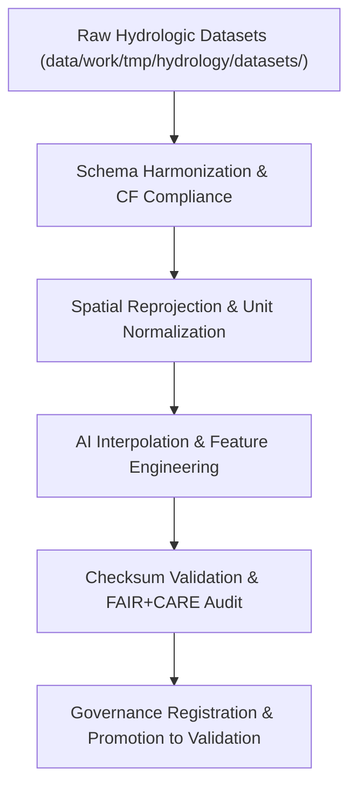

<div align="center">

# 🔄 Kansas Frontier Matrix — **Hydrology TMP Transforms**
`data/work/tmp/hydrology/transforms/README.md`

**Purpose:**  
Governed FAIR+CARE-certified workspace for **hydrologic data transformations**, including schema normalization, spatial reprojection, CF harmonization, and feature generation.  
Supports AI-augmented modeling, hydrologic simulation preprocessing, and data lineage tracking for open-science reproducibility.

[](../../../../../docs/standards/faircare-validation.md)
[](../../../../../LICENSE)
[](../../../../../docs/architecture/repo-focus.md)

</div>

---

## 📚 Overview

The `data/work/tmp/hydrology/transforms/` directory contains **intermediate hydrologic data products** generated from ETL and AI-based harmonization pipelines.  
These transformations standardize spatial, tabular, and temporal data layers to align with CF conventions, ISO 19115 lineage standards, and KFM’s FAIR+CARE governance frameworks.

### Core Responsibilities
- Harmonize hydrologic data schemas, coordinate systems, and temporal resolutions.  
- Apply CF/ISO and FAIR+CARE compliance checks to derived datasets.  
- Generate model-ready hydrologic features for AI and validation workflows.  
- Maintain transformation transparency through checksum and provenance records.  

---

## 🗂️ Directory Layout

```plaintext
data/work/tmp/hydrology/transforms/
├── README.md                              # This file — documentation of hydrology TMP transforms
│
├── hydrology_normalized.parquet           # Harmonized hydrology dataset (streamflow, groundwater, and moisture)
├── flow_direction_grid.tif                # Hydrologic flow direction raster (EPSG:4326, CF-compliant)
├── water_balance_summary.csv              # Aggregated water-balance metrics for Kansas
├── interpolation_audit.json               # AI-assisted hydrologic interpolation audit log
└── metadata.json                          # Provenance metadata and FAIR+CARE certification record
```

---

## ⚙️ Transformation Workflow



### Workflow Description
1. **Schema Harmonization:** Align field names, units, and metadata with the KFM hydrology schema.  
2. **Spatial Normalization:** Convert datasets to EPSG:4326 CRS and CF metadata standards.  
3. **AI Feature Engineering:** Apply AI-augmented interpolation for missing hydrologic parameters.  
4. **FAIR+CARE Validation:** Run automated ethics, accessibility, and data integrity checks.  
5. **Governance Registration:** Record lineage in audit and ledger reports for full traceability.  

---

## 🧩 Example Transform Metadata Record

```json
{
  "id": "hydrology_transforms_v9.5.0_2025Q4",
  "datasets_input": [
    "streamflow_observations.csv",
    "groundwater_levels.parquet"
  ],
  "datasets_output": [
    "hydrology_normalized.parquet",
    "flow_direction_grid.tif"
  ],
  "transformations": ["Schema Harmonization", "CF Compliance", "Spatial Reprojection"],
  "ai_interpolation_applied": true,
  "checksum_verified": true,
  "fairstatus": "certified",
  "records_transformed": 214389,
  "ai_explainability_score": 0.985,
  "telemetry_ref": "releases/v9.5.0/focus-telemetry.json",
  "governance_ref": "reports/audit/ai_hydrology_ledger.json",
  "created": "2025-11-02T21:25:00Z",
  "validator": "@kfm-hydrology"
}
```

---

## 🧠 FAIR+CARE Transformation Governance

| Principle | Implementation |
|------------|----------------|
| **Findable** | Transform outputs indexed with checksum and metadata in provenance ledger. |
| **Accessible** | Stored as open, machine-readable formats (CSV, Parquet, GeoTIFF). |
| **Interoperable** | Conforms to ISO 19115, DCAT, CF Conventions, and STAC metadata standards. |
| **Reusable** | Includes full provenance, schema, and ethical compliance metadata. |
| **Collective Benefit** | Supports sustainable, transparent hydrologic data processing. |
| **Authority to Control** | FAIR+CARE Council reviews transformation processes for governance. |
| **Responsibility** | Validators maintain schema harmonization and AI audit transparency. |
| **Ethics** | Ensures hydrologic transformations do not misrepresent or distort source data. |

Audit and lineage references stored in:  
`reports/audit/ai_hydrology_ledger.json` • `reports/fair/hydrology_transforms_summary.json`

---

## ⚙️ Transformation Artifacts & QA Outputs

| File | Description | Format |
|------|--------------|--------|
| `hydrology_normalized.parquet` | Unified hydrologic dataset across major water parameters. | Parquet |
| `flow_direction_grid.tif` | Raster representation of flow direction (CF-compliant). | GeoTIFF |
| `water_balance_summary.csv` | Aggregated hydrologic water-balance metrics. | CSV |
| `interpolation_audit.json` | AI-augmented interpolation and explainability report. | JSON |
| `metadata.json` | Provenance, schema, and FAIR+CARE certification record. | JSON |

Transformation synchronization managed by `hydrology_transforms_sync.yml`.

---

## 🧾 Retention Policy

| File Type | Retention Duration | Policy |
|------------|--------------------|--------|
| TMP Transform Outputs | 14 days | Purged after staging or validation certification. |
| AI Audit Logs | 180 days | Retained for explainability verification. |
| Metadata | 365 days | Archived under governance lineage records. |
| Provenance Records | Permanent | Stored indefinitely for ethical accountability. |

Cleanup managed by `hydrology_transforms_cleanup.yml`.

---

## 🧾 Internal Use Citation

```text
Kansas Frontier Matrix (2025). Hydrology TMP Transforms (v9.5.0).
FAIR+CARE-certified workspace for hydrologic data harmonization, spatial reprojection, and AI-driven interpolation.
Ensures transparent, ethical, and reproducible transformation pipelines under MCP-DL v6.3 governance.
```

---

## 🧾 Version Notes

| Version | Date | Notes |
|----------|------|--------|
| v9.5.0 | 2025-11-02 | Added CF compliance validation and AI explainability tracking. |
| v9.3.2 | 2025-10-28 | Expanded checksum validation and schema harmonization tools. |
| v9.3.0 | 2025-10-26 | Established hydrology TMP transform workspace under FAIR+CARE compliance. |

---

<div align="center">

**Kansas Frontier Matrix** · *Transformation Integrity × FAIR+CARE Ethics × Provenance Governance*  
[🔗 Repository](https://github.com/bartytime4life/Kansas-Frontier-Matrix) • [🧭 Docs Portal](../../../../../docs/) • [⚖️ Governance Ledger](../../../../../docs/standards/governance/)

</div>