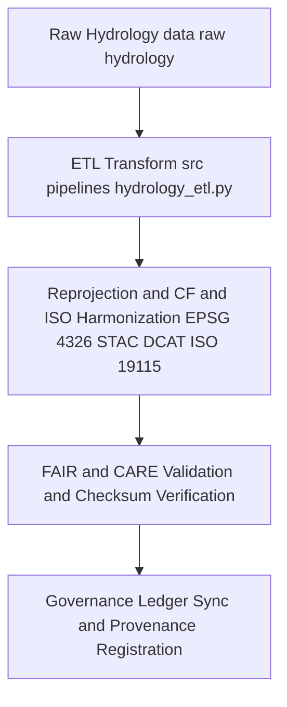

<div align="center">

# 🔄 Kansas Frontier Matrix — **Hydrology TMP Transformations**
`data/work/tmp/hydrology/transforms/README.md`

**Purpose:**  
Temporary **FAIR+CARE**-governed workspace for schema harmonization, reprojection, and **CF and ISO** compliant transformations of hydrological datasets within the Kansas Frontier Matrix (KFM).  
Now upgraded for **telemetry v2** (energy Wh, carbon gCO2e, coverage %, duration) and **JSON-LD lineage anchors** to guarantee that every transform is **traceable, ethical, and reproducible** before promotion to staging.

[](../../../../../docs/architecture/README.md)
[](../../../../../docs/standards/faircare.md)
[]()
[]()
[](../../../../../LICENSE)

</div>

---

## 📘 Overview

The **Hydrology TMP Transformations** directory manages transient ETL operations that prepare hydrological datasets for analysis, validation, and publication.  
Transforms include **CRS normalization to EPSG 4326**, **schema harmonization to STAC and DCAT with ISO 19115 crosswalks**, **CF convention fixes**, checksum continuity, and governance registration.

**v10 Enhancements**

- **Telemetry v2** metrics embedded in `metadata.json` and `transform_audit_report.json`.  
- **JSON-LD lineage** fields linking inputs → transformed outputs → governance ledger entries.  
- Stronger **CF and ISO** checks and continuous checksum reconciliation across chained transforms.

### Core Functions

- Reproject, normalize, and harmonize hydrology datasets (aquifers, watersheds, streamflow, groundwater, precipitation).  
- Validate transformations via **schema**, **FAIR+CARE**, and **checksum** audits.  
- Capture **AI explainability** artifacts for model influenced transforms.  
- Generate **transformation manifests** and **provenance and ledger** entries.

---

## 🗂️ Directory Layout

```plaintext
data/work/tmp/hydrology/transforms/
├── README.md                              # This file — hydrology TMP transformations overview
│
├── hydrology_summary_v10.0.0.parquet      # Transformed summary of hydrological indicators
├── aquifer_extent_reprojected.geojson     # CF and ISO compliant aquifer boundary layer EPSG 4326
├── streamflow_normalized.parquet          # Streamflow normalization output
├── watershed_harmonized.geojson           # Harmonized watershed boundaries HUC EPSG 4326
├── transform_audit_report.json            # Transformation validation and FAIR and CARE audit results
├── checksum_verification.json             # SHA 256 continuity and data lineage validation
└── metadata.json                          # Transformation provenance, JSON LD lineage, telemetry v2, governance refs
```

---

## ⚙️ Transformation Workflow



### Description
1. **Extraction** — Import authoritative sources **USGS, EPA, NIDIS**.  
2. **Transformation** — Apply CRS normalization, attribute and units mapping, and **CF** fixes.  
3. **Validation** — Run **FAIR+CARE** ethics checks and checksum verification.  
4. **Governance** — Write transformation lineage and hashes to the **provenance ledger** and update `manifest.zip`.

---

## 🧩 Example Transformation Record

```json
{
  "id": "hydrology_transform_v10.0.0_2025Q4",
  "source_files": [
    "data/raw/usgs/streamflow_measurements_2025.csv",
    "data/raw/epa/aquifer_boundaries.geojson"
  ],
  "output_files": [
    "data/work/tmp/hydrology/transforms/hydrology_summary_v10.0.0.parquet",
    "data/work/tmp/hydrology/transforms/aquifer_extent_reprojected.geojson"
  ],
  "crs_source": "EPSG:5070",
  "crs_target": "EPSG:4326",
  "transformations": ["reprojection", "schema_harmonization", "unit_standardization", "checksum_validation"],
  "standards": ["STAC 1.0", "DCAT 3.0", "ISO 19115", "CF 1.10"],
  "fairstatus": "certified",
  "checksum_verified": true,
  "ai_explainability_audited": true,
  "telemetry": { "energy_wh": 7.8, "carbon_gco2e": 8.5, "coverage_pct": 100, "duration_s": 960 },
  "validator": "@kfm-hydro-lab",
  "created": "2025-11-09T23:59:00Z",
  "governance_registered": true,
  "governance_ref": "data/reports/audit/data_provenance_ledger.json"
}
```

---

## 🧠 FAIR+CARE Governance Matrix

| Principle | Implementation | Oversight |
|---|---|---|
| **Findable** | Outputs indexed by dataset, CRS, checksum IDs | `@kfm-data` |
| **Accessible** | Parquet and GeoJSON with explicit licensing | `@kfm-accessibility` |
| **Interoperable** | STAC and DCAT with ISO 19115 and CF conformance | `@kfm-architecture` |
| **Reusable** | Lineage and checksum continuity ensure reproducibility | `@kfm-design` |
| **Collective Benefit** | Enables open hydrology research and resilient water planning | `@faircare-council` |
| **Authority to Control** | Council validates schema and FAIR and CARE compliance | `@kfm-governance` |
| **Responsibility** | Validators document schema changes and audit outcomes | `@kfm-security` |
| **Ethics** | Ethical review of transforms and XAI impacts | `@kfm-ethics` |

**Audit Records:**  
`data/reports/fair/data_care_assessment.json` · `data/reports/audit/data_provenance_ledger.json`

---

## ⚙️ Key Transformation Artifacts

| File | Description | Format |
|---|---|---|
| `hydrology_summary_v10.0.0.parquet` | Consolidated hydrological indicators | Parquet |
| `aquifer_extent_reprojected.geojson` | Reprojected aquifer polygons EPSG 4326 | GeoJSON |
| `streamflow_normalized.parquet` | Normalized streamflow observations by basin | Parquet |
| `transform_audit_report.json` | Transformation and FAIR and CARE audit summary | JSON |
| `checksum_verification.json` | Integrity and lineage continuity record | JSON |
| `metadata.json` | Provenance, JSON LD lineage, telemetry v2 | JSON |

**Automation:** `hydrology_transform_sync_v10.yml`

---

## ⚖️ Retention & Provenance Policy

| Transformation Type | Retention | Policy |
|---|---:|---|
| Transformed Data | 7 Days | Purged after validation or staging promotion |
| Validation Reports | 90 Days | Archived for FAIR and CARE review |
| FAIR and CARE Audits | 365 Days | Retained for ethics governance |
| Metadata and Checksums | Permanent | Immutable under governance ledger |

---

## 🌱 Sustainability Metrics

| Metric | Value | Verified By |
|---|---:|---|
| Energy Use per transform cycle | 7.8 Wh | `@kfm-sustainability` |
| Carbon Output | 8.5 gCO₂e | `@kfm-security` |
| Renewable Power | 100% RE100 | `@kfm-infrastructure` |
| FAIR and CARE Compliance | 100% | `@faircare-council` |

**Telemetry:** `../../../../../releases/v10.0.0/focus-telemetry.json`

---

## 🧾 Citation

```text
Kansas Frontier Matrix (2025). Hydrology TMP Transformations (v10.0.0).
Temporary FAIR+CARE-governed workspace for hydrological schema harmonization, reprojection, and transformation with checksum and governance lineage, JSON LD anchors, and telemetry v2 — aligned to MCP-DL v6.3, CF, and ISO 19115.
```

---

## 🕰️ Version History

| Version | Date | Author | Summary |
|---|---|---|---|
| v10.0.0 | 2025-11-09 | `@kfm-hydro-lab` | Upgrade to v10: telemetry v2, JSON LD lineage, tighter CF and ISO checks. |
| v9.7.0  | 2025-11-06 | `@kfm-hydro-lab` | Telemetry schema added; governance and CF and ISO alignment refined. |
| v9.6.0  | 2025-11-03 | `@kfm-hydro-lab` | Added CF compliance and checksum governance; initial FAIR and CARE linkage. |

---

<div align="center">

**Kansas Frontier Matrix**  
*Hydrological Accuracy × FAIR+CARE Ethics × Provenance Assurance*  
© 2025 Kansas Frontier Matrix — CC-BY 4.0 · Diamond⁹ Ω / Crown∞Ω Ultimate Certified  

[Back to Hydrology TMP](../README.md) · [Governance Charter](../../../../../docs/standards/governance/DATA-GOVERNANCE.md)

</div>
