<div align="center">

# 🔄 Kansas Frontier Matrix — **Hydrology TMP Transformations**
`data/work/tmp/hydrology/transforms/README.md`

**Purpose:**  
Temporary **FAIR+CARE**-governed workspace for schema harmonization, reprojection, and **CF/ISO**-compliant transformations of hydrological datasets within the Kansas Frontier Matrix (KFM).  
This layer guarantees that all data transformations are **traceable, ethical, and reproducible** prior to promotion to staging.

[](../../../../../docs/architecture/README.md)
[](../../../../../docs/standards/faircare-validation.md)
[]()
[](../../../../../LICENSE)

</div>

---

## 📘 Overview

The **Hydrology TMP Transformations** directory manages transient ETL operations that prepare hydrological datasets for analysis, validation, and publication.  
Transformations include **CRS normalization (EPSG:4326)**, **schema harmonization (STAC/DCAT/ISO 19115)**, **CF convention fixes**, checksum continuity, and governance registration.

### Core Functions
- Reproject, normalize, and harmonize hydrology datasets (aquifers, watersheds, streamflow, groundwater, precipitation).  
- Validate transformations via **schema**, **FAIR+CARE**, and **checksum** audits.  
- Capture **AI explainability** artifacts for model-influenced transforms.  
- Generate **transformation manifests** and **provenance/ledger** entries.

---

## 🗂️ Directory Layout

```plaintext
data/work/tmp/hydrology/transforms/
├── README.md                            # This file — hydrology TMP transformations overview
│
├── hydrology_summary_v9.7.0.parquet     # Transformed summary of hydrological indicators
├── aquifer_extent_reprojected.geojson   # CF/ISO-compliant aquifer boundary layer (EPSG:4326)
├── streamflow_normalized.parquet        # Streamflow normalization output
├── watershed_harmonized.geojson         # Harmonized watershed boundaries (HUC, EPSG:4326)
├── transform_audit_report.json          # Transformation validation & FAIR+CARE audit results
├── checksum_verification.json           # SHA-256 continuity & data lineage validation
└── metadata.json                        # Transformation provenance & governance metadata
```

---

## ⚙️ Transformation Workflow

```mermaid
flowchart TD
    A["Raw Hydrology (data/raw/hydrology/*)"] --> B["ETL Transform (src/pipelines/etl/hydrology_etl.py)"]
    B --> C["Reprojection & CF/ISO Harmonization (EPSG:4326 · CF 1.x · ISO 19115)"]
    C --> D["FAIR + CARE Validation & Checksum Verification"]
    D --> E["Governance Ledger Sync & Provenance Registration"]
```



### Description
1. **Extraction** — Import authoritative sources (USGS, EPA, NIDIS).  
2. **Transformation** — Apply CRS normalization, attribute/units mapping, and CF fixes.  
3. **Validation** — Run FAIR+CARE ethics checks and checksum verification.  
4. **Governance** — Write transformation lineage and hashes to the **provenance ledger**; update `manifest.zip`.

---

## 🧩 Example Transformation Record

```json
{
  "id": "hydrology_transform_v9.7.0_2025Q4",
  "source_files": [
    "data/raw/usgs/streamflow_measurements_2025.csv",
    "data/raw/epa/aquifer_boundaries.geojson"
  ],
  "output_files": [
    "data/work/tmp/hydrology/transforms/hydrology_summary_v9.7.0.parquet",
    "data/work/tmp/hydrology/transforms/aquifer_extent_reprojected.geojson"
  ],
  "crs_source": "EPSG:5070",
  "crs_target": "EPSG:4326",
  "transformations": ["reprojection", "schema_harmonization", "unit_standardization", "checksum_validation"],
  "fairstatus": "certified",
  "checksum_verified": true,
  "ai_explainability_audited": true,
  "validator": "@kfm-hydro-lab",
  "created": "2025-11-06T23:59:00Z",
  "governance_ref": "data/reports/audit/data_provenance_ledger.json"
}
```

---

## 🧠 FAIR+CARE Governance Matrix

| Principle | Implementation | Oversight |
|---|---|---|
| **Findable** | Outputs indexed by dataset, CRS, and checksum IDs | @kfm-data |
| **Accessible** | Open formats (Parquet/GeoJSON) with explicit licensing | @kfm-accessibility |
| **Interoperable** | STAC/DCAT + ISO 19115 + CF-conformant metadata | @kfm-architecture |
| **Reusable** | Lineage & checksum continuity ensure reproducibility | @kfm-design |
| **Collective Benefit** | Enables open hydrology research & resilient water planning | @faircare-council |
| **Authority to Control** | Council validates schema & FAIR+CARE compliance | @kfm-governance |
| **Responsibility** | Validators document schema changes & audit outcomes | @kfm-security |
| **Ethics** | Ethical review of transformations and XAI impacts | @kfm-ethics |

**Audit Records:**  
`data/reports/fair/data_care_assessment.json` · `data/reports/audit/data_provenance_ledger.json`

---

## ⚙️ Key Transformation Artifacts

| File | Description | Format |
|---|---|---|
| `hydrology_summary_v9.7.0.parquet` | Consolidated hydrological indicators (validated) | Parquet |
| `aquifer_extent_reprojected.geojson` | Reprojected aquifer polygons (EPSG:4326) | GeoJSON |
| `streamflow_normalized.parquet` | Normalized streamflow observations by basin | Parquet |
| `transform_audit_report.json` | Transformation & FAIR+CARE audit summary | JSON |
| `checksum_verification.json` | Integrity & lineage continuity record | JSON |
| `metadata.json` | Provenance, signatures, and ledger linkages | JSON |

**Automation:** `hydrology_transform_sync.yml`

---

## ⚖️ Retention & Provenance Policy

| Transformation Type | Retention | Policy |
|---|---:|---|
| Transformed Data | 7 Days | Purged after validation or staging promotion |
| Validation Reports | 90 Days | Archived for FAIR+CARE review |
| FAIR+CARE Audits | 365 Days | Retained for ethics governance |
| Metadata & Checksums | Permanent | Immutable under governance ledger |

---

## 🌱 Sustainability Metrics

| Metric | Value | Verified By |
|---|---:|---|
| Energy Use (per transform cycle) | 8.0 Wh | @kfm-sustainability |
| Carbon Output | 8.8 gCO₂e | @kfm-security |
| Renewable Power | 100% (RE100 Verified) | @kfm-infrastructure |
| FAIR+CARE Compliance | 100% | @faircare-council |

**Telemetry:** `../../../../../releases/v9.7.0/focus-telemetry.json`

---

## 🧾 Citation

```text
Kansas Frontier Matrix (2025). Hydrology TMP Transformations (v9.7.0).
Temporary FAIR+CARE-governed workspace for hydrological schema harmonization, reprojection, and transformation with checksum and governance lineage under MCP-DL v6.3, CF, and ISO 19115.
```

---

## 🕰️ Version History

| Version | Date | Author | Summary |
|---|---|---|---|
| v9.7.0 | 2025-11-06 | `@kfm-hydro-lab` | Upgraded to v9.7.0; telemetry schema added; governance & CF/ISO alignment refined. |
| v9.6.0 | 2025-11-03 | `@kfm-hydro-lab` | Added CF compliance & checksum governance; initial FAIR+CARE linkage. |

---

<div align="center">

**Kansas Frontier Matrix**  
*Hydrological Accuracy × FAIR+CARE Ethics × Provenance Assurance*  
© 2025 Kansas Frontier Matrix — Master Coder Protocol v6.3 · FAIR+CARE Certified · Diamond⁹ Ω / Crown∞Ω Ultimate Certified  

[Back to Hydrology TMP](../README.md) · [Governance Charter](../../../../../docs/standards/governance/DATA-GOVERNANCE.md)

</div>