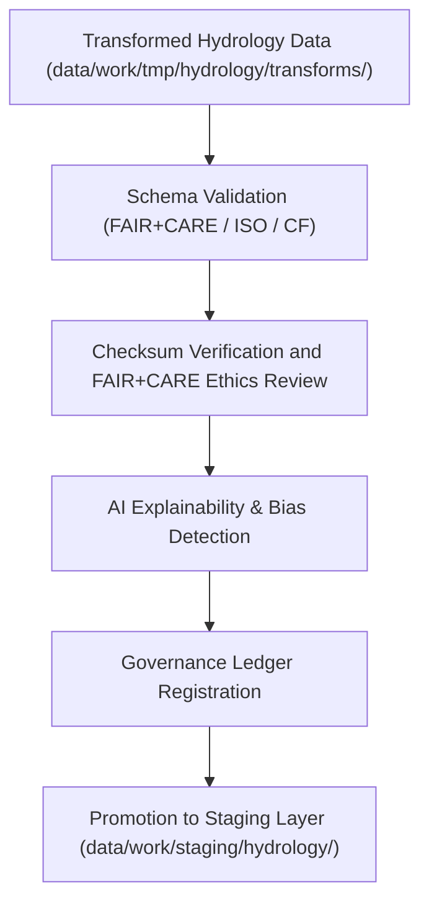

<div align="center">

# ✅ Kansas Frontier Matrix — **Hydrology TMP Validation Layer**
`data/work/tmp/hydrology/validation/README.md`

**Purpose:**  
Central FAIR+CARE-certified workspace for validating schema compliance, checksum integrity, and ethical governance of hydrological datasets within the Kansas Frontier Matrix (KFM).  
This validation layer ensures every hydrology dataset passes technical, ethical, and provenance audits before being staged or processed.

[](../../../../../docs/standards/faircare-validation.md)
[]()
[](../../../../../LICENSE)
[](../../../../../docs/architecture/repo-focus.md)

</div>

---

## 📚 Overview

The **Hydrology TMP Validation Layer** forms the backbone of quality assurance and FAIR+CARE compliance for water-related datasets in KFM.  
This workspace validates structural, semantic, and ethical integrity across all TMP hydrology transformations before promotion to staging.

### Core Functions:
- Validate schema and field alignment against FAIR+CARE and ISO metadata standards.  
- Perform checksum verification to ensure reproducibility and integrity.  
- Conduct FAIR+CARE ethics and accessibility audits.  
- Synchronize validation outcomes to the KFM Governance Ledger for certification.  

---

## 🗂️ Directory Layout

```plaintext
data/work/tmp/hydrology/validation/
├── README.md                                # This file — documentation for hydrology TMP validation layer
│
├── schema_validation_summary.json           # Summary of schema compliance and validation results
├── faircare_audit_report.json               # FAIR+CARE ethical audit and compliance report
├── checksum_registry.json                   # Hash verification and data lineage log
├── ai_explainability_report.json            # AI transparency report for automated validation tasks
├── validation_manifest.json                 # Master manifest linking validation results to governance records
└── metadata.json                            # Provenance linkage and governance registration record
```

---

## ⚙️ Validation Workflow



### Description:
1. **Schema Validation:**  
   Evaluate hydrological datasets for structural, field, and metadata conformity.  
2. **Checksum Validation:**  
   Cross-verify dataset hashes against transformation outputs.  
3. **FAIR+CARE Audit:**  
   Assess accessibility, ethical use, and data transparency.  
4. **AI Explainability:**  
   Validate fairness and drift detection in AI-assisted validation tools.  
5. **Governance Sync:**  
   Register validation records within KFM’s blockchain-backed provenance ledger.  

---

## 🧩 Example Validation Record

```json
{
  "id": "hydrology_validation_v9.6.0_2025Q4",
  "datasets_validated": [
    "hydrology_summary_v9.6.0.parquet",
    "aquifer_extent_reprojected.geojson",
    "streamflow_normalized.parquet"
  ],
  "schema_pass_rate": 99.8,
  "checksum_verified": true,
  "fairstatus": "certified",
  "ai_explainability_verified": true,
  "governance_registered": true,
  "validator": "@kfm-hydro-lab",
  "created": "2025-11-03T23:59:00Z",
  "governance_ref": "data/reports/audit/data_provenance_ledger.json"
}
```

---

## 🧠 FAIR+CARE Validation Matrix

| Principle | Implementation | Oversight |
|------------|----------------|------------|
| **Findable** | Validation results indexed by dataset ID, checksum, and schema version. | @kfm-data |
| **Accessible** | Open, human- and machine-readable JSON format. | @kfm-accessibility |
| **Interoperable** | Conforms to FAIR+CARE, CF, and ISO metadata structures. | @kfm-architecture |
| **Reusable** | Checksum lineage and validation manifest ensure reproducibility. | @kfm-design |
| **Collective Benefit** | Strengthens transparency in hydrological data governance. | @faircare-council |
| **Authority to Control** | Governance Council approves schema and validation audits. | @kfm-governance |
| **Responsibility** | Validators maintain integrity reports for each TMP dataset. | @kfm-security |
| **Ethics** | FAIR+CARE audits ensure accessibility, sustainability, and fairness. | @kfm-ethics |

Audit outcomes logged in:  
`data/reports/fair/data_care_assessment.json`  
and  
`data/reports/audit/data_provenance_ledger.json`

---

## ⚙️ Key Validation Artifacts

| Artifact | Description | Format |
|-----------|--------------|--------|
| `schema_validation_summary.json` | Validation of schema, metadata, and structure. | JSON |
| `faircare_audit_report.json` | FAIR+CARE compliance report. | JSON |
| `checksum_registry.json` | Verification of SHA-256 integrity hashes. | JSON |
| `ai_explainability_report.json` | AI audit of fairness, accuracy, and bias. | JSON |
| `validation_manifest.json` | Registry linking validation results to provenance records. | JSON |
| `metadata.json` | Governance linkage metadata for hydrology validation cycle. | JSON |

Automation handled through `hydrology_validation_sync.yml`.

---

## ⚖️ Retention & Provenance Policy

| Validation Type | Retention Duration | Policy |
|------------------|--------------------|--------|
| Schema Reports | 180 Days | Archived for reproducibility and review. |
| FAIR+CARE Audits | 365 Days | Retained for ethics compliance reference. |
| AI Explainability Reports | 365 Days | Stored for governance and ethics tracking. |
| Metadata | Permanent | Immutable under governance ledger. |

Cleanup automated by `hydrology_validation_cleanup.yml`.

---

## 🌱 Sustainability Metrics

| Metric | Value | Verified By |
|---------|--------|--------------|
| Energy Use (per validation cycle) | 7.9 Wh | @kfm-sustainability |
| Carbon Output | 8.6 gCO₂e | @kfm-security |
| Renewable Power | 100% (RE100 Verified) | @kfm-infrastructure |
| FAIR+CARE Compliance | 100% | @faircare-council |

Telemetry results recorded in:  
`releases/v9.6.0/focus-telemetry.json`

---

## 🧾 Internal Use Citation

```text
Kansas Frontier Matrix (2025). Hydrology TMP Validation Layer (v9.6.0).
FAIR+CARE-certified hydrology validation workspace ensuring schema integrity, ethics compliance, and provenance traceability.
Operates under MCP-DL v6.3 and ISO 19115 metadata standards.
```

---

## 🧾 Version Notes

| Version | Date | Notes |
|----------|------|--------|
| v9.6.0 | 2025-11-03 | Added AI explainability integration and checksum audit automation. |
| v9.5.0 | 2025-11-02 | Enhanced FAIR+CARE audit tracking and governance ledger linkage. |
| v9.3.2 | 2025-10-28 | Established hydrology TMP validation workspace with schema certification. |

---

<div align="center">

**Kansas Frontier Matrix** · *Hydrological Validation × FAIR+CARE Ethics × Provenance Governance*  
[🔗 Repository](https://github.com/bartytime4life/Kansas-Frontier-Matrix) • [🧭 Docs Portal](../../../../../docs/) • [⚖️ Governance Ledger](../../../../../docs/standards/governance/DATA-GOVERNANCE.md)

</div>
