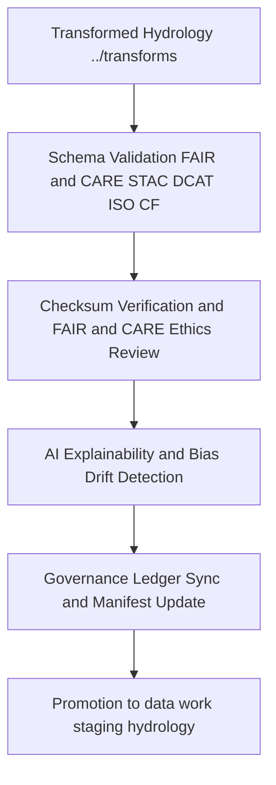

<div align="center">

# ✅ **Kansas Frontier Matrix — Hydrology TMP Validation Layer**
`data/work/tmp/hydrology/validation/README.md`

**Purpose:**  
Central **FAIR+CARE-certified** workspace for validating **schema compliance, checksum integrity, ethics, and AI explainability** of hydrological datasets within the Kansas Frontier Matrix (KFM).  
Now upgraded with **telemetry v2** (energy Wh, carbon gCO2e, coverage %, duration) and **JSON-LD lineage anchors** to ensure every dataset passes technical, ethical, sustainability, and provenance audits before promotion to staging or processed environments.

[](../../../../../docs/architecture/README.md)
[](../../../../../LICENSE)
[](../../../../../docs/standards/faircare.md)
[]()

</div>

---

## 📘 Overview

The **Hydrology TMP Validation Layer** is the backbone of quality assurance and governance for water-related datasets (**aquifers, watersheds, streamflow, groundwater, precipitation**) produced in `data/work/tmp/hydrology/transforms/`.  
All validations yield machine-readable artifacts, checksum proofs, and governance-linked manifests aligned with **MCP-DL v6.3**, **FAIR+CARE**, **STAC 1.0**, **DCAT 3.0**, and **ISO 19115**.

### v10 enhancements
- Emission of **telemetry v2** per validation run in `metadata.json` and `validation_manifest.json`.  
- **JSON-LD lineage**: explicit `prov:wasDerivedFrom` and `prov:wasGeneratedBy` relations to TMP transforms and ledger entries.  
- Expanded **drift and bias** metrics captured in `ai_drift_analysis.json` and referenced by the validation manifest.

### Core functions
- Validate schemas and metadata against **STAC 1.0**, **DCAT 3.0**, **ISO 19115**, **CF**.  
- Verify **SHA-256** integrity and continuity with transform outputs and release manifests.  
- Conduct **FAIR+CARE** ethics and accessibility audits plus **AI explainability and drift** checks.  
- Synchronize all outcomes with the **provenance and governance ledger** and **telemetry v2**.

---

## 🗂️ Directory Layout

```plaintext
data/work/tmp/hydrology/validation/
├── README.md                          # This file — hydrology TMP validation overview
│
├── schema_validation_summary.json     # Structural and metadata compliance results (STAC DCAT ISO CF)
├── faircare_audit_report.json         # FAIR+CARE ethics and accessibility certification
├── ai_explainability_report.json      # XAI transparency and feature importance (SHAP LIME)
├── ai_drift_analysis.json             # Distributional drift and bias metrics
├── checksum_registry.json             # SHA-256 integrity and continuity log
├── validation_manifest.json           # Registry linking all validation artifacts to ledger entries
└── metadata.json                      # Validation provenance, JSON-LD lineage, signatures, telemetry v2
```

---

## ⚙️ Validation Workflow



### Description
1. **Schema validation** — Evaluate structure, codelists, and metadata alignment to KFM contracts.  
2. **Checksum and FAIR and CARE** — Confirm integrity and certify ethical compliance.  
3. **AI explainability and drift** — Assess transparency (SHAP LIME) and detect bias or drift.  
4. **Governance sync** — Register results to `data/reports/audit/data_provenance_ledger.json` and update `releases/*/manifest.zip`.  
5. **Promotion** — Only certified datasets proceed to `data/work/staging/hydrology/`.

---

## 🧩 Example Validation Record

```json
{
  "id": "hydrology_validation_v10.0.0_2025Q4",
  "validated_datasets": [
    "hydrology_summary_v10.0.0.parquet",
    "aquifer_extent_reprojected.geojson",
    "streamflow_normalized.parquet"
  ],
  "schema_pass_rate": 0.999,
  "checksum_verified": true,
  "faircare_status": "certified",
  "ai_explainability_verified": true,
  "ai_drift_detected": false,
  "telemetry": { "energy_wh": 6.4, "carbon_gco2e": 7.2, "coverage_pct": 100, "duration_s": 780 },
  "governance_registered": true,
  "validator": "@kfm-hydro-lab",
  "created": "2025-11-09T23:59:00Z",
  "governance_ref": "data/reports/audit/data_provenance_ledger.json"
}
```

---

## 🧠 FAIR+CARE Validation Matrix

| Principle | Implementation | Oversight |
|---|---|---|
| **Findable** | Results indexed by dataset, checksum, schema version, ledger ID | @kfm-data |
| **Accessible** | Open JSON artifacts for Council review | @kfm-accessibility |
| **Interoperable** | Conforms to FAIR+CARE, STAC, DCAT, ISO 19115, CF | @kfm-architecture |
| **Reusable** | Checksum continuity and validation manifest enable reproducibility | @kfm-design |
| **Collective Benefit** | Strengthens transparency in water data governance | @faircare-council |
| **Authority to Control** | Council approves certification gates | @kfm-governance |
| **Responsibility** | Validators maintain integrity, XAI, drift, and audit records | @kfm-security |
| **Ethics** | Ethics and accessibility verified; sensitive content screened | @kfm-ethics |

**Audit links:**  
`data/reports/fair/data_care_assessment.json` · `data/reports/audit/data_provenance_ledger.json`

---

## ⚙️ Key Validation Artifacts

| Artifact | Description | Format |
|---|---|---|
| `schema_validation_summary.json` | Structural and metadata compliance report | JSON |
| `faircare_audit_report.json` | FAIR+CARE ethics and accessibility certification | JSON |
| `ai_explainability_report.json` | SHAP LIME transparency and qualitative notes | JSON |
| `ai_drift_analysis.json` | Drift and bias metrics and decisions | JSON |
| `checksum_registry.json` | SHA-256 integrity and continuity log | JSON |
| `validation_manifest.json` | Cross-links artifacts to governance ledger | JSON |
| `metadata.json` | Provenance, JSON-LD lineage, and telemetry v2 | JSON |

**Automation:** `hydrology_validation_sync_v10.yml`

---

## ⚖️ Retention & Provenance Policy

| Validation Type | Retention | Policy |
|---|---:|---|
| Schema reports | 365 Days | Archived for reproducibility and review |
| FAIR+CARE audits | 365 Days | Retained for ethics compliance reference |
| XAI and drift reports | 365 Days | Stored for governance and ethics tracking |
| Metadata and manifests | Permanent | Immutable under governance ledger |

---

## 🌱 Sustainability Metrics

| Metric | Value | Verified By |
|---|---:|---|
| Energy use per validation cycle | 6.4 Wh | @kfm-sustainability |
| Carbon output | 7.2 gCO₂e | @kfm-security |
| Renewable power | 100% RE100 | @kfm-infrastructure |
| FAIR+CARE compliance | 100% | @kfm-faircare |

**Telemetry:** `../../../../../releases/v10.0.0/focus-telemetry.json`

---

## 🧾 Citation

```text
Kansas Frontier Matrix (2025). Hydrology TMP Validation Layer (v10.0.0).
FAIR+CARE-certified hydrology validation workspace ensuring schema integrity, ethics compliance, checksum continuity, and governance traceability with JSON-LD lineage and telemetry v2 under MCP-DL v6.3 and ISO 19115.
```

---

## 🕰️ Version History

| Version | Date | Author | Summary |
|---|---|---|---|
| v10.0.0 | 2025-11-09 | `@kfm-hydro-lab` | Upgrade to v10: telemetry v2, JSON-LD lineage anchors, expanded drift metrics. |
| v9.7.0  | 2025-11-06 | `@kfm-hydro-lab` | Telemetry schema added; governance and CF ISO alignment refined. |
| v9.6.0  | 2025-11-03 | `@kfm-hydro-lab` | Added AI explainability integration and checksum audit automation. |

---

<div align="center">

**Kansas Frontier Matrix**  
*Hydrological Validation × FAIR+CARE Ethics × Provenance Governance*  
© 2025 Kansas Frontier Matrix — CC-BY 4.0 · **Diamond⁹ Ω / Crown∞Ω** Ultimate Certified  

[Back to Hydrology TMP](../README.md) · [Governance Charter](../../../../../docs/standards/governance/DATA-GOVERNANCE.md)

</div>
