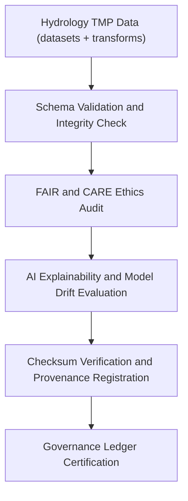

<div align="center">

# ✅ Kansas Frontier Matrix — **Hydrology TMP Validation Workspace**
`data/work/tmp/hydrology/validation/README.md`

**Purpose:**  
Governed FAIR+CARE validation environment for verifying schema integrity, FAIR+CARE compliance, checksum consistency, and AI-driven hydrologic model transparency within the Kansas Frontier Matrix (KFM).  
Ensures all TMP hydrology outputs meet ethical, reproducible, and scientifically valid governance criteria prior to staging promotion.

[](../../../../../docs/standards/faircare-validation.md)
[](../../../../../LICENSE)
[](../../../../../docs/architecture/repo-focus.md)

</div>

---

## 📚 Overview

The `data/work/tmp/hydrology/validation/` directory contains **all validation reports, audits, and schema compliance outputs** for temporary hydrology datasets processed within KFM pipelines.  
Each validation record is FAIR+CARE-certified, checksum-verified, and registered in the provenance governance ledger.

### Core Responsibilities
- Perform schema, checksum, and FAIR+CARE ethics audits on TMP datasets.  
- Validate hydrologic model explainability and AI bias detection.  
- Record governance registration and audit lineage reports.  
- Provide reproducible validation artifacts for Focus Mode and governance review.  

---

## 🗂️ Directory Layout

```plaintext
data/work/tmp/hydrology/validation/
├── README.md                              # This file — documentation of hydrology TMP validation workspace
│
├── schema_validation_summary.json         # Schema validation and field conformance report
├── faircare_audit_report.json             # FAIR+CARE ethics compliance and accessibility review
├── checksum_registry.json                 # Hash registry for all validated hydrology TMP datasets
├── ai_model_explainability.json           # Focus Mode AI interpretability audit for hydrologic modeling
├── drift_audit.json                       # AI model drift detection and retraining metrics
└── metadata.json                          # Provenance linkage and FAIR+CARE certification record
```

---

## ⚙️ Validation Workflow



### Workflow Description
1. **Schema Validation:** Evaluate all TMP hydrology datasets for structural consistency and data-type compliance.  
2. **Ethical Audit:** Conduct FAIR+CARE governance reviews for accessibility, ethics, and equity.  
3. **AI Validation:** Verify model explainability and drift stability for AI-enhanced hydrology workflows.  
4. **Checksum Verification:** Confirm dataset integrity using SHA-256 hash comparisons.  
5. **Governance Registration:** Archive validation reports and lineage entries in provenance ledgers.  

---

## 🧩 Example Validation Metadata Record

```json
{
  "id": "hydrology_tmp_validation_v9.5.0_2025Q4",
  "datasets_validated": [
    "hydrology_normalized.parquet",
    "flow_direction_grid.tif",
    "water_balance_summary.csv"
  ],
  "schema_compliance": "passed",
  "checksum_verified": true,
  "faircare_score": 99.3,
  "ai_explainability_score": 0.986,
  "drift_detected": false,
  "governance_registered": true,
  "fairstatus": "certified",
  "telemetry_ref": "releases/v9.5.0/focus-telemetry.json",
  "governance_ref": "reports/audit/ai_hydrology_ledger.json",
  "created": "2025-11-02T21:35:00Z",
  "validator": "@kfm-hydrology"
}
```

---

## 🧠 FAIR+CARE Governance Matrix

| Principle | Implementation |
|------------|----------------|
| **Findable** | Validation reports indexed by schema ID and checksum registry. |
| **Accessible** | Stored in JSON format for internal and public audit review. |
| **Interoperable** | Conforms to FAIR, CARE, DCAT 3.0, and ISO 19115 lineage models. |
| **Reusable** | Includes full provenance records for reproducibility. |
| **Collective Benefit** | Promotes equitable water resource governance through transparent QA. |
| **Authority to Control** | FAIR+CARE Council certifies hydrologic validation artifacts. |
| **Responsibility** | Validators document results and governance registration. |
| **Ethics** | Upholds non-bias and equitable modeling standards in water data science. |

Audit and validation results logged in:  
`reports/audit/ai_hydrology_ledger.json` • `reports/fair/hydrology_validation_summary.json`

---

## ⚙️ Validation Artifacts & QA Outputs

| File | Description | Format |
|------|--------------|--------|
| `schema_validation_summary.json` | Field and schema-level validation report. | JSON |
| `faircare_audit_report.json` | FAIR+CARE ethical audit and accessibility metrics. | JSON |
| `checksum_registry.json` | File integrity and provenance hash summary. | JSON |
| `ai_model_explainability.json` | AI interpretability audit for Focus Mode hydrology model. | JSON |
| `drift_audit.json` | AI drift detection and performance monitoring results. | JSON |
| `metadata.json` | Provenance linkage and FAIR+CARE validation metadata. | JSON |

Validation workflow automated via `hydrology_validation_sync.yml`.

---

## 🧾 Retention Policy

| File Type | Retention Duration | Policy |
|------------|--------------------|--------|
| Validation Reports | 365 days | Archived for audit and ethics verification. |
| FAIR+CARE Logs | 180 days | Retained for re-certification cycles. |
| Checksum Registries | Permanent | Maintained under governance provenance. |
| AI Validation Logs | 180 days | Retained for explainability and drift tracking. |
| Metadata | Permanent | Archived indefinitely for lineage continuity. |

Cleanup handled by `hydrology_validation_cleanup.yml`.

---

## 🧾 Internal Use Citation

```text
Kansas Frontier Matrix (2025). Hydrology TMP Validation Workspace (v9.5.0).
FAIR+CARE-certified validation environment ensuring schema integrity, checksum reproducibility, and ethical AI model governance in hydrologic data processing.
Supports transparency and open-science compliance under MCP-DL v6.3 governance.
```

---

## 🧾 Version Notes

| Version | Date | Notes |
|----------|------|--------|
| v9.5.0 | 2025-11-02 | Added AI explainability and drift validation with telemetry schema v2. |
| v9.3.2 | 2025-10-28 | Integrated FAIR+CARE ethics audit and checksum registry automation. |
| v9.3.0 | 2025-10-26 | Established TMP validation workspace under FAIR+CARE governance. |

---

<div align="center">

**Kansas Frontier Matrix** · *Validation Integrity × FAIR+CARE Ethics × Provenance Transparency*  
[🔗 Repository](https://github.com/bartytime4life/Kansas-Frontier-Matrix) • [🧭 Docs Portal](../../../../../docs/) • [⚖️ Governance Ledger](../../../../../docs/standards/governance/)

</div>