<div align="center">

# ✅ Kansas Frontier Matrix — **Hydrology TMP Validation Layer**
`data/work/tmp/hydrology/validation/README.md`

**Purpose:**  
Central **FAIR+CARE-certified** workspace for validating **schema compliance, checksum integrity, ethics, and AI explainability** of hydrological datasets within the Kansas Frontier Matrix (KFM).  
This layer ensures every hydrology dataset passes technical, ethical, and provenance audits before promotion to staging or processed environments.

[](../../../../../docs/architecture/README.md)
[](../../../../../LICENSE)
[](../../../../../docs/standards/faircare-validation.md)
[]()

</div>

---

## 📘 Overview

The **Hydrology TMP Validation Layer** is the backbone of quality assurance and governance for water-related datasets (**aquifers, watersheds, streamflow, groundwater, precipitation**) prepared in `data/work/tmp/hydrology/transforms/`.  
All validations produce machine-readable artifacts, checksum proofs, and governance-linked manifests aligned to **MCP-DL v6.3**, **FAIR+CARE**, and **ISO 19115**.

### Core Functions
- Validate schemas and metadata against **STAC 1.0**, **DCAT 3.0**, **ISO 19115**, **CF**.  
- Verify **SHA-256** integrity and continuity with transform outputs & release manifests.  
- Conduct **FAIR+CARE** ethics/accessibility audits and **AI explainability/drift** checks.  
- Synchronize all outcomes with the **provenance/governance ledger** and **telemetry**.

---

## 🗂️ Directory Layout

```plaintext
data/work/tmp/hydrology/validation/
├── README.md                         # This file — hydrology TMP validation overview
│
├── schema_validation_summary.json    # Structural & metadata compliance results (STAC/DCAT/ISO/CF)
├── faircare_audit_report.json        # FAIR+CARE ethics & accessibility certification
├── ai_explainability_report.json     # XAI transparency & drift/bias evaluation
├── checksum_registry.json            # SHA-256 integrity & continuity log
├── validation_manifest.json          # Registry linking all validation artifacts to ledger entries
└── metadata.json                     # Validation provenance, signatures, and governance links
```

---

## ⚙️ Validation Workflow

```mermaid
flowchart TD
    A["Transformed Hydrology (../transforms/)"] --> B["Schema Validation (FAIR+CARE · STAC · DCAT · ISO/CF)"]
    B --> C["Checksum Verification + FAIR + CARE Ethics Review"]
    C --> D["AI Explainability & Bias/Drift Detection"]
    D --> E["Governance Ledger Sync & Manifest Update"]
    E --> F["Promotion → data/work/staging/hydrology/"]
```



### Description
1. **Schema Validation** — Evaluate structure, codelists, and metadata alignment to KFM contracts.  
2. **Checksum & FAIR+CARE** — Confirm integrity and certify ethical compliance.  
3. **AI Explainability** — Assess model transparency (SHAP/LIME) and drift/bias signals.  
4. **Governance Sync** — Register results to `data/reports/audit/data_provenance_ledger.json` and update `releases/*/manifest.zip`.  
5. **Promotion** — Only certified datasets proceed to `data/work/staging/hydrology/`.

---

## 🧩 Example Validation Record

```json
{
  "id": "hydrology_validation_v9.7.0_2025Q4",
  "validated_datasets": [
    "hydrology_summary_v9.7.0.parquet",
    "aquifer_extent_reprojected.geojson",
    "streamflow_normalized.parquet"
  ],
  "schema_pass_rate": 99.8,
  "checksum_verified": true,
  "faircare_status": "certified",
  "ai_explainability_verified": true,
  "governance_registered": true,
  "validator": "@kfm-hydro-lab",
  "created": "2025-11-06T23:59:00Z",
  "governance_ref": "data/reports/audit/data_provenance_ledger.json"
}
```

---

## 🧠 FAIR+CARE Validation Matrix

| Principle | Implementation | Oversight |
|---|---|---|
| **Findable** | Results indexed by dataset, checksum, and schema version | @kfm-data |
| **Accessible** | Open JSON artifacts for Council review | @kfm-accessibility |
| **Interoperable** | Conforms to FAIR+CARE, STAC/DCAT, ISO 19115, CF | @kfm-architecture |
| **Reusable** | Checksum continuity & validation manifest enable reproducibility | @kfm-design |
| **Collective Benefit** | Strengthens transparency in water-data governance | @faircare-council |
| **Authority to Control** | Governance Council approves certification gates | @kfm-governance |
| **Responsibility** | Validators maintain integrity, XAI, and audit records | @kfm-security |
| **Ethics** | Ethics & accessibility verified; sensitive content screened | @kfm-ethics |

**Audit Links:**  
`data/reports/fair/data_care_assessment.json` · `data/reports/audit/data_provenance_ledger.json`

---

## ⚙️ Key Validation Artifacts

| Artifact | Description | Format |
|---|---|---|
| `schema_validation_summary.json` | Structural & metadata compliance report | JSON |
| `faircare_audit_report.json` | FAIR+CARE ethics/accessibility certification | JSON |
| `ai_explainability_report.json` | XAI (SHAP/LIME) & drift analysis | JSON |
| `checksum_registry.json` | SHA-256 integrity & continuity log | JSON |
| `validation_manifest.json` | Cross-links artifacts to governance ledger | JSON |
| `metadata.json` | Provenance, signatures, and telemetry references | JSON |

**Automation:** `hydrology_validation_sync.yml`

---

## ⚖️ Retention & Provenance Policy

| Validation Type | Retention | Policy |
|---|---:|---|
| Schema Reports | 180 Days | Archived for reproducibility & review |
| FAIR+CARE Audits | 365 Days | Retained for ethics compliance reference |
| XAI Reports | 365 Days | Stored for governance & ethics tracking |
| Metadata & Manifests | Permanent | Immutable under governance ledger |

---

## 🌱 Sustainability Metrics

| Metric | Value | Verified By |
|---|---:|---|
| Energy Use (per validation cycle) | 7.8 Wh | @kfm-sustainability |
| Carbon Output | 8.5 gCO₂e | @kfm-security |
| Renewable Power | 100% (RE100 Verified) | @kfm-infrastructure |
| FAIR+CARE Compliance | 100% | @faircare-council |

**Telemetry:** `../../../../../releases/v9.7.0/focus-telemetry.json`

---

## 🧾 Citation

```text
Kansas Frontier Matrix (2025). Hydrology TMP Validation Layer (v9.7.0).
FAIR+CARE-certified hydrology validation workspace ensuring schema integrity, ethics compliance, checksum continuity, and governance traceability under MCP-DL v6.3 and ISO 19115.
```

---

## 🕰️ Version History

| Version | Date | Author | Summary |
|---|---|---|---|
| v9.7.0 | 2025-11-06 | `@kfm-hydro-lab` | Upgraded to v9.7.0; telemetry schema added; governance & CF/ISO alignment refined. |
| v9.6.0 | 2025-11-03 | `@kfm-hydro-lab` | Added AI explainability integration and checksum audit automation. |

---

<div align="center">

**Kansas Frontier Matrix**  
*Hydrological Validation × FAIR+CARE Ethics × Provenance Governance*  
© 2025 Kansas Frontier Matrix — Master Coder Protocol v6.3 · FAIR+CARE Certified · **Diamond⁹ Ω / Crown∞Ω** Ultimate Certified  

[Back to Hydrology TMP](../README.md) · [Governance Charter](../../../../../docs/standards/governance/DATA-GOVERNANCE.md)

</div>