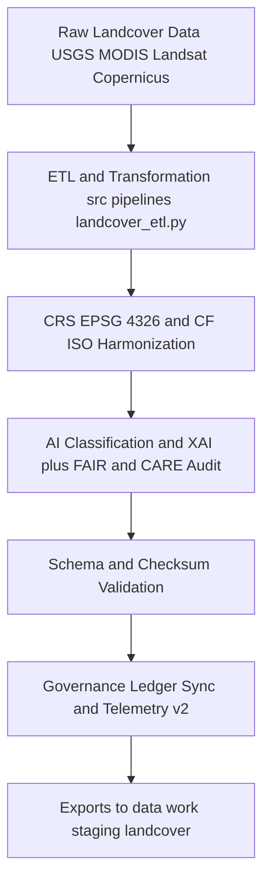

<div align="center">

# 🌿 **Kansas Frontier Matrix — Landcover TMP Workspace**
`data/work/tmp/landcover/README.md`

**Purpose:**  
FAIR+CARE-certified temporary environment for **ingestion, transformation, validation, and ethical governance** of landcover datasets in the Kansas Frontier Matrix (KFM).  
Now upgraded with **telemetry v2** (energy Wh, carbon gCO2e, coverage %, duration) and **JSON-LD lineage anchors**. Supports reproducible ETL for **satellite rasters, vegetation indices NDVI NDMI, land use land cover classifications, and model outputs**, with full provenance, checksum integrity, and XAI driven ethics auditing.

[](../../../../docs/architecture/README.md)
[](../../../../LICENSE)
[](../../../../docs/standards/faircare.md)
[]()

</div>

---

## 📘 Overview

The **Landcover TMP Workspace** provides a structured, auditable hub for short-lived processing under **FAIR+CARE**, **ISO 19115**, and **MCP-DL v6.3**.  
All artifacts traversing this layer undergo **schema validation, CRS normalization to EPSG 4326, checksum verification, ethics and XAI auditing, telemetry v2 capture**, and **governance ledger** registration before promotion to staging.

**v10 enhancements**

- **Telemetry v2** emitted per step to `telemetry_ref` with energy, carbon, coverage, and duration.  
- **JSON-LD lineage** in every `metadata.json` using `prov:wasDerivedFrom` and `prov:wasGeneratedBy`.  
- Strengthened **CF and ISO** crosswalks and continuous checksum reconciliation.

### Core responsibilities

- Preprocess and harmonize **NLCD, MODIS, Landsat, Sentinel, Copernicus** products.  
- Run **CF and ISO** metadata enrichment, unit and attribute normalization.  
- Execute model-based classifications with **XAI** artifacts (SHAP, LIME).  
- Synchronize **provenance, checksum registries, FAIR+CARE audits**, and **telemetry v2**.

---

## 🗂️ Directory Layout

```plaintext
data/work/tmp/landcover/
├── README.md                           # This file — Landcover TMP documentation
│
├── datasets/                           # Temporary raw and harmonized landcover datasets
│   ├── nlcd_landcover_2021_tmp.tif
│   ├── modis_ndvi_2025_tmp.parquet
│   └── metadata.json                   # JSON LD lineage, source, checksums, telemetry v2
│
├── transforms/                         # Harmonization, reprojection, model transforms
│   ├── landcover_classifications_v10.0.0.parquet
│   ├── ndvi_anomaly_reprojection.geojson
│   └── metadata.json
│
├── validation/                         # FAIR+CARE and checksum audits
│   ├── schema_validation_summary.json
│   ├── faircare_landcover_audit.json
│   ├── ai_explainability_audit.json
│   └── metadata.json
│
├── exports/                            # Temporary export ready files prior to staging
│   ├── landcover_export_2025Q4.csv
│   ├── ndvi_metrics_export.parquet
│   ├── classification_tiles_export.geojson
│   └── metadata.json
│
└── logs/                               # ETL, model, governance, telemetry logs
    ├── etl_run.log
    ├── ai_model_audit.log
    ├── governance_sync.log
    ├── checksum_audit.log
    ├── telemetry_v2_summary.json
    └── metadata.json
```

---

## ⚙️ Landcover TMP Workflow



### Description

1. **Ingestion** — Fetch authoritative rasters and vectors from producers.  
2. **Transform** — Reproject and harmonize attributes, units, and metadata (**CF and ISO**).  
3. **AI and FAIR and CARE** — Run model inference with **XAI** and ethics checks.  
4. **Validate** — Perform schema checks and **SHA 256** integrity.  
5. **Govern** — Register outcomes to `data/reports/audit/data_provenance_ledger.json` and update `releases/*/manifest.zip`; emit telemetry per **ISO 50001 and 14064**.  
6. **Promote** — Stage export ready artifacts for long term layers.

---

## 🧩 Example TMP Metadata Record

```json
{
  "id": "landcover_tmp_v10.0.0_2025Q4",
  "source_files": [
    "data/raw/nlcd/landcover_2021_kansas.tif",
    "data/raw/modis/ndvi_2025.parquet"
  ],
  "records_processed": 210842,
  "schema_compliance_rate": 0.997,
  "checksum_verified": true,
  "fairstatus": "certified",
  "ai_explainability_verified": true,
  "telemetry": { "energy_wh": 7.1, "carbon_gco2e": 7.9, "coverage_pct": 100, "duration_s": 1540 },
  "governance_registered": true,
  "validator": "@kfm-landcover-lab",
  "created": "2025-11-09T00:00:00Z",
  "governance_ref": "data/reports/audit/data_provenance_ledger.json"
}
```

---

## 🧠 FAIR+CARE Governance Matrix

| Principle | Implementation | Oversight |
|---|---|---|
| **Findable** | Datasets indexed by checksum, sensor, product, cycle | `@kfm-data` |
| **Accessible** | GeoTIFF, Parquet, CSV with licensing metadata | `@kfm-accessibility` |
| **Interoperable** | STAC and DCAT with CF and ISO 19115 alignment | `@kfm-architecture` |
| **Reusable** | Lineage and checksum manifests for reproducibility | `@kfm-design` |
| **Collective Benefit** | Enables sustainable land use and ecological analysis | `@faircare-council` |
| **Authority to Control** | Council approves model and transform schemas | `@kfm-governance` |
| **Responsibility** | Validators record schema, ethics, checksum, XAI logs | `@kfm-security` |
| **Ethics** | XAI and FAIR and CARE audits enforce fairness and transparency | `@kfm-ethics` |

**Audit records:**  
`data/reports/audit/data_provenance_ledger.json` · `data/reports/fair/data_care_assessment.json`

---

## ⚙️ TMP Artifacts

| Artifact | Description | Format |
|---|---|---|
| `*_tmp.*` | Temporary landcover datasets during ETL | TIFF · CSV · Parquet |
| `*_reprojection.*` | EPSG 4326 aligned vectors and rasters | GeoTIFF · GeoJSON |
| `landcover_classifications_v10.0.0.parquet` | Post validation LULC classifications | Parquet |
| `faircare_landcover_audit.json` | Ethics and accessibility compliance | JSON |
| `checksum_registry.json` | SHA 256 continuity tracking | JSON |
| `metadata.json` | Provenance with JSON LD lineage and telemetry v2 | JSON |

**Automation:** `landcover_tmp_sync_v10.yml`

---

## ⚖️ Retention & Provenance Policy

| Data Type | Retention | Policy |
|---|---:|---|
| TMP datasets | 7 Days | Purged after validation or promotion |
| Validation reports | 365 Days | Retained for reproducibility and review |
| FAIR and CARE audits | 365 Days | Archived for ethical verification |
| Metadata and manifests | Permanent | Immutable in provenance ledger |

---

## 🌱 Sustainability Metrics

| Metric | Value | Verified By |
|---|---:|---|
| Energy use per TMP cycle | 7.1 Wh | `@kfm-sustainability` |
| Carbon output | 7.9 gCO2e | `@kfm-security` |
| Renewable power | 100 percent RE100 | `@kfm-infrastructure` |
| FAIR and CARE compliance | 100 percent | `@kfm-faircare` |

**Telemetry:** `../../../../releases/v10.0.0/focus-telemetry.json`

---

## 🧾 Citation

```text
Kansas Frontier Matrix (2025). Landcover TMP Workspace (v10.0.0).
FAIR+CARE-certified landcover TMP for reproducible ETL, CF and ISO harmonization, validation, XAI auditing, and governance registration with JSON LD lineage and telemetry v2, under MCP-DL v6.3.
```

---

## 🕰️ Version History

| Version | Date | Author | Summary |
|---|---|---|---|
| v10.0.0 | 2025-11-09 | `@kfm-landcover-lab` | Upgrade to v10: telemetry v2, JSON LD lineage anchors, strengthened CF and ISO crosswalks. |
| v9.7.0  | 2025-11-07 | `@kfm-landcover-lab` | Telemetry schema added; governance, XAI, CF alignment refined. |
| v9.6.0  | 2025-11-03 | `@kfm-landcover-lab` | Added XAI audits and checksum validation integration. |

---

<div align="center">

**Kansas Frontier Matrix**  
*Land Intelligence × FAIR+CARE Ethics × Provenance Transparency*  
© 2025 Kansas Frontier Matrix — CC-BY 4.0 · **Diamond⁹ Ω / Crown∞Ω** Ultimate Certified  

[Back to Landcover TMP](../README.md) · [Governance Charter](../../../../docs/standards/governance/DATA-GOVERNANCE.md)

</div>
