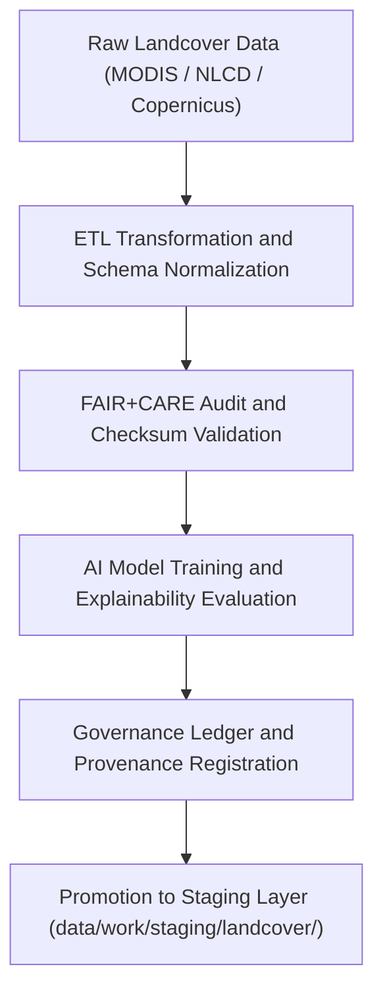

<div align="center">

# 🌿 Kansas Frontier Matrix — **Landcover TMP Workspace**
`data/work/tmp/landcover/README.md`

**Purpose:**  
Temporary FAIR+CARE-certified workspace for landcover data ingestion, normalization, transformation, and AI analysis within the Kansas Frontier Matrix (KFM).  
This directory manages transient datasets including vegetation indices, crop coverage, NDVI composites, and land classification models, all governed under ethical and reproducible science frameworks.

[](../../../../docs/standards/faircare-validation.md)
[](../../../../LICENSE)
[](../../../../docs/architecture/repo-focus.md)

</div>

---

## 📚 Overview

The `data/work/tmp/landcover/` directory serves as the **temporary staging and validation layer** for all landcover datasets processed in KFM workflows.  
It provides a controlled environment for schema harmonization, FAIR+CARE audits, and AI explainability verification across datasets sourced from MODIS, USGS NLCD, and Copernicus Global Land Service.

### Core Responsibilities
- Manage intermediate landcover data transformations and FAIR+CARE audits.  
- Validate classification models, NDVI composites, and vegetation coverage indices.  
- Register checksums, governance records, and AI explainability metadata.  
- Ensure reproducibility and ethical use of environmental land datasets.  

---

## 🗂️ Directory Layout

```plaintext
data/work/tmp/landcover/
├── README.md                              # This file — overview of the Landcover TMP workspace
│
├── datasets/                              # Raw and harmonized landcover and vegetation datasets
│   ├── modis_ndvi_composite_2025.tif
│   ├── nlcd_kansas_2021.tif
│   ├── crop_mask_2025.geojson
│   ├── vegetation_cover_anomaly.csv
│   └── metadata.json
│
├── transforms/                            # Transformation and normalization scripts and outputs
│   ├── landcover_normalized.parquet
│   ├── ndvi_index_resampled.tif
│   ├── vegetation_classification_audit.json
│   └── metadata.json
│
├── validation/                            # FAIR+CARE validation and checksum verification reports
│   ├── schema_validation_summary.json
│   ├── faircare_audit_report.json
│   ├── checksum_registry.json
│   └── metadata.json
│
├── ai/                                    # Focus Mode AI model outputs and explainability metrics
│   ├── landcover_ai_model_explainability.json
│   ├── feature_importance_summary.csv
│   ├── drift_detection_audit.json
│   └── metadata.json
│
├── logs/                                  # Process, validation, and governance synchronization logs
│   ├── etl_run.log
│   ├── ai_model_run.log
│   ├── governance_sync.log
│   └── metadata.json
│
└── exports/                               # Temporary FAIR+CARE-certified exports and test releases
    ├── landcover_summary_2025.csv
    ├── vegetation_cover_tileset.tif
    ├── metadata.json
```

---

## ⚙️ Landcover TMP Workflow



### Workflow Description
1. **Ingestion:** Retrieve landcover and vegetation datasets from global and regional providers.  
2. **Transformation:** Normalize spatial metadata, classification codes, and schema fields.  
3. **Validation:** Apply FAIR+CARE audits and checksum integrity checks.  
4. **AI Analysis:** Generate vegetation models with full explainability verification.  
5. **Governance:** Register all lineage and certification metadata to governance ledger.

---

## 🧩 Example Metadata Record

```json
{
  "id": "landcover_tmp_v9.5.0_2025Q4",
  "datasets": [
    "modis_ndvi_composite_2025.tif",
    "nlcd_kansas_2021.tif",
    "crop_mask_2025.geojson"
  ],
  "records_processed": 174029,
  "checksum_verified": true,
  "schema_version": "v3.0.1",
  "validation_status": "passed",
  "fairstatus": "certified",
  "ai_model_used": "focus-landcover-v2",
  "ai_explainability_score": 0.988,
  "governance_ref": "reports/audit/ai_landcover_ledger.json",
  "telemetry_ref": "releases/v9.5.0/focus-telemetry.json",
  "created": "2025-11-02T21:45:00Z",
  "validator": "@kfm-landcover"
}
```

---

## 🧠 FAIR+CARE Governance Matrix

| Principle | Implementation |
|------------|----------------|
| **Findable** | Indexed by checksum, schema, and FAIR+CARE certification ID. |
| **Accessible** | Data stored in open FAIR-compliant formats (GeoTIFF, CSV, Parquet). |
| **Interoperable** | Complies with STAC 1.0, DCAT 3.0, and ISO 19115 lineage standards. |
| **Reusable** | Each dataset contains governance metadata and provenance lineage. |
| **Collective Benefit** | Supports ethical monitoring of environmental and agricultural data. |
| **Authority to Control** | FAIR+CARE Council validates dataset access and publication approval. |
| **Responsibility** | Validators document schema, checksum, and AI audit results. |
| **Ethics** | All AI and ETL results reviewed for bias, sustainability, and equity compliance. |

Audit and validation results logged in:  
`reports/audit/ai_landcover_ledger.json` • `reports/fair/landcover_summary.json`

---

## ⚙️ QA & Validation Artifacts

| File | Description | Format |
|------|--------------|--------|
| `schema_validation_summary.json` | Schema validation and compliance report. | JSON |
| `faircare_audit_report.json` | FAIR+CARE ethics and accessibility audit. | JSON |
| `checksum_registry.json` | Dataset integrity and provenance hash registry. | JSON |
| `landcover_ai_model_explainability.json` | AI interpretability and performance metrics. | JSON |
| `drift_detection_audit.json` | AI drift and retraining validation report. | JSON |

All processes synchronized through `landcover_tmp_sync.yml`.

---

## 🧾 Retention Policy

| File Type | Retention Duration | Policy |
|------------|--------------------|--------|
| TMP Datasets | 14 days | Purged after staging promotion or validation certification. |
| AI and Validation Logs | 90 days | Archived for governance and audit review. |
| Metadata | 365 days | Retained for lineage traceability. |
| Governance Records | Permanent | Stored under FAIR+CARE ledger for reproducibility. |

Retention automation handled by `landcover_tmp_cleanup.yml`.

---

## 🧾 Internal Use Citation

```text
Kansas Frontier Matrix (2025). Landcover TMP Workspace (v9.5.0).
Temporary FAIR+CARE-certified workspace for landcover data ingestion, normalization, AI modeling, and validation.
Ensures reproducibility, ethics, and provenance continuity under open data and environmental governance standards.
```

---

## 🧾 Version Notes

| Version | Date | Notes |
|----------|------|--------|
| v9.5.0 | 2025-11-02 | Added AI explainability, CF harmonization, and NDVI drift monitoring support. |
| v9.3.2 | 2025-10-28 | Integrated checksum governance and FAIR+CARE validation pipelines. |
| v9.3.0 | 2025-10-26 | Established landcover TMP workspace under FAIR+CARE open governance. |

---

<div align="center">

**Kansas Frontier Matrix** · *Landcover Intelligence × FAIR+CARE Ethics × Provenance Transparency*  
[🔗 Repository](https://github.com/bartytime4life/Kansas-Frontier-Matrix) • [🧭 Docs Portal](../../../../docs/) • [⚖️ Governance Ledger](../../../../docs/standards/governance/)

</div>