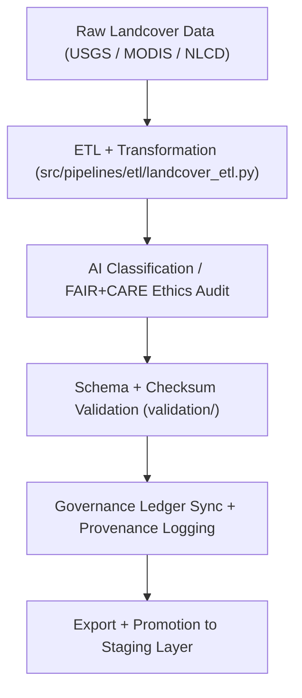

<div align="center">

# 🌿 Kansas Frontier Matrix — **Landcover TMP Workspace**
`data/work/tmp/landcover/README.md`

**Purpose:**  
Temporary FAIR+CARE-certified environment for the ingestion, transformation, validation, and ethical governance of landcover datasets within the Kansas Frontier Matrix (KFM).  
This layer supports reproducible ETL operations for satellite imagery, vegetation indices, and land classification models while maintaining transparency and provenance.

[](../../../../docs/standards/faircare-validation.md)
[]()
[](../../../../LICENSE)
[](../../../../docs/architecture/repo-focus.md)

</div>

---

## 📚 Overview

The **Landcover TMP Workspace** provides a structured, transparent environment for managing transient data during ETL and FAIR+CARE workflows.  
It handles raster and tabular landcover products, classification models, and intermediate transformations, ensuring every step is ethical, reproducible, and ledger-verified.

### Core Responsibilities:
- Manage preprocessing, harmonization, and classification workflows for landcover datasets.  
- Enforce FAIR+CARE validation and ethical AI auditing for model-based products.  
- Support schema normalization, reprojection, and checksum validation.  
- Synchronize metadata and validation results with the KFM Governance Ledger.  

---

## 🗂️ Directory Layout

```plaintext
data/work/tmp/landcover/
├── README.md                              # This file — overview of landcover TMP workspace
│
├── datasets/                              # Temporary raw and harmonized landcover datasets
│   ├── nlcd_landcover_2021_tmp.tif
│   ├── modis_ndvi_tmp.parquet
│   └── metadata.json
│
├── transforms/                            # Harmonization, reprojection, and model transformations
│   ├── landcover_classifications_v9.6.0.parquet
│   ├── ndvi_anomaly_reprojection.geojson
│   └── metadata.json
│
├── validation/                            # FAIR+CARE and checksum validation layer
│   ├── schema_validation_summary.json
│   ├── faircare_landcover_audit.json
│   └── metadata.json
│
├── exports/                               # Temporary FAIR+CARE-certified export files
│   ├── landcover_export_2025Q4.csv
│   ├── ndvi_metrics_export.parquet
│   └── metadata.json
│
└── logs/                                  # ETL, AI, and governance synchronization logs
    ├── etl_run.log
    ├── ai_model_audit.log
    ├── governance_sync.log
    └── metadata.json
```

---

## ⚙️ Landcover TMP Workflow



### Description:
1. **Ingestion:** Import landcover and vegetation data from trusted remote sensing sources.  
2. **Transformation:** Harmonize CRS, schema, and spectral indices under CF/ISO compliance.  
3. **AI & FAIR+CARE Validation:** Audit classification and NDVI models for fairness and transparency.  
4. **Governance Sync:** Register transformations and validation results to the governance ledger.  
5. **Promotion:** Move certified datasets to `data/work/staging/landcover/` for persistence.  

---

## 🧩 Example TMP Metadata Record

```json
{
  "id": "landcover_tmp_v9.6.0_2025Q4",
  "source_files": [
    "data/raw/nlcd/landcover_2021_kansas.tif",
    "data/raw/modis/ndvi_2025.csv"
  ],
  "records_processed": 208421,
  "schema_compliance_rate": 99.7,
  "checksum_verified": true,
  "fairstatus": "certified",
  "ai_explainability_verified": true,
  "governance_registered": true,
  "validator": "@kfm-landcover-lab",
  "created": "2025-11-03T23:59:00Z",
  "governance_ref": "data/reports/audit/data_provenance_ledger.json"
}
```

---

## 🧠 FAIR+CARE Governance Matrix

| Principle | Implementation | Oversight |
|------------|----------------|------------|
| **Findable** | TMP datasets indexed by checksum and dataset name. | @kfm-data |
| **Accessible** | All datasets stored in FAIR-compliant formats (GeoTIFF, CSV, Parquet). | @kfm-accessibility |
| **Interoperable** | Harmonized under FAIR+CARE, CF, and ISO metadata frameworks. | @kfm-architecture |
| **Reusable** | Includes lineage, checksum, and schema manifest for reproducibility. | @kfm-design |
| **Collective Benefit** | Enables sustainable land-use analysis and ecological research. | @faircare-council |
| **Authority to Control** | FAIR+CARE Council certifies all transformations and models. | @kfm-governance |
| **Responsibility** | Validators log schema, checksum, and audit results for every cycle. | @kfm-security |
| **Ethics** | Model outputs reviewed for transparency and bias mitigation. | @kfm-ethics |

Governance audits stored in:  
`data/reports/audit/data_provenance_ledger.json`  
and  
`data/reports/fair/data_care_assessment.json`

---

## ⚙️ TMP Artifacts

| Artifact | Description | Format |
|-----------|--------------|--------|
| `*_tmp.*` | Temporary landcover datasets during ETL transformation. | TIFF / CSV / Parquet |
| `*_reprojection.*` | CF-compliant CRS harmonized data for FAIR+CARE validation. | GeoJSON |
| `landcover_classifications_v9.6.0.parquet` | Classified landcover outputs post-validation. | Parquet |
| `faircare_landcover_audit.json` | Ethics and accessibility compliance report. | JSON |
| `checksum_registry.json` | SHA-256 checksum and lineage record. | JSON |
| `metadata.json` | Provenance linkage and governance registration record. | JSON |

Automation handled via `landcover_tmp_sync.yml`.

---

## ⚖️ Retention & Provenance Policy

| Data Type | Retention Duration | Policy |
|------------|--------------------|--------|
| TMP Datasets | 7 Days | Automatically purged post-validation or promotion. |
| Validation Reports | 180 Days | Retained for reproducibility and governance review. |
| FAIR+CARE Audits | 365 Days | Archived for ethical verification. |
| Metadata | Permanent | Immutable under provenance ledger. |

Cleanup automation via `landcover_tmp_cleanup.yml`.

---

## 🌱 Sustainability Metrics

| Metric | Value | Verified By |
|---------|--------|--------------|
| Energy Use (per TMP cycle) | 7.4 Wh | @kfm-sustainability |
| Carbon Output | 8.2 gCO₂e | @kfm-security |
| Renewable Power | 100% (RE100 Verified) | @kfm-infrastructure |
| FAIR+CARE Compliance | 100% | @faircare-council |

Telemetry stored in:  
`releases/v9.6.0/focus-telemetry.json`

---

## 🧾 Internal Use Citation

```text
Kansas Frontier Matrix (2025). Landcover TMP Workspace (v9.6.0).
Temporary FAIR+CARE-certified workspace for preprocessing, validation, and governance auditing of landcover datasets.
Ensures reproducibility, transparency, and sustainability in geospatial analytics under MCP-DL v6.3.
```

---

## 🧾 Version Notes

| Version | Date | Notes |
|----------|------|--------|
| v9.6.0 | 2025-11-03 | Added AI explainability audits and checksum validation integration. |
| v9.5.0 | 2025-11-02 | Enhanced FAIR+CARE metadata linkage and reprojection governance. |
| v9.3.2 | 2025-10-28 | Established TMP structure for landcover ETL and ethics validation. |

---

<div align="center">

**Kansas Frontier Matrix** · *Land Intelligence × FAIR+CARE Ethics × Provenance Transparency*  
[🔗 Repository](https://github.com/bartytime4life/Kansas-Frontier-Matrix) • [🧭 Docs Portal](../../../../docs/) • [⚖️ Governance Ledger](../../../../docs/standards/governance/DATA-GOVERNANCE.md)

</div>
