<div align="center">

# 🌿 Kansas Frontier Matrix — **Landcover TMP Workspace**
`data/work/tmp/landcover/README.md`

**Purpose:**  
FAIR+CARE-certified temporary environment for **ingestion, transformation, validation, and ethical governance** of landcover datasets in the Kansas Frontier Matrix (KFM).  
Supports reproducible ETL for **satellite rasters, vegetation indices (NDVI/NDMI), land-use/land-cover (LULC) classifications, and model outputs**, with full provenance, checksum integrity, and ethics auditing.

[](../../../../docs/architecture/README.md)
[](../../../../LICENSE)
[](../../../../docs/standards/faircare-validation.md)
[]()

</div>

---

## 📘 Overview

The **Landcover TMP Workspace** provides a structured, auditable hub for short-lived processing under **FAIR+CARE**, **ISO 19115**, and **MCP-DL v6.3**.  
All artifacts traversing this layer undergo **schema validation, CRS normalization (EPSG:4326), checksum verification, ethics/XAI auditing, telemetry capture**, and **governance ledger** registration before promotion to staging.

### Core Responsibilities
- Preprocess & harmonize **NLCD, MODIS, Landsat, Sentinel, Copernicus** products.  
- Run **CF/ISO metadata enrichment**, unit & attribute normalization.  
- Execute **model-based classifications** (e.g., random forest/UNet) with **explainability (SHAP/LIME)**.  
- Synchronize **provenance, checksum registries, FAIR+CARE audits**, and **telemetry**.

---

## 🗂️ Directory Layout

```plaintext
data/work/tmp/landcover/
├── README.md                           # This file — Landcover TMP documentation
│
├── datasets/                           # Temporary raw and harmonized landcover datasets
│   ├── nlcd_landcover_2021_tmp.tif
│   ├── modis_ndvi_2025_tmp.parquet
│   └── metadata.json
│
├── transforms/                         # Harmonization, reprojection, model transforms
│   ├── landcover_classifications_v9.7.0.parquet
│   ├── ndvi_anomaly_reprojection.geojson
│   └── metadata.json
│
├── validation/                         # FAIR+CARE & checksum audits
│   ├── schema_validation_summary.json
│   ├── faircare_landcover_audit.json
│   ├── ai_explainability_audit.json
│   └── metadata.json
│
├── exports/                            # Temporary export-ready files prior to staging
│   ├── landcover_export_2025Q4.csv
│   ├── ndvi_metrics_export.parquet
│   ├── classification_tiles_export.geojson
│   └── metadata.json
│
└── logs/                               # ETL, model, governance & telemetry logs
    ├── etl_run.log
    ├── ai_model_audit.log
    ├── governance_sync.log
    ├── checksum_audit.log
    └── metadata.json
```

---

## ⚙️ Landcover TMP Workflow

```mermaid
flowchart TD
    A["Raw Landcover Data (USGS · MODIS · Landsat · Copernicus)"] --> B["ETL & Transformation (src/pipelines/etl/landcover_etl.py)"]
    B --> C["CRS = EPSG:4326 · CF/ISO Harmonization"]
    C --> D["AI Classification & XAI (SHAP/LIME) + FAIR+CARE Ethics Audit"]
    D --> E["Schema & Checksum Validation (validation/)"]
    E --> F["Governance Ledger Sync + Telemetry (energy/carbon)"]
    F --> G["Exports (exports/) → Promotion to data/work/staging/landcover/"]
```



### Description
1. **Ingestion** — Fetch authoritative rasters/vectors and sensor-level products.  
2. **Transform** — Reproject & harmonize attributes, units, and metadata (CF/ISO).  
3. **AI & FAIR+CARE** — Run model training/inference with **explainability** and ethics checks.  
4. **Validate** — Perform schema checks and **SHA-256** integrity.  
5. **Govern** — Register all outcomes to `data/reports/audit/data_provenance_ledger.json` and update `releases/*/manifest.zip`; emit telemetry per **ISO 50001/14064**.  
6. **Promote** — Stage export-ready artifacts for long-term layers.

---

## 🧩 Example TMP Metadata Record

```json
{
  "id": "landcover_tmp_v9.7.0_2025Q4",
  "source_files": [
    "data/raw/nlcd/landcover_2021_kansas.tif",
    "data/raw/modis/ndvi_2025.parquet"
  ],
  "records_processed": 210842,
  "schema_compliance_rate": 99.7,
  "checksum_verified": true,
  "fairstatus": "certified",
  "ai_explainability_verified": true,
  "telemetry": { "energy_wh": 7.4, "carbon_gco2e": 8.2 },
  "governance_registered": true,
  "validator": "@kfm-landcover-lab",
  "created": "2025-11-07T00:00:00Z",
  "governance_ref": "data/reports/audit/data_provenance_ledger.json"
}
```

---

## 🧠 FAIR+CARE Governance Matrix

| Principle | Implementation | Oversight |
|---|---|---|
| **Findable** | Datasets indexed by checksum, sensor, product & cycle | @kfm-data |
| **Accessible** | Open GeoTIFF/Parquet/CSV with licensing metadata | @kfm-accessibility |
| **Interoperable** | STAC/DCAT + CF + ISO 19115 metadata alignment | @kfm-architecture |
| **Reusable** | Lineage & checksum manifests for reproducibility | @kfm-design |
| **Collective Benefit** | Enables sustainable land-use & ecological analysis | @faircare-council |
| **Authority to Control** | Council approves model & transform schemas | @kfm-governance |
| **Responsibility** | Validators record schema, ethics, checksum, XAI logs | @kfm-security |
| **Ethics** | XAI & FAIR+CARE audits enforce fairness & transparency | @kfm-ethics |

**Audit Records:**  
`data/reports/audit/data_provenance_ledger.json` · `data/reports/fair/data_care_assessment.json`

---

## ⚙️ TMP Artifacts

| Artifact | Description | Format |
|---|---|---|
| `*_tmp.*` | Temporary landcover datasets during ETL | TIFF/CSV/Parquet |
| `*_reprojection.*` | EPSG:4326 aligned vectors/rasters | GeoTIFF/GeoJSON |
| `landcover_classifications_v9.7.0.parquet` | Post-validation LULC classifications | Parquet |
| `faircare_landcover_audit.json` | Ethics & accessibility compliance | JSON |
| `checksum_registry.json` | SHA-256 continuity tracking | JSON |
| `metadata.json` | Provenance links to governance & telemetry | JSON |

**Automation:** `landcover_tmp_sync.yml`

---

## ⚖️ Retention & Provenance Policy

| Data Type | Retention | Policy |
|---|---:|---|
| TMP Datasets | 7 Days | Purged after validation or promotion |
| Validation Reports | 180 Days | Retained for reproducibility & governance review |
| FAIR+CARE Audits | 365 Days | Archived for ethical verification |
| Metadata & Manifests | Permanent | Immutable in provenance ledger |

---

## 🌱 Sustainability Metrics

| Metric | Value | Verified By |
|---|---:|---|
| Energy Use (per TMP cycle) | 7.3 Wh | @kfm-sustainability |
| Carbon Output | 8.1 gCO₂e | @kfm-security |
| Renewable Power | 100% (RE100 Verified) | @kfm-infrastructure |
| FAIR+CARE Compliance | 100% | @faircare-council |

**Telemetry:** `../../../../releases/v9.7.0/focus-telemetry.json`

---

## 🧾 Citation

```text
Kansas Frontier Matrix (2025). Landcover TMP Workspace (v9.7.0).
FAIR+CARE-certified landcover TMP for reproducible ETL, CF/ISO harmonization, validation, XAI auditing, and governance registration under MCP-DL v6.3.
```

---

## 🕰️ Version History

| Version | Date | Author | Summary |
|---|---|---|---|
| v9.7.0 | 2025-11-07 | `@kfm-landcover-lab` | Upgraded to v9.7.0; telemetry schema added; governance/XAI/CF alignment refined. |
| v9.6.0 | 2025-11-03 | `@kfm-landcover-lab` | Added XAI audits and checksum validation integration. |

---

<div align="center">

**Kansas Frontier Matrix**  
*Land Intelligence × FAIR+CARE Ethics × Provenance Transparency*  
© 2025 Kansas Frontier Matrix — Master Coder Protocol v6.3 · FAIR+CARE Certified · **Diamond⁹ Ω / Crown∞Ω** Ultimate Certified  

[Back to Landcover TMP](../README.md) · [Governance Charter](../../../../docs/standards/governance/DATA-GOVERNANCE.md)

</div>