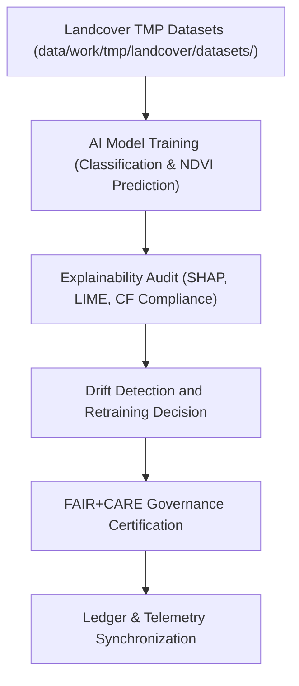

<div align="center">

# 🤖 Kansas Frontier Matrix — **Landcover TMP AI Workspace**
`data/work/tmp/landcover/ai/README.md`

**Purpose:**  
Governed AI/ML workspace for model training, explainability validation, and predictive analytics within the **Kansas Frontier Matrix (KFM)**.  
This layer performs ethical, reproducible, and FAIR+CARE-aligned AI operations on landcover datasets — including vegetation classification, NDVI prediction, and temporal drift detection.

[](../../../../../docs/standards/faircare-validation.md)
[](../../../../../LICENSE)
[](../../../../../docs/architecture/repo-focus.md)

</div>

---

## 📚 Overview

The `data/work/tmp/landcover/ai/` directory serves as the **temporary AI analytics and model governance workspace** for landcover datasets.  
It is responsible for training and validating machine learning models while maintaining audit-ready explainability and compliance with FAIR+CARE ethics and ISO sustainability standards.

### Core Responsibilities
- Train and validate AI models for vegetation and landcover classification.  
- Conduct explainability audits (SHAP/LIME) and drift monitoring.  
- Record performance metrics, ethics reports, and governance synchronization.  
- Register results to the **AI Governance Ledger** and Focus Mode telemetry.  

---

## 🗂️ Directory Layout

```plaintext
data/work/tmp/landcover/ai/
├── README.md                                  # This file — documentation for Landcover TMP AI workspace
│
├── landcover_ai_model_explainability.json     # Explainability analysis report (SHAP, LIME, Grad-CAM)
├── feature_importance_summary.csv             # Model variable importance and feature ranking
├── drift_detection_audit.json                 # AI drift detection and retraining decision report
├── model_performance_metrics.json             # Accuracy, F1, precision, recall, and FAIR+CARE scoring
└── metadata.json                              # Provenance and governance linkage metadata
```

---

## ⚙️ AI Workflow



### Workflow Description
1. **Data Preparation:** Curate landcover datasets for supervised or unsupervised ML tasks.  
2. **Model Training:** Train AI models for vegetation mapping and anomaly detection.  
3. **Explainability:** Use SHAP/LIME/Grad-CAM for interpretability audits.  
4. **Drift Detection:** Evaluate temporal or feature-based model drift.  
5. **Governance:** Log AI ethics, validation, and performance results in ledgers.

---

## 🧩 Example Metadata Record

```json
{
  "id": "landcover_tmp_ai_v9.5.0_2025Q4",
  "ai_model": "focus-landcover-v2",
  "datasets_used": [
    "modis_ndvi_composite_2025.tif",
    "nlcd_kansas_2021.tif"
  ],
  "records_processed": 582901,
  "training_accuracy": 0.972,
  "f1_score": 0.963,
  "drift_detected": false,
  "ai_explainability_score": 0.989,
  "fairstatus": "certified",
  "governance_registered": true,
  "telemetry_ref": "releases/v9.5.0/focus-telemetry.json",
  "governance_ref": "reports/audit/ai_landcover_ledger.json",
  "created": "2025-11-02T22:20:00Z",
  "validator": "@kfm-landcover-ai"
}
```

---

## 🧠 FAIR+CARE Governance Matrix

| Principle | Implementation |
|------------|----------------|
| **Findable** | AI models indexed by checksum and performance ID in governance ledger. |
| **Accessible** | Stored as open explainability reports (JSON/CSV). |
| **Interoperable** | Aligned with ISO 19115, CF Conventions, and AI Ethics Guidelines (OECD/UNESCO). |
| **Reusable** | Includes metadata for model reproducibility and governance tracking. |
| **Collective Benefit** | Encourages equitable and sustainable AI research on land ecosystems. |
| **Authority to Control** | FAIR+CARE Council validates AI audit and retraining approvals. |
| **Responsibility** | Validators document bias, accuracy, and explainability metrics. |
| **Ethics** | All models reviewed for fairness, transparency, and bias mitigation. |

Audit and governance results stored in:  
`reports/audit/ai_landcover_ledger.json` • `reports/fair/landcover_ai_summary.json`

---

## ⚙️ AI Validation & QA Artifacts

| File | Description | Format |
|------|--------------|--------|
| `landcover_ai_model_explainability.json` | Explainability report for landcover AI model. | JSON |
| `feature_importance_summary.csv` | Variable importance and ranking metrics. | CSV |
| `drift_detection_audit.json` | Drift detection and retraining log. | JSON |
| `model_performance_metrics.json` | Model accuracy, precision, recall, and governance status. | JSON |
| `metadata.json` | FAIR+CARE-certified metadata and provenance linkage. | JSON |

Automation managed via `landcover_ai_sync.yml`.

---

## 🧾 Retention Policy

| File Type | Retention Duration | Policy |
|------------|--------------------|--------|
| AI Explainability Reports | 365 days | Archived for audit and retraining validation. |
| Drift Audits | 180 days | Stored for bias monitoring and retraining cycles. |
| Model Metrics | 365 days | Retained for reproducibility verification. |
| Metadata | Permanent | Maintained indefinitely under FAIR+CARE provenance chain. |

Cleanup managed by `landcover_ai_cleanup.yml`.

---

## 🧾 Internal Use Citation

```text
Kansas Frontier Matrix (2025). Landcover TMP AI Workspace (v9.5.0).
FAIR+CARE-certified environment for AI modeling, explainability validation, and ethical landcover analytics.
Supports transparent, interpretable, and reproducible AI within environmental governance frameworks.
```

---

## 🧾 Version Notes

| Version | Date | Notes |
|----------|------|--------|
| v9.5.0 | 2025-11-02 | Added drift detection and AI explainability audit integration. |
| v9.3.2 | 2025-10-28 | Improved telemetry synchronization and FAIR+CARE ethics auditing. |
| v9.3.0 | 2025-10-26 | Established Landcover TMP AI workspace for ethical AI model validation. |

---

<div align="center">

**Kansas Frontier Matrix** · *AI Explainability × FAIR+CARE Governance × Provenance Assurance*  
[🔗 Repository](https://github.com/bartytime4life/Kansas-Frontier-Matrix) • [🧭 Docs Portal](../../../../../docs/) • [⚖️ Governance Ledger](../../../../../docs/standards/governance/)

</div>