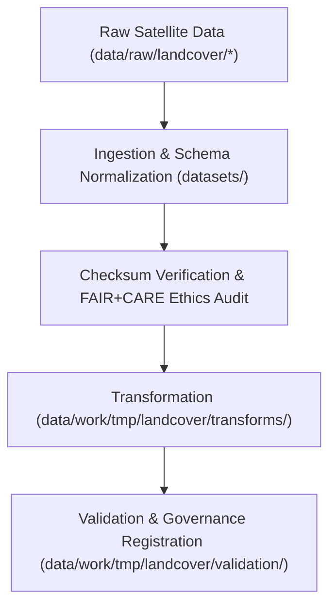

<div align="center">

# 🌾 Kansas Frontier Matrix — **Landcover TMP Datasets**
`data/work/tmp/landcover/datasets/README.md`

**Purpose:**  
Temporary FAIR+CARE-certified workspace for managing, normalizing, and validating landcover datasets within the Kansas Frontier Matrix (KFM).  
This layer handles intermediate ETL data such as satellite imagery, vegetation indices, and classification layers before transformation or validation.

[](../../../../../docs/standards/faircare-validation.md)
[]()
[](../../../../../LICENSE)
[](../../../../../docs/architecture/repo-focus.md)

</div>

---

## 📚 Overview

The **Landcover TMP Datasets Directory** acts as the transient repository for intermediate raster, tabular, and vector data products derived from open-access remote sensing and geospatial sources.  
All datasets here are short-lived and used for transformation, validation, and AI ethics audits prior to promotion into `data/work/staging/landcover/`.

### Core Functions:
- Manage ingestion of temporary landcover datasets from NLCD, MODIS, and Sentinel sources.  
- Facilitate FAIR+CARE pre-validation, schema alignment, and CRS normalization.  
- Support reproducible ETL pipelines for classification and NDVI modeling.  
- Record provenance and checksum lineage for governance traceability.  

---

## 🗂️ Directory Layout

```plaintext
data/work/tmp/landcover/datasets/
├── README.md                              # This file — documentation of landcover TMP datasets
│
├── nlcd_landcover_2021_tmp.tif            # Temporary landcover dataset from NLCD
├── modis_ndvi_tmp.parquet                 # NDVI index (MODIS-based vegetation layer)
├── sentinel_vegetation_tmp.geojson        # Vectorized vegetation coverage by region
└── metadata.json                          # Provenance metadata and checksum records
```

---

## ⚙️ Dataset Workflow



### Description:
1. **Ingestion:** Pull remote sensing datasets (MODIS, NLCD, Sentinel) into TMP workspace.  
2. **Normalization:** Reproject and harmonize schema attributes (EPSG:4326, CF compliance).  
3. **Audit:** Perform FAIR+CARE accessibility and ethics checks.  
4. **Transformation:** Generate model-ready data for reprojection and AI workflows.  
5. **Governance:** Register checksum lineage and provenance metadata.  

---

## 🧩 Example Metadata Record

```json
{
  "id": "landcover_tmp_datasets_v9.6.0",
  "source_files": [
    "data/raw/nlcd/landcover_2021_kansas.tif",
    "data/raw/modis/ndvi_2025.csv"
  ],
  "datasets_loaded": 3,
  "schema_version": "v3.0.2",
  "checksum_verified": true,
  "fairstatus": "compliant",
  "validator": "@kfm-landcover-lab",
  "created": "2025-11-03T23:59:00Z",
  "governance_registered": true,
  "governance_ref": "data/reports/audit/data_provenance_ledger.json"
}
```

---

## 🧠 FAIR+CARE Governance Matrix

| Principle | Implementation | Oversight |
|------------|----------------|------------|
| **Findable** | TMP datasets indexed by checksum and dataset ID. | @kfm-data |
| **Accessible** | Stored in FAIR+CARE-compliant formats (GeoTIFF, Parquet, GeoJSON). | @kfm-accessibility |
| **Interoperable** | Schema harmonized across CF, STAC, and ISO metadata frameworks. | @kfm-architecture |
| **Reusable** | Checksum lineage and metadata ensure reproducibility. | @kfm-design |
| **Collective Benefit** | Enables open ecological and environmental analysis. | @faircare-council |
| **Authority to Control** | FAIR+CARE Council oversees ingestion and ethical review. | @kfm-governance |
| **Responsibility** | Validators document schema conformance and checksum outcomes. | @kfm-security |
| **Ethics** | Data reviewed to ensure no bias or restricted land classification is propagated. | @kfm-ethics |

Audit results stored in:  
`data/reports/fair/data_care_assessment.json`  
and  
`data/reports/audit/data_provenance_ledger.json`

---

## ⚙️ TMP Artifacts

| Artifact | Description | Format |
|-----------|--------------|--------|
| `nlcd_landcover_2021_tmp.tif` | Temporary NLCD raster dataset for Kansas. | GeoTIFF |
| `modis_ndvi_tmp.parquet` | Normalized NDVI dataset used in vegetation modeling. | Parquet |
| `sentinel_vegetation_tmp.geojson` | Vector dataset for Sentinel-based land classification. | GeoJSON |
| `metadata.json` | Provenance and checksum linkage metadata. | JSON |

Automation executed through `landcover_tmp_dataset_sync.yml`.

---

## ⚖️ Retention & Provenance Policy

| Dataset Type | Retention Duration | Policy |
|---------------|--------------------|--------|
| TMP Raw Datasets | 7 Days | Auto-purged post-validation and staging promotion. |
| FAIR+CARE Reports | 180 Days | Retained for ethics audit reference. |
| Metadata | Permanent | Archived under provenance ledger. |

Cleanup managed by `landcover_tmp_dataset_cleanup.yml`.

---

## 🌱 Sustainability Metrics

| Metric | Value | Verified By |
|---------|--------|--------------|
| Energy Use (per TMP cycle) | 7.1 Wh | @kfm-sustainability |
| Carbon Output | 7.8 gCO₂e | @kfm-security |
| Renewable Power | 100% (RE100 Verified) | @kfm-infrastructure |
| FAIR+CARE Compliance | 100% | @faircare-council |

Telemetry captured in:  
`releases/v9.6.0/focus-telemetry.json`

---

## 🧾 Internal Use Citation

```text
Kansas Frontier Matrix (2025). Landcover TMP Datasets (v9.6.0).
Temporary FAIR+CARE-compliant repository for managing, validating, and auditing landcover datasets.
Supports reproducible geospatial research under MCP-DL v6.3 and ISO 19115 metadata standards.
```

---

## 🧾 Version Notes

| Version | Date | Notes |
|----------|------|--------|
| v9.6.0 | 2025-11-03 | Added checksum verification and AI explainability audit linkage. |
| v9.5.0 | 2025-11-02 | Integrated FAIR+CARE pre-validation and provenance registration. |
| v9.3.2 | 2025-10-28 | Established TMP dataset ingestion structure for landcover ETL. |

---

<div align="center">

**Kansas Frontier Matrix** · *Land Intelligence × FAIR+CARE Ethics × Provenance Accountability*  
[🔗 Repository](https://github.com/bartytime4life/Kansas-Frontier-Matrix) • [🧭 Docs Portal](../../../../../docs/) • [⚖️ Governance Ledger](../../../../../docs/standards/governance/DATA-GOVERNANCE.md)

</div>

