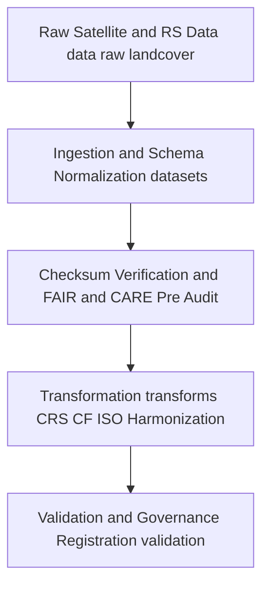

<div align="center">

# 🌾 **Kansas Frontier Matrix — Landcover TMP Datasets**
`data/work/landcover/datasets/README.md`

**Purpose:**  
FAIR+CARE-certified temporary workspace for **managing, normalizing, and validating landcover datasets** within the Kansas Frontier Matrix (KFM).  
Upgraded with **telemetry v2** (energy Wh, carbon gCO₂e, coverage %, duration) and **JSON-LD lineage anchors**. Stages intermediate ETL artifacts—satellite rasters, vegetation indices (NDVI NDMI), and classification layers—prior to transformation and validation, with full **checksum, provenance, and ethics** controls.

[](../../../../../docs/README.md)
[](../../../../../LICENSE)
[](../../../../../docs/standards/faircare.md)
[]()

</div>

---

## 📘 Overview

The **Landcover TMP Datasets** directory is the transient repository for raster, vector, and tabular inputs sourced from **NLCD, MODIS, Landsat, Sentinel, Copernicus** and partner archives.  
All contents are short lived and used for **schema alignment, CRS normalization to EPSG 4326, FAIR and CARE pre validation, and XAI aware preparation** before promotion to `data/work/staging/landcover/`.

**v10 enhancements**

- **Telemetry v2** for each ingestion and normalization step (`telemetry_ref`, `telemetry_v2` block in `metadata.json`).  
- **JSON-LD lineage** (`prov:wasDerivedFrom`, `prov:wasGeneratedBy`) to bind raw sources → TMP artifacts → transforms → ledger entries.  
- Hardened **CF and ISO** attribute and unit checks; continuous checksum reconciliation against `manifest.zip`.

### Core functions

- Ingest and buffer landcover and vegetation datasets from trusted open sources.  
- Facilitate **CF and ISO** metadata enrichment, **STAC/DCAT** schema mapping, and unit normalization.  
- Support reproducible ETL for classification and index computation with **telemetry v2** capture.  
- Record **provenance and checksum lineage** for governance traceability.

---

## 🗂️ Directory Layout

```plaintext
data/work/tmp/landcover/datasets/
├── README.md                             # This file — Landcover TMP datasets overview
│
├── nlcd_landcover_2021_tmp.tif           # Temporary NLCD raster for Kansas
├── modis_ndvi_2025_tmp.parquet           # MODIS NDVI index in normalized schema
├── sentinel_vegetation_tmp.geojson       # Vectorized Sentinel based vegetation coverage
└── metadata.json                         # JSON LD lineage, checksums, telemetry v2, governance links
```

---

## ⚙️ Dataset Lifecycle Workflow



### Description

1. **Ingestion** — Pull authoritative remote sensing products (NLCD, MODIS, Landsat, Sentinel, Copernicus).  
2. **Normalization** — Apply EPSG 4326 reprojection, CF attribute and unit fixes, STAC and DCAT mapping.  
3. **Audit** — Run **FAIR and CARE** pre validation for accessibility, licensing, and sensitivity.  
4. **Transform** — Prepare model ready artifacts for downstream harmonization and XAI.  
5. **Govern** — Register checksum lineage and provenance to the **governance ledger** and update `manifest.zip`.

---

## 🧩 Example Dataset Metadata Record

```json
{
  "id": "landcover_tmp_datasets_v10.0.0",
  "source_files": [
    "data/raw/nlcd/landcover_2021_kansas.tif",
    "data/raw/modis/ndvi_2025.parquet"
  ],
  "datasets_loaded": 3,
  "schema_version": "v3.0.4",
  "schema_compliance": 0.995,
  "checksum_verified": true,
  "fairstatus": "certified",
  "telemetry": { "energy_wh": 6.9, "carbon_gco2e": 7.6, "coverage_pct": 100, "duration_s": 840 },
  "validator": "@kfm-landcover-lab",
  "created": "2025-11-09T00:00:00Z",
  "governance_registered": true,
  "governance_ref": "data/reports/audit/data_provenance_ledger.json"
}
```

---

## 🧠 FAIR+CARE Governance Matrix

| Principle | Implementation | Oversight |
|---|---|---|
| **Findable** | Datasets indexed by checksum, sensor or product, and cycle | `@kfm-data` |
| **Accessible** | GeoTIFF, Parquet, GeoJSON with licensing metadata | `@kfm-accessibility` |
| **Interoperable** | STAC and DCAT plus CF and ISO 19115 schema alignment | `@kfm-architecture` |
| **Reusable** | Provenance and checksum lineage ensure reproducibility | `@kfm-design` |
| **Collective Benefit** | Enables open ecological and land use planning | `@faircare-council` |
| **Authority to Control** | Council reviews ingestion and sensitivity flags | `@kfm-governance` |
| **Responsibility** | Teams document schema conformance and checksum results | `@kfm-security` |
| **Ethics** | Sensitive locations and attributes reviewed, bias mitigations applied | `@kfm-ethics` |

**Audit records:**  
`data/reports/fair/faircare_validation.json` · `data/reports/audit/data_provenance_ledger.json`

---

## ⚙️ TMP Artifacts

| File | Description | Format |
|---|---|---|
| `nlcd_landcover_2021_tmp.tif` | NLCD raster subset or clip for Kansas | GeoTIFF |
| `modis_ndvi_2025_tmp.parquet` | Normalized NDVI for modeling and QC | Parquet |
| `sentinel_vegetation_tmp.geojson` | Sentinel derived vegetation vectors | GeoJSON |
| `metadata.json` | Source to TMP lineage, checksums, JSON LD, telemetry v2 | JSON |

**Automation:** `landcover_tmp_dataset_sync_v10.yml`

---

## ⚖️ Retention & Provenance Policy

| Dataset Type | Retention | Policy |
|---|---:|---|
| TMP raw or harmonized | 7 Days | Auto purged post transform or validation |
| FAIR and CARE pre audit reports | 365 Days | Retained for ethics review |
| Metadata and checksums | Permanent | Immutable in provenance ledger |

---

## 🌱 Sustainability Metrics

| Metric | Value | Verified By |
|---|---:|---|
| Energy use per TMP cycle | 6.9 Wh | `@kfm-sustainability` |
| Carbon output | 7.6 gCO₂e | `@kfm-security` |
| Renewable power | 100 percent RE100 | `@kfm-infrastructure` |
| FAIR and CARE compliance | 100 percent | `@kfm-faircare` |

**Telemetry:** `../../../../../releases/v10.0.0/focus-telemetry.json`

---

## 🧾 Citation

```text
Kansas Frontier Matrix (2025). Landcover TMP Datasets (v10.0.0).
FAIR+CARE-certified transient repository for landcover dataset ingestion, normalization, and ethics pre validation with JSON LD lineage and telemetry v2, under MCP-DL v6.3 and ISO 19115.
```

---

## 🕰️ Version History

| Version | Date | Author | Summary |
|---|---|---|---|
| v10.0.0 | 2025-11-09 | `@kfm-landcover-lab` | Upgrade to v10: telemetry v2, JSON LD lineage anchors, strengthened CF and ISO checks. |
| v9.7.0  | 2025-11-07 | `@kfm-landcover-lab` | Telemetry schema added; governance and CF ISO alignment refined. |
| v9.6.0  | 2025-11-03 | `@kfm-landcover-lab` | Added checksum verification and XAI audit linkage. |

---

<div align="center">

**Kansas Frontier Matrix**  
*Land Intelligence × FAIR+CARE Ethics × Provenance Accountability*  
© 2025 Kansas Frontier Matrix — CC-BY 4.0 · **Diamond⁹ Ω / Crown∞Ω** Ultimate Certified  

[Back to Landcover TMP](../README.md) · [Governance Charter](../../../../../docs/standards/governance/DATA-GOVERNANCE.md)

</div>
