<div align="center">

# 🌾 Kansas Frontier Matrix — **Landcover TMP Datasets**
`data/work/tmp/landcover/datasets/README.md`

**Purpose:**  
FAIR+CARE-certified temporary workspace for **managing, normalizing, and validating landcover datasets** within the Kansas Frontier Matrix (KFM).  
This layer stages intermediate ETL artifacts—satellite rasters, vegetation indices (NDVI/NDMI), and classification layers—prior to transformation and validation, with full **checksum, provenance, and ethics** controls.

[](../../../../../docs/architecture/README.md)
[](../../../../../LICENSE)
[](../../../../../docs/standards/faircare-validation.md)
[]()

</div>

---

## 📘 Overview

The **Landcover TMP Datasets** directory is the transient repository for raster, vector, and tabular inputs sourced from **NLCD, MODIS, Landsat, Sentinel, Copernicus** and partner archives.  
All contents are short-lived and used for **schema alignment, CRS normalization (EPSG:4326), FAIR+CARE pre-validation, and XAI-aware preparation** before promotion to `data/work/staging/landcover/`.

### Core Functions
- Ingest and buffer landcover/vegetation datasets from trusted open sources.  
- Facilitate **CF/ISO** metadata enrichment, schema mapping (STAC/DCAT), and unit normalization.  
- Support reproducible ETL for classification and index computation with **telemetry** capture.  
- Record **provenance & checksum lineage** for governance traceability.

---

## 🗂️ Directory Layout

```plaintext
data/work/tmp/landcover/datasets/
├── README.md                            # This file — Landcover TMP datasets overview
│
├── nlcd_landcover_2021_tmp.tif          # Temporary NLCD raster for Kansas
├── modis_ndvi_2025_tmp.parquet          # MODIS NDVI index in normalized schema
├── sentinel_vegetation_tmp.geojson      # Vectorized Sentinel-based vegetation coverage
└── metadata.json                        # Provenance, checksums, telemetry & governance links
```

---

## ⚙️ Dataset Lifecycle Workflow

```mermaid
flowchart TD
    A["Raw Satellite/RS Data (data/raw/landcover/*)"] --> B["Ingestion & Schema Normalization (datasets/)"]
    B --> C["Checksum Verification · FAIR+CARE Ethics Pre-Audit"]
    C --> D["Transformation (../transforms/) — CRS/CF/ISO Harmonization"]
    D --> E["Validation & Governance Registration (../validation/)"]
```



### Description
1. **Ingestion** — Pull authoritative remote-sensing products (NLCD, MODIS, Landsat, Sentinel, Copernicus).  
2. **Normalization** — Apply EPSG:4326 reprojection, CF attribute & unit fixes, STAC/DCAT mapping.  
3. **Audit** — Run **FAIR+CARE** pre-validation (accessibility, licensing, sensitivity).  
4. **Transform** — Prepare model-ready artifacts for downstream harmonization and XAI.  
5. **Govern** — Register checksum lineage and provenance to the **governance ledger**.

---

## 🧩 Example Dataset Metadata Record

```json
{
  "id": "landcover_tmp_datasets_v9.7.0",
  "source_files": [
    "data/raw/nlcd/landcover_2021_kansas.tif",
    "data/raw/modis/ndvi_2025.parquet"
  ],
  "datasets_loaded": 3,
  "schema_version": "v3.0.3",
  "schema_compliance": 0.99,
  "checksum_verified": true,
  "fairstatus": "certified",
  "telemetry": { "energy_wh": 7.1, "carbon_gco2e": 7.8 },
  "validator": "@kfm-landcover-lab",
  "created": "2025-11-07T00:00:00Z",
  "governance_registered": true,
  "governance_ref": "data/reports/audit/data_provenance_ledger.json"
}
```

---

## 🧠 FAIR+CARE Governance Matrix

| Principle | Implementation | Oversight |
|---|---|---|
| **Findable** | Datasets indexed by checksum, sensor/product, and cycle | @kfm-data |
| **Accessible** | GeoTIFF/Parquet/GeoJSON with open licensing metadata | @kfm-accessibility |
| **Interoperable** | STAC/DCAT + CF + ISO 19115 schema alignment | @kfm-architecture |
| **Reusable** | Provenance & checksum lineage ensure reproducibility | @kfm-design |
| **Collective Benefit** | Enables open ecological & land-use planning | @faircare-council |
| **Authority to Control** | Council reviews ingestion & sensitivity flags | @kfm-governance |
| **Responsibility** | Teams document schema conformance & checksum results | @kfm-security |
| **Ethics** | Sensitive locations/attributes reviewed; bias mitigations applied | @kfm-ethics |

**Audit Records:**  
`data/reports/fair/data_care_assessment.json` · `data/reports/audit/data_provenance_ledger.json`

---

## ⚙️ TMP Artifacts

| File | Description | Format |
|---|---|---|
| `nlcd_landcover_2021_tmp.tif` | NLCD raster subset/clip for Kansas | GeoTIFF |
| `modis_ndvi_2025_tmp.parquet` | Normalized NDVI for modeling & QC | Parquet |
| `sentinel_vegetation_tmp.geojson` | Sentinel-derived vegetation vectors | GeoJSON |
| `metadata.json` | Provenance (source → TMP), checksums, telemetry refs | JSON |

**Automation:** `landcover_tmp_dataset_sync.yml`

---

## ⚖️ Retention & Provenance Policy

| Dataset Type | Retention | Policy |
|---|---:|---|
| TMP Raw/Harmonized Datasets | 7 Days | Auto-purged post-transform/validation |
| FAIR+CARE Pre-Audit Reports | 180 Days | Retained for ethics review |
| Metadata & Checksums | Permanent | Immutable in provenance ledger |

---

## 🌱 Sustainability Metrics

| Metric | Value | Verified By |
|---|---:|---|
| Energy Use (per TMP cycle) | 7.0 Wh | @kfm-sustainability |
| Carbon Output | 7.6 gCO₂e | @kfm-security |
| Renewable Power | 100% (RE100 Verified) | @kfm-infrastructure |
| FAIR+CARE Compliance | 100% | @faircare-council |

**Telemetry:** `../../../../../releases/v9.7.0/focus-telemetry.json`

---

## 🧾 Citation

```text
Kansas Frontier Matrix (2025). Landcover TMP Datasets (v9.7.0).
FAIR+CARE-certified transient repository for landcover dataset ingestion, normalization, and ethics pre-validation with full checksum and provenance tracking under MCP-DL v6.3 and ISO 19115.
```

---

## 🕰️ Version History

| Version | Date | Author | Summary |
|---|---|---|---|
| v9.7.0 | 2025-11-07 | `@kfm-landcover-lab` | Upgraded to v9.7.0; telemetry schema added; governance & CF/ISO alignment refined. |
| v9.6.0 | 2025-11-03 | `@kfm-landcover-lab` | Added checksum verification & XAI audit linkage. |

---

<div align="center">

**Kansas Frontier Matrix**  
*Land Intelligence × FAIR+CARE Ethics × Provenance Accountability*  
© 2025 Kansas Frontier Matrix — Master Coder Protocol v6.3 · FAIR+CARE Certified · **Diamond⁹ Ω / Crown∞Ω** Ultimate Certified  

[Back to Landcover TMP](../README.md) · [Governance Charter](../../../../../docs/standards/governance/DATA-GOVERNANCE.md)

</div>