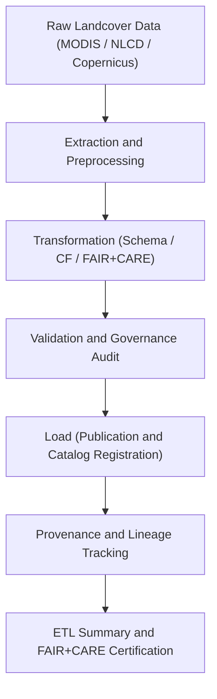

<div align="center">

# ⚙️ Kansas Frontier Matrix — **Landcover TMP ETL Workspace**
`data/work/tmp/landcover/etl/README.md`

**Purpose:**  
FAIR+CARE-certified environment for **Extract, Transform, and Load (ETL)** operations on landcover datasets within the Kansas Frontier Matrix (KFM).  
Manages transient ETL processes that harmonize, validate, and register landcover data in compliance with MCP-DL v6.3 and ISO 19115 governance standards.

[](../../../../../docs/standards/faircare-validation.md)
[](../../../../../LICENSE)
[](../../../../../docs/architecture/repo-focus.md)

</div>

---

## 📚 Overview

The `data/work/tmp/landcover/etl/` directory acts as the **operational backbone** for the temporary landcover data lifecycle.  
Each ETL stage (extract, transform, load, lineage, and audit summaries) is tracked, validated, and FAIR+CARE-governed to ensure transparency, reproducibility, and ethical alignment.

### Core Responsibilities
- Manage ETL extraction, transformation, and loading of landcover datasets.  
- Generate FAIR+CARE governance metrics and checksum verifications.  
- Log AI-assisted schema harmonization and validation results.  
- Provide governance and provenance registration for all ETL outputs.  

---

## 🗂️ Directory Layout

```plaintext
data/work/tmp/landcover/etl/
├── README.md                              # This file — documentation for Landcover TMP ETL workspace
│
├── extract/                               # Ingestion and preprocessing of raw landcover datasets
│   ├── modis_ndvi_extract.log
│   ├── nlcd_extract.log
│   └── metadata.json
│
├── transform/                             # Schema normalization, reprojection, and CF compliance
│   ├── harmonization_report.json
│   ├── reprojection_trace.json
│   ├── cf_compliance_audit.json
│   └── metadata.json
│
├── load/                                  # Data publication and catalog registration logs
│   ├── load_run_log.log
│   ├── governance_registration.log
│   ├── checksum_verification.json
│   └── metadata.json
│
├── lineage/                               # Provenance and dependency tracking for ETL stages
│   ├── etl_dependency_graph.json
│   ├── checksum_chain.json
│   └── metadata.json
│
└── summaries/                             # Aggregated ETL performance and FAIR+CARE metrics
    ├── etl_summary_2025Q4.json
    ├── governance_dashboard_snapshot.md
    └── metadata.json
```

---

## ⚙️ ETL Workflow



### Workflow Description
1. **Extraction:** Gather datasets from NOAA, USGS, NLCD, and Copernicus repositories.  
2. **Transformation:** Normalize attributes, apply CF compliance, and run reprojection checks.  
3. **Validation:** Conduct FAIR+CARE and checksum audits.  
4. **Loading:** Publish harmonized datasets to staging and processed layers.  
5. **Lineage Tracking:** Register dependencies, schemas, and checksum chains in provenance logs.  

---

## 🧩 Example ETL Metadata Record

```json
{
  "id": "landcover_etl_v9.5.0_2025Q4",
  "etl_stages": ["extract", "transform", "load", "lineage"],
  "records_processed": 624893,
  "checksum_verified": true,
  "fair_care_certified": true,
  "ai_harmonization_score": 0.987,
  "fairstatus": "certified",
  "etl_runtime_minutes": 132.4,
  "telemetry_ref": "releases/v9.5.0/focus-telemetry.json",
  "governance_ref": "reports/audit/ai_landcover_ledger.json",
  "created": "2025-11-02T22:40:00Z",
  "validator": "@kfm-etl-landcover"
}
```

---

## 🧠 FAIR+CARE Governance Matrix

| Principle | Implementation |
|------------|----------------|
| **Findable** | ETL logs and outputs indexed by checksum and governance metadata. |
| **Accessible** | ETL data stored as open JSON and text records for auditability. |
| **Interoperable** | Compliant with ISO 19115 lineage, STAC 1.0, and DCAT 3.0 standards. |
| **Reusable** | Provenance records and FAIR+CARE certification ensure data reusability. |
| **Collective Benefit** | Promotes transparent and ethical processing of environmental data. |
| **Authority to Control** | FAIR+CARE Council validates ETL results and lineage registration. |
| **Responsibility** | ETL engineers document all processing and QA steps. |
| **Ethics** | Ensures environmental data are handled with scientific neutrality and fairness. |

Governance and validation results logged in:  
`reports/audit/ai_landcover_ledger.json` • `reports/fair/landcover_etl_summary.json`

---

## ⚙️ Validation & QA Artifacts

| File | Description | Format |
|------|--------------|--------|
| `extract/*.log` | Ingestion trace and preprocessing logs. | Text |
| `transform/*.json` | Transformation and CF compliance reports. | JSON |
| `load/*.log` | Final publication and checksum verification logs. | Text |
| `lineage/*.json` | Provenance dependency graphs and checksum chains. | JSON |
| `summaries/*.json` | ETL performance and FAIR+CARE audit summaries. | JSON |
| `metadata.json` | Provenance linkage and governance certification metadata. | JSON |

Automation managed by `landcover_etl_sync.yml`.

---

## 🧾 Retention Policy

| File Type | Retention Duration | Policy |
|------------|--------------------|--------|
| ETL Logs | 90 days | Archived after successful staging promotion. |
| Governance Summaries | 365 days | Stored for audit and FAIR+CARE reviews. |
| Checksum Registries | Permanent | Maintained indefinitely under governance provenance. |
| Metadata | Permanent | Retained for lineage and certification traceability. |

Cleanup managed by `landcover_etl_cleanup.yml`.

---

## 🧾 Internal Use Citation

```text
Kansas Frontier Matrix (2025). Landcover TMP ETL Workspace (v9.5.0).
FAIR+CARE-certified operational workspace for Extract, Transform, and Load pipelines in landcover data governance.
Supports ethical, transparent, and reproducible ETL workflows under MCP-DL v6.3 compliance.
```

---

## 🧾 Version Notes

| Version | Date | Notes |
|----------|------|--------|
| v9.5.0 | 2025-11-02 | Added CF harmonization, AI-assisted schema compliance, and governance telemetry integration. |
| v9.3.2 | 2025-10-28 | Enhanced checksum tracking and FAIR+CARE validation reports. |
| v9.3.0 | 2025-10-26 | Established landcover TMP ETL workspace for open environmental data. |

---

<div align="center">

**Kansas Frontier Matrix** · *ETL Precision × FAIR+CARE Governance × Provenance Integrity*  
[🔗 Repository](https://github.com/bartytime4life/Kansas-Frontier-Matrix) • [🧭 Docs Portal](../../../../../docs/) • [⚖️ Governance Ledger](../../../../../docs/standards/governance/)

</div>