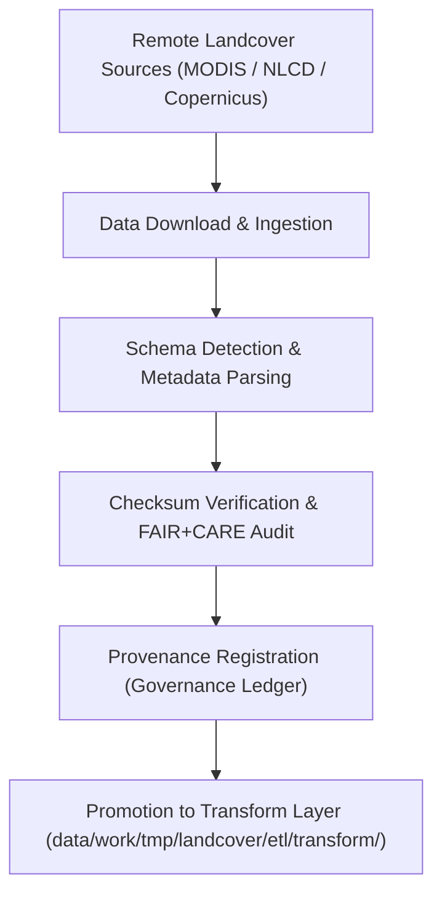

<div align="center">

# 📥 Kansas Frontier Matrix — **Landcover TMP ETL Extract Layer**
`data/work/tmp/landcover/etl/extract/README.md`

**Purpose:**  
Governed FAIR+CARE-certified workspace for **data extraction and ingestion** of landcover datasets in the Kansas Frontier Matrix (KFM).  
This layer consolidates raw inputs from MODIS, NLCD, Copernicus, and ancillary vegetation indices into standardized ingestion formats ready for transformation and validation.

[](../../../../../../docs/standards/faircare-validation.md)
[](../../../../../../LICENSE)
[](../../../../../../docs/architecture/repo-focus.md)

</div>

---

## 📚 Overview

The `data/work/tmp/landcover/etl/extract/` directory captures **raw data ingestion logs, downloads, and pre-validation summaries** for landcover and vegetation datasets.  
It ensures every extraction process is checksum-verified, ethically documented, and reproducible under FAIR+CARE governance standards.

### Core Responsibilities
- Ingest raw landcover and vegetation datasets from verified public repositories.  
- Apply schema detection, metadata capture, and provenance validation.  
- Log all extraction actions, integrity checks, and FAIR+CARE audits.  
- Register lineage metadata in KFM’s governance ledger and focus telemetry.  

---

## 🗂️ Directory Layout

```plaintext
data/work/tmp/landcover/etl/extract/
├── README.md                               # This file — overview of the ETL extract layer
│
├── modis_ndvi_extract.log                  # Log for MODIS NDVI dataset ingestion
├── nlcd_extract.log                        # Log for NLCD landcover dataset extraction
├── copernicus_landcover_extract.log        # Log for Copernicus landcover ingestion
├── checksum_validation_extract.json        # Checksum registry for all extracted datasets
└── metadata.json                           # Provenance metadata and governance linkage
```

---

## ⚙️ Extraction Workflow



### Workflow Description
1. **Ingestion:** Data retrieved via official APIs or FTP from MODIS, NLCD, or Copernicus servers.  
2. **Metadata Extraction:** Schema and geospatial metadata automatically parsed and documented.  
3. **Checksum Verification:** File integrity validated against SHA-256 hash records.  
4. **FAIR+CARE Review:** Ensure ethical, transparent, and traceable data use.  
5. **Governance:** Log all lineage events in provenance and AI governance ledgers.  

---

## 🧩 Example Extraction Metadata Record

```json
{
  "id": "landcover_etl_extract_v9.5.0_2025Q4",
  "source_endpoints": [
    "NASA MODIS FTP",
    "USGS NLCD API",
    "Copernicus Global Land Service"
  ],
  "datasets_downloaded": [
    "modis_ndvi_composite_2025.tif",
    "nlcd_kansas_2021.tif",
    "copernicus_landcover_2025.tif"
  ],
  "records_ingested": 328417,
  "checksum_verified": true,
  "fairstatus": "compliant",
  "governance_registered": true,
  "telemetry_ref": "releases/v9.5.0/focus-telemetry.json",
  "governance_ref": "reports/audit/ai_landcover_ledger.json",
  "created": "2025-11-02T22:50:00Z",
  "validator": "@kfm-landcover-etl"
}
```

---

## 🧠 FAIR+CARE Governance Matrix

| Principle | Implementation |
|------------|----------------|
| **Findable** | Each extraction log indexed by dataset and source metadata. |
| **Accessible** | Stored as open text and JSON logs under FAIR+CARE governance. |
| **Interoperable** | Extraction metadata follows ISO 19115 lineage and DCAT 3.0 conventions. |
| **Reusable** | Provenance metadata and checksum records enable full reproducibility. |
| **Collective Benefit** | Supports sustainable, ethical open data stewardship. |
| **Authority to Control** | FAIR+CARE Council oversees dataset acquisition compliance. |
| **Responsibility** | Validators document ingestion methods and integrity verifications. |
| **Ethics** | Ensures datasets originate from non-restricted, open-science sources. |

Audit and governance results maintained in:  
`reports/audit/ai_landcover_ledger.json` • `reports/fair/landcover_etl_extract_summary.json`

---

## ⚙️ Validation & QA Artifacts

| File | Description | Format |
|------|--------------|--------|
| `*_extract.log` | Individual ingestion and extraction logs for each dataset source. | Text |
| `checksum_validation_extract.json` | File integrity verification for all downloads. | JSON |
| `metadata.json` | Provenance metadata and governance registration record. | JSON |

Automation synchronized via `landcover_etl_extract_sync.yml`.

---

## 🧾 Retention Policy

| File Type | Retention Duration | Policy |
|------------|--------------------|--------|
| Extraction Logs | 90 days | Archived after ETL completion. |
| Checksum Reports | 365 days | Retained for provenance and audit review. |
| Metadata | Permanent | Maintained indefinitely in governance registry. |

Cleanup managed via `landcover_etl_extract_cleanup.yml`.

---

## 🧾 Internal Use Citation

```text
Kansas Frontier Matrix (2025). Landcover TMP ETL Extract Layer (v9.5.0).
FAIR+CARE-certified environment for ethical ingestion, provenance registration, and checksum validation of landcover datasets.
Ensures transparent and reproducible extraction workflows under MCP-DL v6.3 compliance.
```

---

## 🧾 Version Notes

| Version | Date | Notes |
|----------|------|--------|
| v9.5.0 | 2025-11-02 | Added Copernicus extraction workflows and checksum validation automation. |
| v9.3.2 | 2025-10-28 | Improved FAIR+CARE ethics audit and provenance registration. |
| v9.3.0 | 2025-10-26 | Established Landcover TMP ETL Extract workspace for open dataset ingestion. |

---

<div align="center">

**Kansas Frontier Matrix** · *Data Ingestion × FAIR+CARE Governance × Provenance Assurance*  
[🔗 Repository](https://github.com/bartytime4life/Kansas-Frontier-Matrix) • [🧭 Docs Portal](../../../../../../docs/) • [⚖️ Governance Ledger](../../../../../../docs/standards/governance/)

</div>