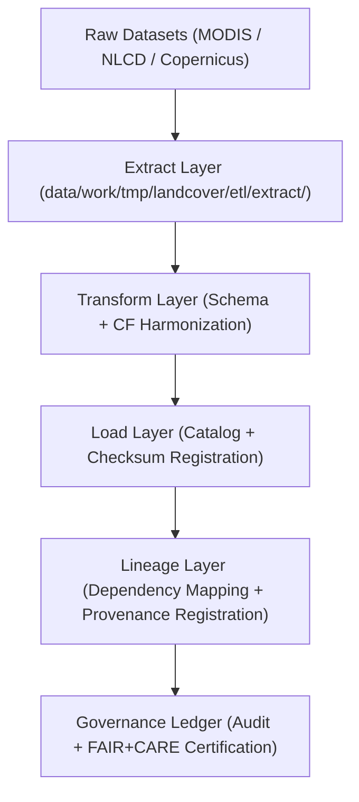

<div align="center">

# ⛓️ Kansas Frontier Matrix — **Landcover TMP ETL Lineage Layer**
`data/work/tmp/landcover/etl/lineage/README.md`

**Purpose:**  
FAIR+CARE-certified workspace for **tracking data lineage, dependency flow, and provenance verification** within the Landcover ETL pipeline in the Kansas Frontier Matrix (KFM).  
This directory ensures that every data transformation, validation, and publication step is fully traceable and audit-ready under ethical and reproducible science frameworks.

[](../../../../../../docs/standards/faircare-validation.md)
[](../../../../../../LICENSE)
[](../../../../../../docs/architecture/repo-focus.md)

</div>

---

## 📚 Overview

The `data/work/tmp/landcover/etl/lineage/` directory stores **lineage graphs, dependency mappings, and checksum verification chains** for all Landcover ETL processes.  
It forms a critical part of KFM’s reproducibility chain, allowing any dataset to be traced back through each extract, transform, and load event, ensuring full transparency.

### Core Responsibilities
- Document lineage relationships between raw, intermediate, and processed datasets.  
- Maintain a checksum dependency chain for reproducibility.  
- Synchronize provenance metadata with the KFM Governance Ledger.  
- Provide lineage graphs for visualization and FAIR+CARE audit readiness.  

---

## 🗂️ Directory Layout

```plaintext
data/work/tmp/landcover/etl/lineage/
├── README.md                                 # This file — documentation of Landcover ETL lineage layer
│
├── etl_dependency_graph.json                 # Directed graph of dataset and workflow dependencies
├── checksum_chain.json                       # Hash chain linking all ETL transformation outputs
├── provenance_trace_report.json              # Provenance metadata and FAIR+CARE lineage report
└── metadata.json                             # Governance linkage and checksum registry record
```

---

## ⚙️ Lineage Workflow



### Workflow Description
1. **Capture:** Track dependencies across ETL stages (extract, transform, load).  
2. **Verify:** Generate and cross-check checksum chains across datasets.  
3. **Document:** Build machine-readable lineage maps with FAIR+CARE annotations.  
4. **Register:** Log lineage data into the Governance Ledger and manifest.  
5. **Visualize:** Enable Focus Mode or dashboard rendering of lineage relationships.

---

## 🧩 Example Lineage Record

```json
{
  "id": "landcover_etl_lineage_v9.5.0_2025Q4",
  "dependencies": [
    {
      "source": "data/work/tmp/landcover/etl/extract/modis_ndvi_extract.log",
      "output": "data/work/tmp/landcover/etl/transform/harmonization_report.json",
      "checksum": "sha256:9b13f27a2b0b3d9f49c29b2ecf50a381b0c33b99..."
    },
    {
      "source": "data/work/tmp/landcover/etl/transform/reprojection_trace.json",
      "output": "data/work/tmp/landcover/etl/load/checksum_verification.json",
      "checksum": "sha256:1f63c5a88e9185d2cfb57d91d1cb452a6b52982a..."
    }
  ],
  "records_traced": 14,
  "checksum_verified": true,
  "fairstatus": "compliant",
  "governance_registered": true,
  "telemetry_ref": "releases/v9.5.0/focus-telemetry.json",
  "governance_ref": "reports/audit/ai_landcover_ledger.json",
  "created": "2025-11-02T23:00:00Z",
  "validator": "@kfm-landcover-lineage"
}
```

---

## 🧠 FAIR+CARE Governance Matrix

| Principle | Implementation |
|------------|----------------|
| **Findable** | Each lineage graph indexed by ETL stage and checksum registry. |
| **Accessible** | Stored in JSON format for FAIR+CARE council and audit teams. |
| **Interoperable** | Compliant with ISO 19115 lineage and DCAT 3.0 metadata models. |
| **Reusable** | Lineage graphs enable reproducible research validation and AI governance. |
| **Collective Benefit** | Promotes ethical, traceable environmental data processing. |
| **Authority to Control** | FAIR+CARE Council validates lineage chain completeness. |
| **Responsibility** | Validators ensure checksum and dependency consistency. |
| **Ethics** | Upholds open-science transparency and anti-tampering safeguards. |

Audit results logged in:  
`reports/audit/ai_landcover_ledger.json` • `reports/fair/landcover_etl_lineage_summary.json`

---

## ⚙️ Validation & QA Artifacts

| File | Description | Format |
|------|--------------|--------|
| `etl_dependency_graph.json` | Full ETL dependency mapping for Landcover workflows. | JSON |
| `checksum_chain.json` | Hash chain verifying dataset and log consistency. | JSON |
| `provenance_trace_report.json` | FAIR+CARE-certified lineage report for governance submission. | JSON |
| `metadata.json` | Provenance linkage and governance registration metadata. | JSON |

Synchronization automated via `landcover_etl_lineage_sync.yml`.

---

## 🧾 Retention Policy

| File Type | Retention Duration | Policy |
|------------|--------------------|--------|
| Lineage Graphs | 365 days | Retained for reproducibility and FAIR+CARE audits. |
| Checksum Chains | Permanent | Stored for governance verification and integrity tracking. |
| Provenance Reports | 365 days | Archived under governance and ethics records. |
| Metadata | Permanent | Maintained indefinitely for lineage traceability. |

Cleanup automated via `landcover_etl_lineage_cleanup.yml`.

---

## 🧾 Internal Use Citation

```text
Kansas Frontier Matrix (2025). Landcover TMP ETL Lineage Layer (v9.5.0).
FAIR+CARE-certified environment for tracking dataset dependencies, checksum chains, and provenance metadata across ETL workflows.
Supports transparent, reproducible, and ethically governed landcover data processing under MCP-DL v6.3 standards.
```

---

## 🧾 Version Notes

| Version | Date | Notes |
|----------|------|--------|
| v9.5.0 | 2025-11-02 | Added checksum chain validation and AI-governance lineage integration. |
| v9.3.2 | 2025-10-28 | Improved FAIR+CARE audit coverage and manifest synchronization. |
| v9.3.0 | 2025-10-26 | Established Landcover TMP ETL Lineage workspace for provenance tracking. |

---

<div align="center">

**Kansas Frontier Matrix** · *Lineage Integrity × FAIR+CARE Ethics × Provenance Continuity*  
[🔗 Repository](https://github.com/bartytime4life/Kansas-Frontier-Matrix) • [🧭 Docs Portal](../../../../../../docs/) • [⚖️ Governance Ledger](../../../../../../docs/standards/governance/)

</div>