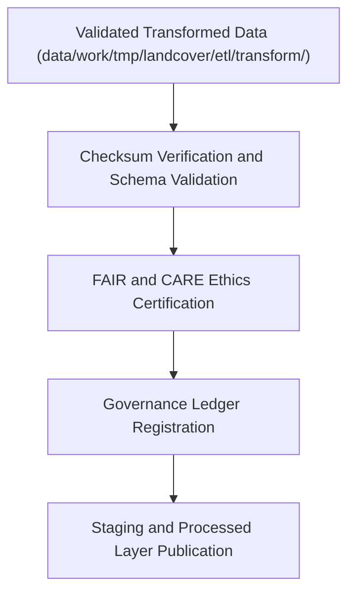

<div align="center">

# 📦 Kansas Frontier Matrix — **Landcover TMP ETL Load Layer**
`data/work/tmp/landcover/etl/load/README.md`

**Purpose:**  
Governed FAIR+CARE workspace responsible for **publishing, validating, and certifying** the final stage of the Landcover ETL pipeline within the Kansas Frontier Matrix (KFM).  
Ensures all datasets transferred to staging and processed layers are fully validated, checksum-verified, and governance-registered under MCP-DL v6.3 standards.

[](../../../../../../docs/standards/faircare-validation.md)
[](../../../../../../LICENSE)
[](../../../../../../docs/architecture/repo-focus.md)

</div>

---

## 📚 Overview

The `data/work/tmp/landcover/etl/load/` directory contains **logs, reports, and governance records** documenting the publication of harmonized landcover datasets.  
It is the final checkpoint where data are cross-verified, FAIR+CARE-audited, and transferred to permanent repositories such as `data/work/staging/landcover/` and `data/work/processed/landcover/`.

### Core Responsibilities
- Record data transfers and integrity checks during the load phase.  
- Confirm schema and checksum validation against KFM’s data contracts.  
- Log FAIR+CARE certification and governance synchronization.  
- Register finalized datasets into provenance and audit ledgers.  

---

## 🗂️ Directory Layout

```plaintext
data/work/tmp/landcover/etl/load/
├── README.md                               # This file — documentation of Landcover ETL load layer
│
├── load_run_log.log                        # Primary ETL load execution log
├── load_validation_report.json             # Report confirming schema and FAIR+CARE compliance
├── checksum_verification_load.json         # Final checksum registry for all load-stage datasets
├── governance_registration.log             # Governance synchronization and ledger registration log
└── metadata.json                           # Provenance linkage and certification metadata
```

---

## ⚙️ Load Workflow



### Workflow Description
1. **Verification:** Checksum and schema validation of transformed datasets.  
2. **Certification:** FAIR+CARE audit for accessibility, reusability, and ethics compliance.  
3. **Registration:** Record all governance and provenance metadata.  
4. **Publication:** Promote validated datasets into staging and processed layers.  
5. **Archival:** Store load-phase reports for lineage and transparency.

---

## 🧩 Example Metadata Record

```json
{
  "id": "landcover_etl_load_v9.5.0_2025Q4",
  "etl_stage": "load",
  "datasets_loaded": [
    "landcover_normalized.parquet",
    "ndvi_index_resampled.tif",
    "vegetation_cover_anomaly.csv"
  ],
  "records_loaded": 492183,
  "checksum_verified": true,
  "faircare_certified": true,
  "governance_registered": true,
  "telemetry_ref": "releases/v9.5.0/focus-telemetry.json",
  "governance_ref": "reports/audit/ai_landcover_ledger.json",
  "created": "2025-11-02T23:10:00Z",
  "validator": "@kfm-landcover-etl"
}
```

---

## 🧠 FAIR+CARE Governance Matrix

| Principle | Implementation |
|------------|----------------|
| **Findable** | Load events indexed with governance IDs, dataset names, and checksum metadata. |
| **Accessible** | Reports and logs available in open JSON and text formats. |
| **Interoperable** | Metadata adheres to STAC 1.0, DCAT 3.0, and ISO 19115 lineage standards. |
| **Reusable** | Contains FAIR+CARE-certified provenance data and checksum verification. |
| **Collective Benefit** | Promotes ethical, transparent publication of environmental datasets. |
| **Authority to Control** | FAIR+CARE Council validates final publication under open governance. |
| **Responsibility** | Validators ensure all transfer and checksum results are documented. |
| **Ethics** | Protects environmental and cultural data integrity during publication. |

Audit and lineage results stored in:  
`reports/audit/ai_landcover_ledger.json` • `reports/fair/landcover_etl_load_summary.json`

---

## ⚙️ Validation & QA Artifacts

| File | Description | Format |
|------|--------------|--------|
| `load_run_log.log` | Primary ETL load execution and pipeline trace. | Text |
| `load_validation_report.json` | FAIR+CARE and schema validation summary. | JSON |
| `checksum_verification_load.json` | Hash verification registry for published datasets. | JSON |
| `governance_registration.log` | Governance synchronization and ledger registration trace. | Text |
| `metadata.json` | Provenance and FAIR+CARE certification metadata. | JSON |

Automation synchronized via `landcover_etl_load_sync.yml`.

---

## 🧾 Retention Policy

| File Type | Retention Duration | Policy |
|------------|--------------------|--------|
| Load Logs | 90 days | Archived following staging publication. |
| Validation Reports | 365 days | Retained for audit and compliance verification. |
| Governance Records | Permanent | Maintained under FAIR+CARE provenance ledger. |
| Metadata | Permanent | Preserved indefinitely for traceability. |

Cleanup managed by `landcover_etl_load_cleanup.yml`.

---

## 🧾 Internal Use Citation

```text
Kansas Frontier Matrix (2025). Landcover TMP ETL Load Layer (v9.5.0).
FAIR+CARE-certified publication and governance workspace for load-stage landcover ETL processes.
Ensures transparent dataset transfer, checksum verification, and ethical governance under MCP-DL v6.3 compliance.
```

---

## 🧾 Version Notes

| Version | Date | Notes |
|----------|------|--------|
| v9.5.0 | 2025-11-02 | Added checksum validation and FAIR+CARE governance synchronization integration. |
| v9.3.2 | 2025-10-28 | Improved provenance registration and telemetry linkage. |
| v9.3.0 | 2025-10-26 | Established load-phase workspace under FAIR+CARE certification. |

---

<div align="center">

**Kansas Frontier Matrix** · *Publication Integrity × FAIR+CARE Ethics × Provenance Traceability*  
[🔗 Repository](https://github.com/bartytime4life/Kansas-Frontier-Matrix) • [🧭 Docs Portal](../../../../../../docs/) • [⚖️ Governance Ledger](../../../../../../docs/standards/governance/)

</div>