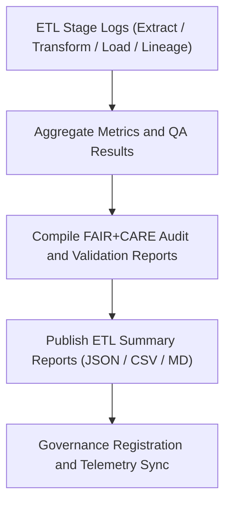

<div align="center">

# 📊 Kansas Frontier Matrix — **Landcover TMP ETL Summaries**
`data/work/tmp/landcover/etl/summaries/README.md`

**Purpose:**  
Governed FAIR+CARE-certified workspace for consolidated **ETL performance, audit, and governance summaries** related to Landcover datasets within the Kansas Frontier Matrix (KFM).  
This layer aggregates metrics, compliance results, and lineage overviews from extract, transform, and load processes for transparent, reproducible environmental data governance.

[](../../../../../../docs/standards/faircare-validation.md)
[](../../../../../../LICENSE)
[](../../../../../../docs/architecture/repo-focus.md)

</div>

---

## 📚 Overview

The `data/work/tmp/landcover/etl/summaries/` directory serves as the **central QA and reporting hub** for the Landcover ETL pipeline.  
It consolidates FAIR+CARE validation results, checksum audits, and governance metrics from across all ETL stages — extraction, transformation, loading, and lineage registration.

### Core Responsibilities
- Aggregate ETL metrics from all TMP landcover processing stages.  
- Summarize FAIR+CARE certification, schema validation, and governance results.  
- Provide reproducibility dashboards for audit and ethics compliance.  
- Feed lineage metrics into KFM’s **Focus Telemetry** and provenance ledgers.  

---

## 🗂️ Directory Layout

```plaintext
data/work/tmp/landcover/etl/summaries/
├── README.md                                   # This file — documentation for Landcover ETL summaries
│
├── etl_summary_2025Q4.json                     # Consolidated ETL metrics and FAIR+CARE audit summary
├── etl_performance_overview_2025Q4.csv         # Tabular ETL performance report (runtime, throughput)
├── governance_dashboard_snapshot_2025Q4.md     # Human-readable dashboard for FAIR+CARE and governance results
├── etl_audit_findings_matrix_2025Q4.json       # Cross-stage validation and ethics audit matrix
└── metadata.json                               # Provenance and governance linkage metadata
```

---

## ⚙️ ETL Summary Workflow



### Workflow Description
1. **Aggregation:** Collect ETL metrics from logs and telemetry datasets.  
2. **Audit:** Integrate FAIR+CARE ethics and compliance scores.  
3. **Dashboard:** Produce summary views for internal and public audit reviews.  
4. **Governance:** Register metrics and summaries into the provenance ledger.  
5. **Telemetry:** Synchronize with Focus Mode dashboards for traceability.

---

## 🧩 Example Metadata Record

```json
{
  "id": "landcover_etl_summaries_v9.5.0_2025Q4",
  "etl_cycle": "Q4 2025",
  "stages_included": ["extract", "transform", "load", "lineage"],
  "records_processed": 948230,
  "schema_validation_pass_rate": 99.7,
  "fairstatus": "certified",
  "avg_runtime_minutes": 128.5,
  "qa_audit_score": 99.4,
  "checksum_verified": true,
  "telemetry_ref": "releases/v9.5.0/focus-telemetry.json",
  "governance_ref": "reports/audit/ai_landcover_ledger.json",
  "created": "2025-11-02T23:20:00Z",
  "validator": "@kfm-landcover-etl"
}
```

---

## 🧠 FAIR+CARE Governance Matrix

| Principle | Implementation |
|------------|----------------|
| **Findable** | ETL summaries indexed by quarterly cycle and governance ledger entry. |
| **Accessible** | Reports stored in open JSON, CSV, and Markdown formats. |
| **Interoperable** | Schema adheres to FAIR, DCAT 3.0, and STAC 1.0 metadata standards. |
| **Reusable** | Provenance metadata and checksum validation ensure reproducibility. |
| **Collective Benefit** | Promotes open, ethical management of environmental data processes. |
| **Authority to Control** | FAIR+CARE Council reviews audit dashboards before publication. |
| **Responsibility** | Validators document all ETL audit outcomes and metrics. |
| **Ethics** | Validation includes sustainability and transparency metrics under CARE principles. |

Governance records maintained in:  
`reports/audit/ai_landcover_ledger.json` • `reports/fair/landcover_etl_summaries_summary.json`

---

## ⚙️ Validation & QA Artifacts

| File | Description | Format |
|------|--------------|--------|
| `etl_summary_*.json` | Combined metrics from all ETL stages. | JSON |
| `etl_performance_overview_*.csv` | Runtime and throughput performance summaries. | CSV |
| `governance_dashboard_snapshot_*.md` | FAIR+CARE dashboard for review committees. | Markdown |
| `etl_audit_findings_matrix_*.json` | Matrix of QA audit findings and resolutions. | JSON |
| `metadata.json` | Provenance and certification metadata. | JSON |

All automation managed via `landcover_etl_summaries_sync.yml`.

---

## 🧾 Retention Policy

| Summary Type | Retention Duration | Policy |
|---------------|--------------------|--------|
| ETL Summaries | 365 days | Retained for governance and reproducibility audits. |
| Performance Reports | 180 days | Archived for FAIR+CARE QA analysis. |
| Governance Dashboards | Permanent | Maintained indefinitely for ethical traceability. |
| Metadata | Permanent | Retained under provenance and checksum registry. |

Cleanup managed by `landcover_etl_summaries_cleanup.yml`.

---

## 🧾 Internal Use Citation

```text
Kansas Frontier Matrix (2025). Landcover TMP ETL Summaries (v9.5.0).
FAIR+CARE-certified environment aggregating ETL performance, validation, and governance metrics for reproducible landcover workflows.
Supports open-science ethics, provenance traceability, and continuous quality assurance under MCP-DL v6.3.
```

---

## 🧾 Version Notes

| Version | Date | Notes |
|----------|------|--------|
| v9.5.0 | 2025-11-02 | Added Focus Telemetry integration and improved FAIR+CARE metrics visualization. |
| v9.3.2 | 2025-10-28 | Enhanced checksum audit tracking and dashboard generation. |
| v9.3.0 | 2025-10-26 | Established ETL summaries workspace for governance reporting. |

---

<div align="center">

**Kansas Frontier Matrix** · *ETL Transparency × FAIR+CARE Ethics × Provenance Assurance*  
[🔗 Repository](https://github.com/bartytime4life/Kansas-Frontier-Matrix) • [🧭 Docs Portal](../../../../../../docs/) • [⚖️ Governance Ledger](../../../../../../docs/standards/governance/)

</div>