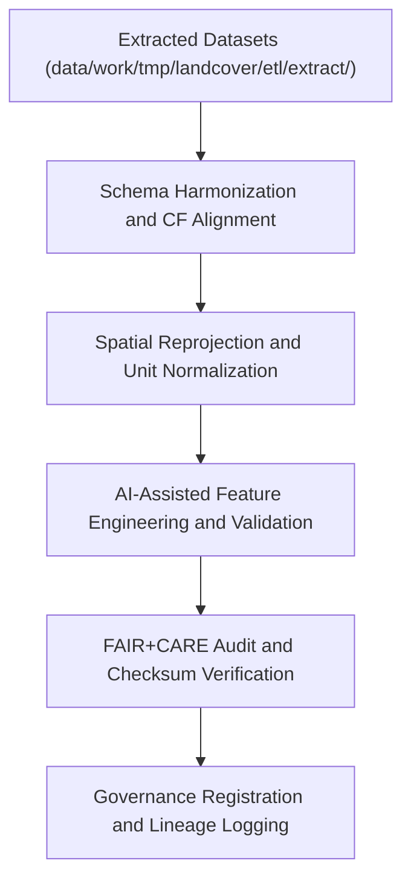

<div align="center">

# 🔄 Kansas Frontier Matrix — **Landcover TMP ETL Transform Layer**
`data/work/tmp/landcover/etl/transform/README.md`

**Purpose:**  
Governed FAIR+CARE-certified environment for **schema normalization, spatial reprojection, CF compliance, and harmonization** of landcover datasets in the Kansas Frontier Matrix (KFM).  
This workspace performs ethical and reproducible transformations that prepare datasets for AI modeling, validation, and staging publication.

[](../../../../../../docs/standards/faircare-validation.md)
[](../../../../../../LICENSE)
[](../../../../../../docs/architecture/repo-focus.md)

</div>

---

## 📚 Overview

The `data/work/tmp/landcover/etl/transform/` directory contains **intermediate transformation outputs** created during the ETL pipeline for landcover datasets.  
These transformations ensure each dataset meets FAIR+CARE, ISO 19115, and CF Conventions standards for interoperability and environmental data ethics.

### Core Responsibilities
- Normalize and harmonize landcover schemas (MODIS, NLCD, Copernicus).  
- Perform spatial reprojection to EPSG:4326 and CF-compliant metadata adjustments.  
- Run AI-assisted harmonization audits and explainability validation.  
- Register transformation provenance in governance ledgers and checksum manifests.  

---

## 🗂️ Directory Layout

```plaintext
data/work/tmp/landcover/etl/transform/
├── README.md                               # This file — documentation for Landcover ETL transform layer
│
├── harmonization_report.json               # Summary of schema harmonization and normalization
├── reprojection_trace.json                 # Spatial reprojection and CRS normalization record
├── cf_compliance_audit.json                # CF compliance and metadata standards audit
├── ai_harmonization_audit.json             # AI-assisted feature alignment and ethics report
└── metadata.json                           # Provenance and FAIR+CARE governance metadata
```

---

## ⚙️ Transformation Workflow



### Workflow Description
1. **Schema Harmonization:** Align landcover fields and attributes between global datasets (NLCD, MODIS, Copernicus).  
2. **Spatial Normalization:** Reproject all datasets to EPSG:4326 and standardize units.  
3. **AI Feature Validation:** Leverage AI for feature consistency checks and bias detection.  
4. **FAIR+CARE Audit:** Ensure accessibility, ethics, and reuse compliance.  
5. **Governance Sync:** Register transformation events with governance ledgers and telemetry systems.  

---

## 🧩 Example Transform Metadata Record

```json
{
  "id": "landcover_etl_transform_v9.5.0_2025Q4",
  "inputs": [
    "modis_ndvi_extract.log",
    "nlcd_extract.log",
    "copernicus_landcover_extract.log"
  ],
  "outputs": [
    "harmonization_report.json",
    "reprojection_trace.json"
  ],
  "transformations_applied": [
    "Schema Harmonization",
    "CF Compliance",
    "Reprojection to EPSG:4326"
  ],
  "records_transformed": 672419,
  "checksum_verified": true,
  "fairstatus": "certified",
  "ai_explainability_score": 0.987,
  "governance_registered": true,
  "telemetry_ref": "releases/v9.5.0/focus-telemetry.json",
  "governance_ref": "reports/audit/ai_landcover_ledger.json",
  "created": "2025-11-02T23:30:00Z",
  "validator": "@kfm-landcover-etl"
}
```

---

## 🧠 FAIR+CARE Governance Matrix

| Principle | Implementation |
|------------|----------------|
| **Findable** | Transformation logs and outputs indexed by dataset ID and checksum. |
| **Accessible** | All files stored in open JSON format under FAIR+CARE governance. |
| **Interoperable** | Aligns with ISO 19115 lineage, CF 1.10 conventions, and DCAT metadata. |
| **Reusable** | Provenance and ethical compliance metadata embedded in every record. |
| **Collective Benefit** | Enhances global access to harmonized landcover datasets. |
| **Authority to Control** | FAIR+CARE Council validates all schema transformations. |
| **Responsibility** | Validators maintain transparency for schema and reprojection results. |
| **Ethics** | Ensures transformations preserve accuracy and avoid ecological misrepresentation. |

Governance records and audits stored in:  
`reports/audit/ai_landcover_ledger.json` • `reports/fair/landcover_etl_transform_summary.json`

---

## ⚙️ Validation & QA Artifacts

| File | Description | Format |
|------|--------------|--------|
| `harmonization_report.json` | Summary of schema normalization and harmonization. | JSON |
| `reprojection_trace.json` | CRS reprojection and spatial normalization record. | JSON |
| `cf_compliance_audit.json` | CF compliance and metadata standards validation report. | JSON |
| `ai_harmonization_audit.json` | AI-augmented harmonization audit and ethics evaluation. | JSON |
| `metadata.json` | Provenance and FAIR+CARE governance metadata. | JSON |

Automation handled via `landcover_etl_transform_sync.yml`.

---

## 🧾 Retention Policy

| File Type | Retention Duration | Policy |
|------------|--------------------|--------|
| Transformation Logs | 90 days | Archived after load-phase validation. |
| CF and AI Audits | 365 days | Retained for FAIR+CARE governance and reproducibility. |
| Metadata | Permanent | Stored under governance lineage registry. |
| Provenance Records | Permanent | Maintained indefinitely for open audit traceability. |

Cleanup managed by `landcover_etl_transform_cleanup.yml`.

---

## 🧾 Internal Use Citation

```text
Kansas Frontier Matrix (2025). Landcover TMP ETL Transform Layer (v9.5.0).
FAIR+CARE-certified workspace for schema harmonization, CF compliance, and AI-assisted transformation of landcover datasets.
Ensures ethical, transparent, and reproducible processing under MCP-DL v6.3 governance.
```

---

## 🧾 Version Notes

| Version | Date | Notes |
|----------|------|--------|
| v9.5.0 | 2025-11-02 | Added CF compliance auditing, AI explainability tracking, and checksum integration. |
| v9.3.2 | 2025-10-28 | Enhanced schema harmonization and FAIR+CARE metadata registration. |
| v9.3.0 | 2025-10-26 | Established transform layer under FAIR+CARE-certified ETL pipeline. |

---

<div align="center">

**Kansas Frontier Matrix** · *Transformation Integrity × FAIR+CARE Governance × Provenance Continuity*  
[🔗 Repository](https://github.com/bartytime4life/Kansas-Frontier-Matrix) • [🧭 Docs Portal](../../../../../../docs/) • [⚖️ Governance Ledger](../../../../../../docs/standards/governance/)

</div>