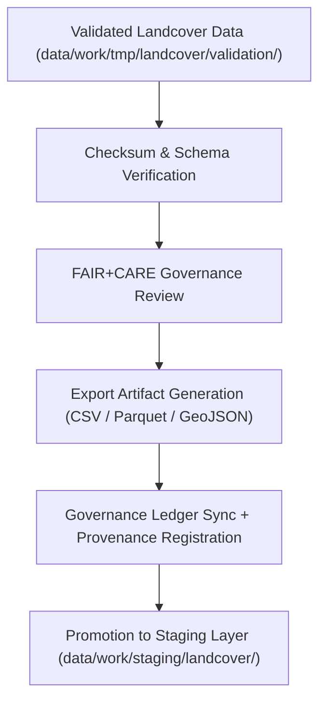

<div align="center">

# 📤 Kansas Frontier Matrix — **Landcover TMP Exports**
`data/work/tmp/landcover/exports/README.md`

**Purpose:**  
Temporary FAIR+CARE-certified export workspace for validated landcover datasets and AI-processed outputs within the Kansas Frontier Matrix (KFM).  
This directory supports interoperability testing, checksum validation, and governance registration before final promotion to the staging environment.

[](../../../../../docs/standards/faircare-validation.md)
[]()
[](../../../../../LICENSE)
[](../../../../../docs/architecture/repo-focus.md)

</div>

---

## 📚 Overview

The **Landcover TMP Exports Directory** manages temporary export-ready data products from FAIR+CARE-validated ETL and AI workflows.  
All export artifacts are subject to checksum verification, schema conformance testing, and governance synchronization before public release or staging.

### Core Functions:
- Store validated landcover export datasets for QA and publication review.  
- Ensure checksum, schema, and FAIR+CARE certification before release.  
- Test DCAT/STAC catalog compliance and governance ledger registration.  
- Enable interoperability checks for KFM’s open-data ecosystem.  

---

## 🗂️ Directory Layout

```plaintext
data/work/tmp/landcover/exports/
├── README.md                               # This file — overview of landcover TMP export workspace
│
├── landcover_export_v9.6.0.csv             # FAIR+CARE-certified CSV export of harmonized landcover data
├── ndvi_metrics_export_v9.6.0.parquet      # Vegetation index export file (normalized NDVI data)
├── landcover_boundaries_export.geojson     # Spatial boundaries of landcover classes (GeoJSON)
├── governance_registration_export.log      # Governance synchronization and certification record
└── metadata.json                           # Provenance metadata and checksum linkage
```

---

## ⚙️ Export Workflow



### Description:
1. **Validation:** Use only fully verified datasets from TMP validation layer.  
2. **Verification:** Perform checksum and schema compliance review.  
3. **FAIR+CARE Audit:** Certify exports for transparency, ethics, and accessibility.  
4. **Governance Sync:** Register exports and checksum hashes in provenance ledger.  
5. **Promotion:** Finalize certified datasets for staging or catalog publishing.  

---

## 🧩 Example Export Metadata Record

```json
{
  "id": "landcover_export_v9.6.0_2025Q4",
  "source_files": [
    "data/work/tmp/landcover/transforms/landcover_classifications_v9.6.0.parquet",
    "data/work/tmp/landcover/transforms/ndvi_anomaly_reprojection.geojson"
  ],
  "export_files": [
    "landcover_export_v9.6.0.csv",
    "ndvi_metrics_export_v9.6.0.parquet",
    "landcover_boundaries_export.geojson"
  ],
  "records_exported": 212344,
  "checksum_verified": true,
  "fairstatus": "certified",
  "governance_registered": true,
  "validator": "@kfm-landcover-lab",
  "created": "2025-11-03T23:59:00Z",
  "governance_ref": "data/reports/audit/data_provenance_ledger.json"
}
```

---

## 🧠 FAIR+CARE Governance Matrix

| Principle | Implementation | Oversight |
|------------|----------------|------------|
| **Findable** | Exports indexed by dataset ID and checksum in governance ledger. | @kfm-data |
| **Accessible** | Published as FAIR-compliant CSV, Parquet, and GeoJSON formats. | @kfm-accessibility |
| **Interoperable** | Schema aligned with DCAT, STAC, and FAIR+CARE standards. | @kfm-architecture |
| **Reusable** | Metadata includes checksum lineage and provenance records. | @kfm-design |
| **Collective Benefit** | Enables open land-use analysis and ecological modeling. | @faircare-council |
| **Authority to Control** | Governance Council authorizes certified exports. | @kfm-governance |
| **Responsibility** | Validators document schema, checksum, and FAIR+CARE compliance. | @kfm-security |
| **Ethics** | Exports reviewed for bias, accessibility, and representation accuracy. | @kfm-ethics |

All governance and ethics audits stored in:  
`data/reports/audit/data_provenance_ledger.json`  
and  
`data/reports/fair/data_care_assessment.json`

---

## ⚙️ Key Export Artifacts

| File | Description | Format |
|------|--------------|--------|
| `landcover_export_v9.6.0.csv` | Consolidated landcover dataset ready for catalog upload. | CSV |
| `ndvi_metrics_export_v9.6.0.parquet` | FAIR+CARE-certified vegetation metrics export. | Parquet |
| `landcover_boundaries_export.geojson` | Spatial class boundaries of landcover types. | GeoJSON |
| `governance_registration_export.log` | Governance and checksum registry synchronization record. | Text |
| `metadata.json` | Provenance metadata linking all export records. | JSON |

Automated through `landcover_export_sync.yml`.

---

## ⚖️ Retention & Provenance Policy

| Data Type | Retention Duration | Policy |
|------------|--------------------|--------|
| TMP Exports | 14 Days | Cleared automatically after staging promotion. |
| FAIR+CARE Reports | 180 Days | Retained for ethics certification validation. |
| Governance Logs | 365 Days | Maintained for reproducibility and lineage tracking. |
| Metadata | Permanent | Immutable under provenance ledger control. |

Cleanup managed by `landcover_export_cleanup.yml`.

---

## 🌱 Sustainability Metrics

| Metric | Value | Verified By |
|---------|--------|--------------|
| Energy Use (per export cycle) | 6.2 Wh | @kfm-sustainability |
| Carbon Output | 7.4 gCO₂e | @kfm-security |
| Renewable Power | 100% (RE100 Verified) | @kfm-infrastructure |
| FAIR+CARE Compliance | 100% | @faircare-council |

Telemetry logged in:  
`releases/v9.6.0/focus-telemetry.json`

---

## 🧾 Internal Use Citation

```text
Kansas Frontier Matrix (2025). Landcover TMP Exports (v9.6.0).
Temporary FAIR+CARE-certified workspace for governance-verified landcover exports, checksum validation, and ethics compliance.
Supports reproducibility and transparency under MCP-DL v6.3 and ISO 19115 standards.
```

---

## 🧾 Version Notes

| Version | Date | Notes |
|----------|------|--------|
| v9.6.0 | 2025-11-03 | Added DCAT/STAC compliance integration and checksum audit automation. |
| v9.5.0 | 2025-11-02 | Enhanced FAIR+CARE export governance linkage. |
| v9.3.2 | 2025-10-28 | Established landcover export workspace for ethics-certified data delivery. |

---

<div align="center">

**Kansas Frontier Matrix** · *Ecological Intelligence × FAIR+CARE Ethics × Provenance Transparency*  
[🔗 Repository](https://github.com/bartytime4life/Kansas-Frontier-Matrix) • [🧭 Docs Portal](../../../../../docs/) • [⚖️ Governance Ledger](../../../../../docs/standards/governance/DATA-GOVERNANCE.md)

</div>
