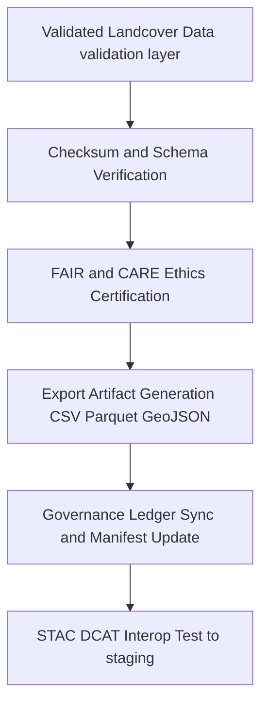

<div align="center">

# 📤 **Kansas Frontier Matrix — Landcover TMP Exports**  
`data/work/tmp/landcover/exports/README.md`

**Purpose:**  
FAIR+CARE-certified **temporary export workspace** for validated landcover datasets and AI-derived products.  
Upgraded for **v10** with **telemetry v2** (energy Wh, carbon gCO₂e, coverage %, duration) and **JSON-LD lineage anchors**. This layer performs **interoperability checks (STAC DCAT), checksum and schema verification, ethics review, and governance telemetry sync** before promotion to the staging layer.

[](../../../../../docs/architecture/README.md)  
[](../../../../../LICENSE)  
[](../../../../../docs/standards/faircare.md)  
[]()

</div>

---

## 📘 Overview

The **Landcover TMP Exports** directory stores export-ready artifacts produced from the Landcover TMP **validation** layer (`data/work/tmp/landcover/validation/`).  
Exports are the final checkpoint prior to staging and must pass **checksum integrity**, **schema conformance**, **FAIR+CARE ethics**, and **governance and telemetry v2** requirements.

### v10 enhancements
- **Telemetry v2** embedded in `metadata.json` for each export artifact (energy, carbon, coverage, duration).  
- **JSON-LD lineage** (`prov:wasDerivedFrom`, `prov:wasGeneratedBy`) linking back to TMP transforms and forward to staging and manifests.  
- Strengthened **CF and ISO** metadata checks and continuous checksum reconciliation against `manifest.zip`.

### Core functions
- Buffer **validated, schema-aligned** landcover exports for QA and publication review.  
- Execute **checksum continuity** and **CF ISO STAC DCAT** conformance checks.  
- Register export events in the **provenance ledger** and update **release manifests**.  
- Capture **energy and carbon telemetry** in line with **ISO 50001 14064**.

---

## 🗂️ Directory Layout

```plaintext
data/work/tmp/landcover/exports/
├── README.md                                  # This file — landcover TMP exports documentation
│
├── landcover_export_v10.0.0.csv               # Harmonized LULC export (FAIR+CARE certified)
├── ndvi_metrics_export_v10.0.0.parquet        # Normalized NDVI NDMI export
├── landcover_boundaries_export_v10.0.0.geojson# Class boundaries WGS84 STAC DCAT ready
├── governance_registration_export_2025Q4.log  # Governance and checksum synchronization record
└── metadata.json                              # Export provenance, JSON LD lineage, checksums, telemetry v2, ledger links
```

---

## ⚙️ Export Workflow



### Description
1. **Validation gate** — Only datasets certified in `../validation/` proceed.  
2. **Verification** — Run **SHA-256** checks; confirm **STAC DCAT ISO CF** conformance.  
3. **Ethics** — Apply **FAIR+CARE** checks (licensing, accessibility, sensitivity).  
4. **Governance and telemetry** — Update `data/reports/audit/data_provenance_ledger.json` and `releases/*/manifest.zip`; record energy and carbon to `telemetry_ref`.  
5. **Promotion** — Publish to `data/work/staging/landcover/` for catalogue and release workflows.

---

## 🧩 Example Export Metadata Record

```json
{
  "@context": "https://www.w3.org/ns/prov#",
  "id": "landcover_export_v10.0.0_2025Q4",
  "prov:wasDerivedFrom": [
    "data/work/tmp/landcover/transforms/landcover_classifications_v10.0.0.parquet",
    "data/work/tmp/landcover/transforms/ndvi_anomaly_reprojection.geojson"
  ],
  "export_files": [
    "data/work/tmp/landcover/exports/landcover_export_v10.0.0.csv",
    "data/work/tmp/landcover/exports/ndvi_metrics_export_v10.0.0.parquet",
    "data/work/tmp/landcover/exports/landcover_boundaries_export_v10.0.0.geojson"
  ],
  "schema_conformant": true,
  "checksum_verified": true,
  "fairstatus": "certified",
  "telemetry_v2": { "energy_wh": 6.3, "carbon_gco2e": 7.4, "coverage_pct": 100, "duration_s": 920 },
  "governance_registered": true,
  "validator": "@kfm-landcover-lab",
  "created": "2025-11-10T00:00:00Z",
  "prov:wasGeneratedBy": "landcover_export_pipeline_v10",
  "governance_ref": "data/reports/audit/data_provenance_ledger.json"
}
```

---

## 🧠 FAIR+CARE Governance Matrix

| Principle | Implementation | Oversight |
|---|---|---|
| **Findable** | Exports indexed by dataset ID, cycle, checksum, manifest entry | `@kfm-data` |
| **Accessible** | CSV Parquet GeoJSON with CC-BY 4.0 and alt text metadata | `@kfm-accessibility` |
| **Interoperable** | STAC DCAT and ISO 19115 metadata, CRS = EPSG 4326 | `@kfm-architecture` |
| **Reusable** | Checksum lineage and provenance ensure reproducibility | `@kfm-design` |
| **Collective Benefit** | Supports open land use and ecological modeling | `@faircare-council` |
| **Authority to Control** | Council authorizes releases and sensitivity handling | `@kfm-governance` |
| **Responsibility** | Teams document schema, checksum, and ethics results | `@kfm-security` |
| **Ethics** | Exports screened for bias and sensitive location concerns | `@kfm-ethics` |

**Audit and provenance:**  
`data/reports/audit/data_provenance_ledger.json` · `data/reports/fair/data_care_assessment.json`

---

## ⚙️ Key Export Artifacts

| Artifact | Description | Format |
|---|---|---|
| `landcover_export_v10.0.0.csv` | Harmonized class table for catalogue ingestion | CSV |
| `ndvi_metrics_export_v10.0.0.parquet` | Normalized NDVI NDMI metrics | Parquet |
| `landcover_boundaries_export_v10.0.0.geojson` | Class boundaries (WGS84, tiling ready) | GeoJSON |
| `governance_registration_export_2025Q4.log` | Ledger and checksum sync activity | Text |
| `metadata.json` | Source to export linkage, JSON LD lineage, checksums, telemetry v2, sign offs | JSON |

**Automation:** `landcover_export_sync_v10.yml`

---

## ⚖️ Retention & Provenance Policy

| Type | Retention | Policy |
|---|---:|---|
| TMP exports | 14 Days | Cleared automatically post promotion |
| Governance logs | 365 Days | Retained for audit reproducibility |
| FAIR and CARE reports | 365 Days | Kept for ethics certification review |
| Metadata and manifests | Permanent | Immutable in provenance ledger |

---

## 🌱 Sustainability Metrics

| Metric | Value | Verified By |
|---|---:|---|
| Energy use per export cycle | 6.2–6.6 Wh | `@kfm-sustainability` |
| Carbon output | 7.2–7.6 gCO₂e | `@kfm-security` |
| Renewable power | 100% RE100 | `@kfm-infrastructure` |
| FAIR and CARE compliance | 100% | `@kfm-faircare` |

**Telemetry:** `../../../../../releases/v10.0.0/focus-telemetry.json`

---

## 🧾 Citation

```text
Kansas Frontier Matrix (2025). Landcover TMP Exports (v10.0.0).
FAIR+CARE-certified export workspace for landcover data, providing checksum-verified, schema-conformant artifacts with JSON-LD lineage and telemetry v2, synchronized with governance ledgers under MCP-DL v6.3 and ISO 19115.
```

---

## 🕰️ Version History

| Version | Date | Author | Summary |
|---|---|---|---|
| v10.0.0 | 2025-11-10 | `@kfm-landcover-lab` | Upgrade to v10: telemetry v2, JSON-LD lineage, strengthened CF and ISO checks. |
| v9.7.0  | 2025-11-07 | `@kfm-landcover-lab` | Telemetry schema added; STAC DCAT ISO alignment and governance sync refined. |
| v9.6.0  | 2025-11-03 | `@kfm-landcover-lab` | Added DCAT STAC compliance checks and checksum audit automation. |

---

<div align="center">

**Kansas Frontier Matrix**  
*Ecological Intelligence × FAIR+CARE Ethics × Provenance Transparency*  
© 2025 Kansas Frontier Matrix — CC-BY 4.0 · **Diamond⁹ Ω / Crown∞Ω** Ultimate Certified  

[Back to Landcover TMP](../README.md) · [Governance Charter](../../../../../docs/standards/governance/DATA-GOVERNANCE.md)

</div>
