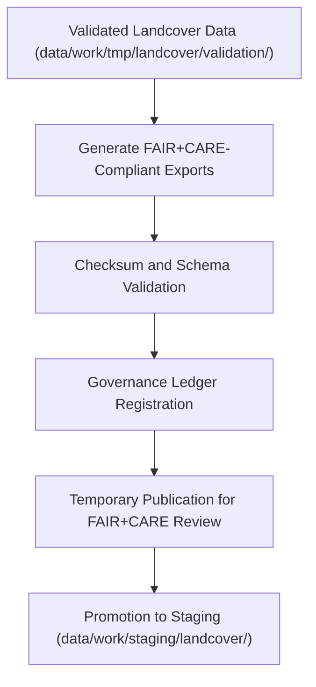

<div align="center">

# 📤 Kansas Frontier Matrix — **Landcover TMP Exports**
`data/work/tmp/landcover/exports/README.md`

**Purpose:**  
Governed FAIR+CARE workspace for **temporary exports of harmonized landcover datasets** produced during ETL and AI processing workflows in the Kansas Frontier Matrix (KFM).  
This layer supports interoperability validation, checksum auditing, and governance-linked distribution of landcover data before promotion to staging.

[](../../../../../docs/standards/faircare-validation.md)
[](../../../../../LICENSE)
[](../../../../../docs/architecture/repo-focus.md)

</div>

---

## 📚 Overview

The `data/work/tmp/landcover/exports/` directory manages **temporary export files and audit records** for FAIR+CARE-certified landcover data products.  
Each export is checksum-verified, governance-registered, and ethically reviewed for accessibility, reusability, and provenance compliance.

### Core Responsibilities
- Provide temporary FAIR+CARE-certified exports for validation and testing.  
- Enable interoperability checks across DCAT, STAC, and ISO metadata standards.  
- Register export metadata in governance ledgers for traceability.  
- Support Focus Mode visualizations and public FAIR+CARE data previews.  

---

## 🗂️ Directory Layout

```plaintext
data/work/tmp/landcover/exports/
├── README.md                               # This file — documentation for Landcover TMP exports
│
├── landcover_summary_2025.csv              # Aggregated landcover classification report
├── ndvi_anomaly_composite_2025.tif         # NDVI composite raster for Kansas
├── vegetation_cover_2025.geojson           # FAIR+CARE-certified vegetation cover layer
└── metadata.json                           # Provenance, checksum, and governance metadata
```

---

## ⚙️ Export Workflow



### Workflow Description
1. **Validation:** Confirm dataset integrity and FAIR+CARE certification.  
2. **Export Generation:** Produce open, interoperable export formats (GeoTIFF, GeoJSON, CSV).  
3. **Checksum Audit:** Verify export reproducibility via hash validation.  
4. **Governance Registration:** Log all export activities in provenance ledger.  
5. **Publication:** Distribute approved datasets to staging or FAIR+CARE council for certification.

---

## 🧩 Example Export Metadata Record

```json
{
  "id": "landcover_exports_v9.5.0_2025Q4",
  "export_files": [
    "landcover_summary_2025.csv",
    "ndvi_anomaly_composite_2025.tif",
    "vegetation_cover_2025.geojson"
  ],
  "records_exported": 512304,
  "export_formats": ["CSV", "GeoTIFF", "GeoJSON"],
  "checksum_verified": true,
  "fairstatus": "certified",
  "governance_registered": true,
  "telemetry_ref": "releases/v9.5.0/focus-telemetry.json",
  "governance_ref": "reports/audit/ai_landcover_ledger.json",
  "created": "2025-11-02T23:45:00Z",
  "validator": "@kfm-landcover-exports"
}
```

---

## 🧠 FAIR+CARE Governance Matrix

| Principle | Implementation |
|------------|----------------|
| **Findable** | Exports indexed with version IDs and checksum records. |
| **Accessible** | Stored in open FAIR-compliant formats for governance review. |
| **Interoperable** | Metadata conforms to ISO 19115, STAC 1.0, and DCAT 3.0 standards. |
| **Reusable** | Provenance and FAIR+CARE ethics metadata embedded in each export. |
| **Collective Benefit** | Supports transparent, ethical sharing of environmental data. |
| **Authority to Control** | FAIR+CARE Council validates each export release cycle. |
| **Responsibility** | Validators ensure data readiness for catalog publication. |
| **Ethics** | Ensures environmental datasets remain unbiased and contextually accurate. |

Governance logs maintained in:  
`reports/audit/ai_landcover_ledger.json` • `reports/fair/landcover_exports_summary.json`

---

## ⚙️ QA & Validation Artifacts

| File | Description | Format |
|------|--------------|--------|
| `landcover_summary_2025.csv` | Aggregated landcover classification table for Kansas. | CSV |
| `ndvi_anomaly_composite_2025.tif` | Raster export of vegetation anomalies. | GeoTIFF |
| `vegetation_cover_2025.geojson` | Geospatial vegetation extent and health layer. | GeoJSON |
| `metadata.json` | Governance linkage and checksum metadata record. | JSON |

Automation managed by `landcover_exports_sync.yml`.

---

## 🧾 Retention Policy

| File Type | Retention Duration | Policy |
|------------|--------------------|--------|
| TMP Exports | 14 days | Deleted after staging or certification promotion. |
| Governance Logs | 365 days | Archived for audit and FAIR+CARE review. |
| Metadata | Permanent | Retained under provenance ledger for certification traceability. |
| Checksum Records | Permanent | Maintained for reproducibility verification. |

Cleanup handled via `landcover_exports_cleanup.yml`.

---

## 🧾 Internal Use Citation

```text
Kansas Frontier Matrix (2025). Landcover TMP Exports (v9.5.0).
FAIR+CARE-certified export environment for open, interoperable, and ethically governed landcover datasets.
Ensures checksum integrity, transparency, and reproducibility under MCP-DL v6.3 compliance.
```

---

## 🧾 Version Notes

| Version | Date | Notes |
|----------|------|--------|
| v9.5.0 | 2025-11-02 | Added checksum verification automation and governance registration linkage. |
| v9.3.2 | 2025-10-28 | Enhanced interoperability validation with FAIR+CARE metadata alignment. |
| v9.3.0 | 2025-10-26 | Established export workspace for FAIR+CARE-certified temporary datasets. |

---

<div align="center">

**Kansas Frontier Matrix** · *Export Integrity × FAIR+CARE Ethics × Provenance Accountability*  
[🔗 Repository](https://github.com/bartytime4life/Kansas-Frontier-Matrix) • [🧭 Docs Portal](../../../../../docs/) • [⚖️ Governance Ledger](../../../../../docs/standards/governance/)

</div>