<div align="center">

# 📤 Kansas Frontier Matrix — **Landcover TMP Exports**
`data/work/tmp/landcover/exports/README.md`

**Purpose:**  
FAIR+CARE-certified **temporary export workspace** for validated landcover datasets and AI-derived products.  
This layer performs **interoperability checks (STAC/DCAT), checksum & schema verification, ethics review, and governance/telemetry sync** before promotion to the staging layer.

[](../../../../../docs/architecture/README.md)
[](../../../../../LICENSE)
[](../../../../../docs/standards/faircare-validation.md)
[]()

</div>

---

## 📘 Overview

The **Landcover TMP Exports** directory stores export-ready artifacts produced from the Landcover TMP **validation** layer (`data/work/tmp/landcover/validation/`).  
Exports are the final checkpoint prior to staging and must pass **checksum integrity**, **schema conformance**, **FAIR+CARE ethics**, and **governance/telemetry** requirements.

### Core Functions
- Buffer **validated, schema-aligned** landcover exports for QA & publication review.  
- Execute **checksum continuity** and **CF/ISO/STAC/DCAT** conformance checks.  
- Register export events in the **provenance ledger** and update **release manifests**.  
- Capture **energy/carbon telemetry** in line with **ISO 50001/14064**.

---

## 🗂️ Directory Layout

```plaintext
data/work/tmp/landcover/exports/
├── README.md                                 # This file — landcover TMP exports documentation
│
├── landcover_export_v9.7.0.csv               # Harmonized LULC export (FAIR+CARE certified)
├── ndvi_metrics_export_v9.7.0.parquet        # Normalized NDVI/NDMI metrics export
├── landcover_boundaries_export_v9.7.0.geojson# Class boundaries (EPSG:4326, STAC/DCAT-ready)
├── governance_registration_export.log        # Governance & checksum synchronization record
└── metadata.json                             # Export provenance, checksums, telemetry & ledger links
```

---

## ⚙️ Export Workflow

```mermaid
flowchart TD
    A["Validated Landcover Data (../validation/)"] --> B["Checksum & Schema Verification"]
    B --> C["FAIR + CARE Ethics Certification"]
    C --> D["Export Artifact Generation (CSV · Parquet · GeoJSON)"]
    D --> E["Governance Ledger Sync + Manifest Update"]
    E --> F["STAC/DCAT Interop Test → Promotion to data/work/staging/landcover/"]
```



### Description
1. **Validation Gate** — Only datasets certified in `../validation/` proceed.  
2. **Verification** — Run **SHA-256** checks; confirm **STAC/DCAT/ISO/CF** conformance.  
3. **Ethics** — Apply **FAIR+CARE** checks (licensing, accessibility, sensitivity).  
4. **Governance & Telemetry** — Update `data/reports/audit/data_provenance_ledger.json` and `releases/*/manifest.zip`; record energy/carbon to `telemetry_ref`.  
5. **Promotion** — Publish to `data/work/staging/landcover/` for catalogue & release workflows.

---

## 🧩 Example Export Metadata Record

```json
{
  "id": "landcover_export_v9.7.0_2025Q4",
  "source_files": [
    "data/work/tmp/landcover/transforms/landcover_classifications_v9.7.0.parquet",
    "data/work/tmp/landcover/transforms/ndvi_anomaly_reprojection.geojson"
  ],
  "export_files": [
    "landcover_export_v9.7.0.csv",
    "ndvi_metrics_export_v9.7.0.parquet",
    "landcover_boundaries_export_v9.7.0.geojson"
  ],
  "records_exported": 212344,
  "schema_conformant": true,
  "checksum_verified": true,
  "fairstatus": "certified",
  "telemetry": { "energy_wh": 6.2, "carbon_gco2e": 7.4 },
  "governance_registered": true,
  "validator": "@kfm-landcover-lab",
  "created": "2025-11-07T00:00:00Z",
  "governance_ref": "data/reports/audit/data_provenance_ledger.json"
}
```

---

## 🧠 FAIR+CARE Governance Matrix

| Principle | Implementation | Oversight |
|---|---|---|
| **Findable** | Exports indexed by dataset ID, cycle, checksum, and manifest entry | @kfm-data |
| **Accessible** | CSV/Parquet/GeoJSON with CC-BY 4.0; alt text & metadata | @kfm-accessibility |
| **Interoperable** | STAC/DCAT + ISO 19115 metadata, EPSG:4326 CRS | @kfm-architecture |
| **Reusable** | Checksum lineage & provenance ensure reproducibility | @kfm-design |
| **Collective Benefit** | Supports open land-use & ecological modeling | @faircare-council |
| **Authority to Control** | Council authorizes releases & sensitivity handling | @kfm-governance |
| **Responsibility** | Teams document schema, checksum & ethics results | @kfm-security |
| **Ethics** | Exports screened for bias & sensitive location concerns | @kfm-ethics |

**Audit/Provenance:**  
`data/reports/audit/data_provenance_ledger.json` · `data/reports/fair/data_care_assessment.json`

---

## ⚙️ Key Export Artifacts

| Artifact | Description | Format |
|---|---|---|
| `landcover_export_v9.7.0.csv` | Harmonized class table for catalogue ingestion | CSV |
| `ndvi_metrics_export_v9.7.0.parquet` | Normalized NDVI/NDMI metrics | Parquet |
| `landcover_boundaries_export_v9.7.0.geojson` | Class boundaries (WGS84, tiling-ready) | GeoJSON |
| `governance_registration_export.log` | Ledger and checksum sync activity | Text |
| `metadata.json` | Source → export linkage, checksums, telemetry, sign-offs | JSON |

**Automation:** `landcover_export_sync.yml`

---

## ⚖️ Retention & Provenance Policy

| Type | Retention | Policy |
|---|---:|---|
| TMP Exports | 14 Days | Cleared automatically post-promotion |
| Governance Logs | 365 Days | Retained for audit reproducibility |
| FAIR+CARE Reports | 180 Days | Kept for ethics certification review |
| Metadata & Manifests | Permanent | Immutable in provenance ledger |

---

## 🌱 Sustainability Metrics

| Metric | Value | Verified By |
|---|---:|---|
| Energy Use (per export cycle) | 6.1–6.5 Wh | @kfm-sustainability |
| Carbon Output | 7.2–7.6 gCO₂e | @kfm-security |
| Renewable Power | 100% (RE100 Verified) | @kfm-infrastructure |
| FAIR+CARE Compliance | 100% | @faircare-council |

**Telemetry:** `../../../../../releases/v9.7.0/focus-telemetry.json`

---

## 🧾 Citation

```text
Kansas Frontier Matrix (2025). Landcover TMP Exports (v9.7.0).
FAIR+CARE-certified export workspace for landcover data, providing checksum-verified, schema-conformant artifacts with governance and telemetry synchronization under MCP-DL v6.3 and ISO 19115.
```

---

## 🕰️ Version History

| Version | Date | Author | Summary |
|---|---|---|---|
| v9.7.0 | 2025-11-07 | `@kfm-landcover-lab` | Upgraded to v9.7.0; telemetry schema added; STAC/DCAT/ISO alignment & governance sync refined. |
| v9.6.0 | 2025-11-03 | `@kfm-landcover-lab` | Added DCAT/STAC compliance checks and checksum audit automation. |

---

<div align="center">

**Kansas Frontier Matrix**  
*Ecological Intelligence × FAIR+CARE Ethics × Provenance Transparency*  
© 2025 Kansas Frontier Matrix — Master Coder Protocol v6.3 · FAIR+CARE Certified · **Diamond⁹ Ω / Crown∞Ω** Ultimate Certified  

[Back to Landcover TMP](../README.md) · [Governance Charter](../../../../../docs/standards/governance/DATA-GOVERNANCE.md)

</div>