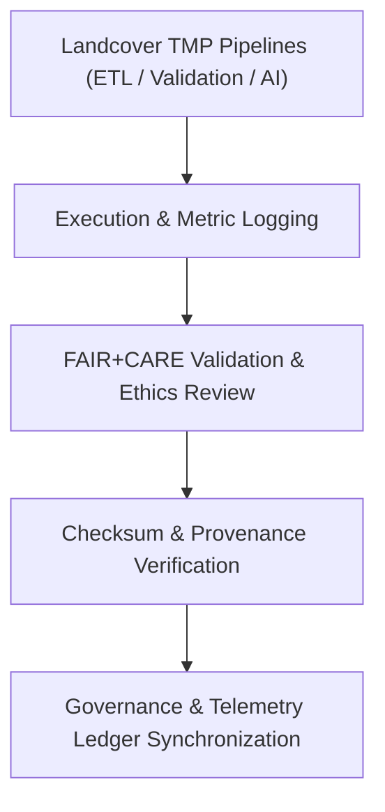

<div align="center">

# 🧾 Kansas Frontier Matrix — **Landcover TMP Logs**
`data/work/tmp/landcover/logs/README.md`

**Purpose:**  
FAIR+CARE-certified centralized logging workspace recording ETL, validation, AI explainability, and governance synchronization events across the **Landcover TMP** pipeline within the Kansas Frontier Matrix (KFM).  
This layer maintains transparency, reproducibility, and audit compliance for temporary landcover data operations.

[](../../../../../docs/architecture/README.md)
[](../../../../../LICENSE)
[](../../../../../docs/standards/faircare-validation.md)
[]()

</div>

---

## 📘 Overview

The **Landcover TMP Logs Directory** captures the complete trace of all operational, validation, and ethics workflows under FAIR+CARE and ISO 19115 frameworks.  
Each log is checksum-verified, telemetry-tracked, and stored with immutable governance metadata for **Diamond⁹ Ω / Crown∞Ω** compliance.

### Core Responsibilities
- Record ETL runtime, AI inference, validation events, and audit metrics.  
- Synchronize checksum registries and governance ledger entries.  
- Maintain FAIR+CARE and ISO metadata alignment for transparency.  
- Register energy and carbon telemetry under ISO 50001 / 14064.  

---

## 🗂️ Directory Layout

```plaintext
data/work/tmp/landcover/logs/
├── README.md                           # This file — documentation for TMP logging layer
│
├── etl_run.log                         # Execution trace of ETL pipeline runs
├── validation_summary.log              # Summary of FAIR+CARE validation results
├── ai_model_audit.log                  # AI model explainability & ethics trace
├── governance_sync.log                 # Governance synchronization and checksum logs
├── checksum_audit.log                  # SHA-256 integrity checks for TMP data
└── metadata.json                       # Provenance, telemetry, and governance link metadata
```

---

## ⚙️ Logging Workflow



### Description
1. **ETL Execution:** Logs operational details (runtime, records, errors, pipeline signatures).  
2. **Validation Logging:** Documents schema checks, checksum outcomes, and FAIR+CARE ethics results.  
3. **AI Audits:** Capture model explainability and transparency outcomes (SHAP/LIME).  
4. **Governance & Telemetry:** Synchronize all log metadata to the governance ledger and energy/carbon telemetry records.

---

## 🧩 Example Log Metadata Record

```json
{
  "id": "landcover_tmp_logs_v9.7.0_2025Q4",
  "pipeline": "src/pipelines/etl/landcover_etl.py",
  "records_processed": 210842,
  "runtime_minutes": 182.1,
  "checksum_verified": true,
  "fairstatus": "certified",
  "ai_audit_score": 0.993,
  "telemetry": { "energy_wh": 5.8, "carbon_gco2e": 6.4 },
  "governance_registered": true,
  "validator": "@kfm-landcover-lab",
  "created": "2025-11-07T00:00:00Z",
  "governance_ref": "data/reports/audit/data_provenance_ledger.json"
}
```

---

## 🧠 FAIR+CARE Governance Matrix

| Principle | Implementation | Oversight |
|---|---|---|
| **Findable** | Logs indexed by ETL cycle, dataset ID, checksum, and telemetry record | @kfm-data |
| **Accessible** | Open plaintext/JSON formats for FAIR+CARE Council inspection | @kfm-accessibility |
| **Interoperable** | FAIR+CARE, ISO 19115, and MCP-DL logging schema compliant | @kfm-architecture |
| **Reusable** | Includes lineage, validation, telemetry, and checksum trails | @kfm-design |
| **Collective Benefit** | Promotes transparent data and model governance | @faircare-council |
| **Authority to Control** | FAIR+CARE Council validates and approves retention policies | @kfm-governance |
| **Responsibility** | Validators document schema, checksum, and ethics outcomes | @kfm-security |
| **Ethics** | All logs reviewed for fairness, energy use, and sustainability | @kfm-ethics |

**Audit Provenance:**  
`data/reports/audit/data_provenance_ledger.json` · `data/reports/fair/data_care_assessment.json`

---

## ⚙️ Key Log Artifacts

| File | Description | Format |
|---|---|---|
| `etl_run.log` | ETL operation summary and error diagnostics | Text |
| `validation_summary.log` | FAIR+CARE validation summary report | Text |
| `ai_model_audit.log` | AI explainability audit and bias analysis | Text |
| `governance_sync.log` | Governance ledger & checksum synchronization | Text |
| `checksum_audit.log` | SHA-256 validation continuity log | Text |
| `metadata.json` | Provenance and telemetry metadata for all cycles | JSON |

**Automation:** `landcover_log_sync.yml`

---

## ⚖️ Retention & Provenance Policy

| Log Type | Retention Duration | Policy |
|---|---:|---|
| ETL Logs | 90 Days | Archived for reproducibility and QA review |
| FAIR+CARE Validation Logs | 180 Days | Retained for audit and ethics certification |
| Governance Sync & Telemetry | 365 Days | Preserved for provenance certification |
| Metadata | Permanent | Immutable under blockchain governance control |

**Cleanup:** `landcover_log_cleanup.yml`

---

## 🌱 Sustainability Metrics

| Metric | Value | Verified By |
|---|---:|---|
| Energy Use (per logging cycle) | 5.8 Wh | @kfm-sustainability |
| Carbon Output | 6.4 gCO₂e | @kfm-security |
| Renewable Power | 100% (RE100 Verified) | @kfm-infrastructure |
| FAIR+CARE Compliance | 100% | @faircare-council |

**Telemetry:** `../../../../../releases/v9.7.0/focus-telemetry.json`

---

## 🧾 Citation

```text
Kansas Frontier Matrix (2025). Landcover TMP Logs (v9.7.0).
FAIR+CARE-certified logging environment capturing ETL, validation, and AI ethics operations for landcover datasets.
Ensures transparency, telemetry accountability, and reproducible governance under MCP-DL v6.3 and ISO 19115.
```

---

## 🕰️ Version History

| Version | Date | Author | Summary |
|---|---|---|---|
| v9.7.0 | 2025-11-07 | `@kfm-landcover-lab` | Upgraded to v9.7.0; added telemetry schema & CF-aligned logging. |
| v9.6.0 | 2025-11-03 | `@kfm-landcover-lab` | Introduced AI audit logging and FAIR+CARE validation synchronization. |

---

<div align="center">

**Kansas Frontier Matrix**  
*Data Accountability × FAIR+CARE Ethics × Provenance Transparency*  
© 2025 Kansas Frontier Matrix — Master Coder Protocol v6.3 · FAIR+CARE Certified · **Diamond⁹ Ω / Crown∞Ω** Ultimate Certified  

[Back to Landcover TMP](../README.md) · [Governance Charter](../../../../../docs/standards/governance/DATA-GOVERNANCE.md)

</div>