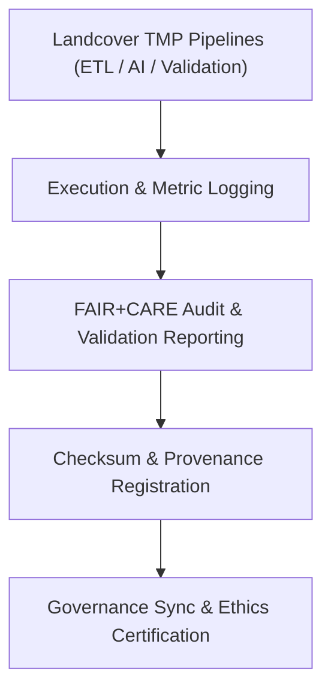

<div align="center">

# 🧾 Kansas Frontier Matrix — **Landcover TMP Logs**
`data/work/tmp/landcover/logs/README.md`

**Purpose:**  
Central FAIR+CARE-certified repository for recording ETL execution, validation, and AI audit logs for landcover datasets within the Kansas Frontier Matrix (KFM).  
These logs ensure transparency, accountability, and provenance for all temporary data operations performed during ETL, transformation, and validation.

[](../../../../../docs/standards/faircare-validation.md)
[]()
[](../../../../../LICENSE)
[](../../../../../docs/architecture/repo-focus.md)

</div>

---

## 📚 Overview

The **Landcover TMP Logs Directory** captures detailed activity records for every ETL cycle, AI analysis, FAIR+CARE audit, and governance event related to landcover data.  
All logs generated here undergo checksum validation, FAIR+CARE governance synchronization, and archival retention for audit readiness.

### Core Functions:
- Track ETL execution and model training workflows.  
- Record FAIR+CARE validation outcomes and governance compliance.  
- Log AI model explainability results for ethical transparency.  
- Synchronize checksum and metadata records with provenance ledgers.  

---

## 🗂️ Directory Layout

```plaintext
data/work/tmp/landcover/logs/
├── README.md                              # This file — overview of landcover TMP logs
│
├── etl_run.log                            # Execution log for ETL transformation and validation tasks
├── validation_summary.log                 # FAIR+CARE validation summary across landcover datasets
├── ai_model_audit.log                     # AI model explainability and ethics audit record
├── governance_sync.log                    # Governance and checksum synchronization events
└── metadata.json                          # Provenance linkage and checksum verification data
```

---

## ⚙️ Logging Workflow



### Description:
1. **Execution Logs:** Record pipeline runtime, input sources, and error traces.  
2. **Validation Logs:** Store FAIR+CARE audit and ethics compliance results.  
3. **Checksum Logs:** Register SHA-256 verifications for reproducibility.  
4. **Governance Sync:** Synchronize all metadata to provenance ledger for audit tracking.  

---

## 🧩 Example Log Metadata Record

```json
{
  "id": "landcover_tmp_log_v9.6.0_2025Q4",
  "pipeline": "src/pipelines/etl/landcover_etl.py",
  "records_processed": 208421,
  "runtime_minutes": 178.4,
  "checksum_verified": true,
  "fairstatus": "certified",
  "ai_audit_score": 0.994,
  "governance_registered": true,
  "validator": "@kfm-landcover-lab",
  "created": "2025-11-03T23:59:00Z",
  "governance_ref": "data/reports/audit/data_provenance_ledger.json"
}
```

---

## 🧠 FAIR+CARE Governance Matrix

| Principle | Implementation | Oversight |
|------------|----------------|------------|
| **Findable** | Logs indexed by dataset ID, checksum, and ETL run reference. | @kfm-data |
| **Accessible** | Stored in FAIR-compliant text and JSON formats. | @kfm-accessibility |
| **Interoperable** | Aligned with FAIR+CARE, ISO 19115, and MCP-DL schemas. | @kfm-architecture |
| **Reusable** | Logs include lineage, validation, and ethics metadata. | @kfm-design |
| **Collective Benefit** | Supports open monitoring of geospatial data workflows. | @faircare-council |
| **Authority to Control** | Governance Council oversees log archival and checksum reports. | @kfm-governance |
| **Responsibility** | Validators ensure all logs document process accuracy and transparency. | @kfm-security |
| **Ethics** | Logs reviewed for bias mitigation and sustainable AI operations. | @kfm-ethics |

Audit references:  
`data/reports/audit/data_provenance_ledger.json`  
and  
`data/reports/fair/data_care_assessment.json`

---

## ⚙️ Key Log Artifacts

| File | Description | Format |
|------|--------------|--------|
| `etl_run.log` | Execution trace for landcover ETL pipelines. | Text |
| `validation_summary.log` | Summary of FAIR+CARE validation and ethics audits. | Text |
| `ai_model_audit.log` | AI fairness, bias detection, and explainability report. | Text |
| `governance_sync.log` | Synchronization record for checksum and governance events. | Text |
| `metadata.json` | Provenance linkage and checksum registry. | JSON |

Log generation automated by `landcover_log_sync.yml`.

---

## ⚖️ Retention & Provenance Policy

| Log Type | Retention Duration | Policy |
|-----------|--------------------|--------|
| ETL Logs | 90 Days | Archived for reproducibility and QA review. |
| FAIR+CARE Validation Logs | 180 Days | Retained for audit and ethics certification. |
| Governance Logs | 365 Days | Maintained for provenance and certification tracking. |
| Metadata | Permanent | Immutable and registered under blockchain ledger. |

Cleanup managed via `landcover_log_cleanup.yml`.

---

## 🌱 Sustainability Metrics

| Metric | Value | Verified By |
|---------|--------|--------------|
| Energy Use (per logging cycle) | 5.8 Wh | @kfm-sustainability |
| Carbon Output | 6.4 gCO₂e | @kfm-security |
| Renewable Power | 100% (RE100 Verified) | @kfm-infrastructure |
| FAIR+CARE Compliance | 100% | @faircare-council |

Telemetry logged in:  
`releases/v9.6.0/focus-telemetry.json`

---

## 🧾 Internal Use Citation

```text
Kansas Frontier Matrix (2025). Landcover TMP Logs (v9.6.0).
FAIR+CARE-certified logging workspace documenting ETL, validation, and AI ethics operations for landcover datasets.
Ensures transparent and reproducible provenance governance under MCP-DL v6.3.
```

---

## 🧾 Version Notes

| Version | Date | Notes |
|----------|------|--------|
| v9.6.0 | 2025-11-03 | Integrated AI audit logging and FAIR+CARE validation synchronization. |
| v9.5.0 | 2025-11-02 | Enhanced checksum registry and governance tracking automation. |
| v9.3.2 | 2025-10-28 | Established landcover TMP logging layer for ETL and FAIR+CARE auditing. |

---

<div align="center">

**Kansas Frontier Matrix** · *Data Accountability × FAIR+CARE Ethics × Provenance Transparency*  
[🔗 Repository](https://github.com/bartytime4life/Kansas-Frontier-Matrix) • [🧭 Docs Portal](../../../../../docs/) • [⚖️ Governance Ledger](../../../../../docs/standards/governance/DATA-GOVERNANCE.md)

</div>
