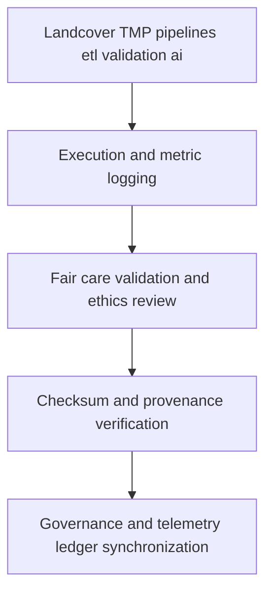

<div align="center">

# 🧾 **Kansas Frontier Matrix — Landcover TMP Logs**  
`data/work/tmp/landcover/logs/README.md`

**Purpose:**  
FAIR+CARE-certified centralized logging workspace recording **ETL, validation, AI explainability, and governance synchronization** events across the **Landcover TMP** pipeline within the Kansas Frontier Matrix (KFM).  
Upgraded for **v10** with **telemetry v2** (energy Wh, carbon gCO₂e, coverage %, duration) and **JSON-LD provenance anchors** to guarantee end-to-end transparency and auditability.

[](../../../../../docs/architecture/README.md)  
[](../../../../../LICENSE)  
[](../../../../../docs/standards/faircare.md)  
[]()

</div>

---

## 📘 Overview

The **Landcover TMP Logs** directory captures the complete trace of **operational, validation, and ethics** workflows under **FAIR+CARE**, **ISO 19115**, and **MCP-DL v6.3**.  
Each log is checksum-verified, **emits telemetry v2**, and is stored with immutable governance metadata for **Diamond⁹ Ω / Crown∞Ω** compliance.

**v10 Enhancements**

- **Telemetry v2**: per-step energy and carbon metrics with coverage and duration, persisted to `telemetry_ref`.  
- **JSON-LD lineage**: all `metadata.json` include `@context` and `prov:*` relations to upstream sources and downstream manifests.  
- Strengthened **continuous checksum reconciliation** against `manifest_ref` and stricter **CF / ISO** logging fields.

### Core responsibilities

- Record ETL runtime, AI inference, validation events, and audit metrics.  
- Synchronize checksum registries and governance ledger entries.  
- Maintain FAIR+CARE and ISO metadata alignment for transparency.  
- Register energy and carbon telemetry under **ISO 50001 / 14064**.

---

## 🗂️ Directory Layout

```plaintext
data/work/tmp/landcover/logs/
├── README.md                           # This file — documentation for TMP logging layer
│
├── etl_run.log                         # Execution trace of ETL pipeline runs
├── validation_summary.log              # Summary of FAIR+CARE validation results
├── ai_model_audit.log                  # AI model explainability and ethics trace
├── governance_sync.log                 # Governance synchronization and checksum logs
├── checksum_audit.log                  # SHA-256 integrity checks for TMP data
├── telemetry_v2_summary.json           # Energy, carbon, coverage, duration per step
└── metadata.json                       # JSON-LD provenance, telemetry refs, signatures
```

---

## ⚙️ Logging Workflow



### Description

1. **ETL execution** — Logs operational details: runtime, records, parameters, versions.  
2. **Validation logging** — Documents schema checks, checksum outcomes, **FAIR+CARE** ethics results.  
3. **AI audits** — Captures model explainability (SHAP LIME) and bias or drift signals.  
4. **Governance and telemetry** — Synchronizes log metadata to the **provenance ledger** and updates `telemetry_ref` with **telemetry v2**.

---

## 🧩 Example Log Metadata Record

```json
{
  "@context": "https://www.w3.org/ns/prov#",
  "id": "landcover_tmp_logs_v10.0.0_2025Q4",
  "pipeline": "src/pipelines/etl/landcover_etl.py",
  "records_processed": 210842,
  "runtime_minutes": 179.6,
  "checksum_verified": true,
  "fairstatus": "certified",
  "ai_audit_score": 0.993,
  "telemetry_v2": { "energy_wh": 5.6, "carbon_gco2e": 6.2, "coverage_pct": 100, "duration_s": 10800 },
  "governance_registered": true,
  "prov:wasGeneratedBy": "landcover_tmp_log_pipeline_v10",
  "prov:wasDerivedFrom": [
    "data/work/tmp/landcover/datasets/nlcd_landcover_2021_tmp.tif",
    "data/work/tmp/landcover/transforms/landcover_classifications_v10.0.0.parquet"
  ],
  "created": "2025-11-10T00:00:00Z",
  "governance_ref": "data/reports/audit/data_provenance_ledger.json"
}
```

---

## 🧠 FAIR+CARE Governance Matrix

| Principle | Implementation | Oversight |
|---|---|---|
| **Findable** | Logs indexed by ETL cycle, dataset id, checksum, telemetry record | `@kfm-data` |
| **Accessible** | Plaintext and JSON logs available for Council audit | `@kfm-accessibility` |
| **Interoperable** | Logging schemas align with FAIR+CARE and ISO 19115 | `@kfm-architecture` |
| **Reusable** | Lineage, validation, telemetry, and checksum trails | `@kfm-design` |
| **Collective Benefit** | Transparent data and model governance | `@faircare-council` |
| **Authority to Control** | Council validates and approves retention policies | `@kfm-governance` |
| **Responsibility** | Validators document schema, checksum, and ethics outcomes | `@kfm-security` |
| **Ethics** | Logs reviewed for fairness, energy use, and sustainability | `@kfm-ethics` |

**Audit provenance:**  
`data/reports/audit/data_provenance_ledger.json` · `data/reports/fair/data_care_assessment.json`

---

## ⚙️ Key Log Artifacts

| File | Description | Format |
|---|---|---|
| `etl_run.log` | ETL operation summary and error diagnostics | Text |
| `validation_summary.log` | Consolidated schema and FAIR+CARE outcomes | Text |
| `ai_model_audit.log` | Explainability audit and bias analysis | Text |
| `governance_sync.log` | Ledger and checksum synchronization | Text |
| `checksum_audit.log` | SHA-256 validation continuity | Text |
| `telemetry_v2_summary.json` | Per-step energy and carbon metrics | JSON |
| `metadata.json` | JSON-LD provenance and telemetry references | JSON |

**Automation:** `landcover_log_sync_v10.yml`

---

## ⚖️ Retention & Provenance Policy

| Log Type | Retention | Policy |
|---|---:|---|
| ETL logs | 90 Days | Archived for reproducibility and QA review |
| FAIR+CARE validation logs | 180 Days | Retained for audit and ethics certification |
| Governance sync and telemetry | 365 Days | Preserved for provenance certification |
| Metadata | Permanent | Immutable under blockchain governance control |

---

## 🌱 Sustainability Metrics

| Metric | Value | Verified By |
|---|---:|---|
| Energy use per logging cycle | 5.6 Wh | `@kfm-sustainability` |
| Carbon output | 6.2 gCO₂e | `@kfm-security` |
| Renewable power | 100% RE100 | `@kfm-infrastructure` |
| FAIR+CARE compliance | 100% | `@kfm-faircare` |

**Telemetry:** `../../../../../releases/v10.0.0/focus-telemetry.json`

---

## 🧾 Citation

```text
Kansas Frontier Matrix (2025). Landcover TMP Logs (v10.0.0).
FAIR+CARE-certified logging environment capturing ETL, validation, and AI ethics operations for landcover datasets, upgraded with telemetry v2 and JSON-LD lineage.  
Ensures transparency, energy and carbon accountability, and reproducible governance under MCP-DL v6.3 and ISO 19115.
```

---

## 🕰️ Version History

| Version | Date | Author | Summary |
|---|---|---|---|
| v10.0.0 | 2025-11-10 | `@kfm-landcover-lab` | Upgrade to v10: telemetry v2, JSON-LD lineage anchors, stricter CF and ISO reconciliation. |
| v9.7.0  | 2025-11-07 | `@kfm-landcover-lab` | Added telemetry schema and CF-aligned logging. |
| v9.6.0  | 2025-11-03 | `@kfm-landcover-lab` | Introduced AI audit logging and FAIR+CARE validation sync. |

---

<div align="center">

**Kansas Frontier Matrix**  
*Data Accountability × FAIR+CARE Ethics × Provenance Transparency*  
© 2025 Kansas Frontier Matrix — Internal Governance Data · **Diamond⁹ Ω / Crown∞Ω** Ultimate Certified  

[Back to Landcover TMP](../README.md) · [Governance Charter](../../../../../docs/standards/governance/DATA-GOVERNANCE.md)

</div>
