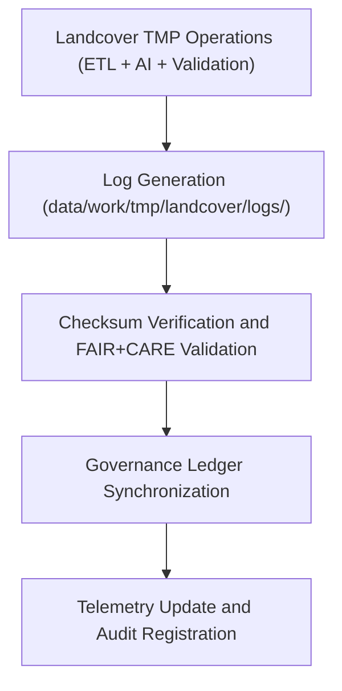

<div align="center">

# 🧾 Kansas Frontier Matrix — **Landcover TMP Logs**
`data/work/tmp/landcover/logs/README.md`

**Purpose:**  
Central FAIR+CARE-certified logging environment for landcover ETL, AI analysis, and governance operations within the Kansas Frontier Matrix (KFM).  
Logs in this workspace ensure full lineage visibility, checksum verification, and ethical compliance for every transformation and validation event in the TMP layer.

[](../../../../docs/standards/faircare-validation.md)
[](../../../../LICENSE)
[](../../../../docs/architecture/repo-focus.md)

</div>

---

## 📚 Overview

The `data/work/tmp/landcover/logs/` directory records **all operational traces, ETL records, validation results, and AI explainability events** generated during temporary landcover data processing.  
Each log ensures reproducibility and governance synchronization under FAIR+CARE and MCP-DL standards.

### Core Responsibilities
- Track ETL extract, transform, and validation operations for landcover data.  
- Record checksum verification and schema audit outcomes.  
- Capture AI explainability results and model drift reports.  
- Synchronize governance events and Focus Mode telemetry updates.  

---

## 🗂️ Directory Layout

```plaintext
data/work/tmp/landcover/logs/
├── README.md                               # This file — documentation of landcover TMP logs
│
├── etl/                                    # ETL pipeline logs and summaries
│   ├── extract/                            # Landcover source ingestion logs
│   ├── transform/                          # Schema and reprojection logs
│   ├── load/                               # Data publication and staging logs
│   ├── lineage/                            # Provenance and dependency flow traces
│   └── summaries/                          # Aggregated ETL metrics and audits
│
├── validation/                             # FAIR+CARE validation and schema QA logs
├── ai/                                     # Focus Mode AI explainability and drift detection logs
├── manifests/                              # Checksum and telemetry manifest linkage
├── system/                                 # Internal process and automation system logs
└── metadata.json                           # Provenance and governance linkage metadata
```

---

## ⚙️ Logging Workflow



### Workflow Description
1. **Event Logging:** Records runtime activity across ETL and AI pipelines.  
2. **Checksum Validation:** Ensures log file and data integrity consistency.  
3. **Governance Sync:** Updates provenance metadata in FAIR+CARE governance ledgers.  
4. **Telemetry Registration:** Links log events to Focus Mode AI performance metrics.  

---

## 🧩 Example Log Metadata Record

```json
{
  "id": "landcover_tmp_logs_v9.5.0_2025Q4",
  "log_categories": ["etl", "validation", "ai", "system"],
  "records_logged": 17420,
  "checksum_verified": true,
  "fairstatus": "compliant",
  "governance_synced": true,
  "telemetry_ref": "releases/v9.5.0/focus-telemetry.json",
  "governance_ref": "reports/audit/ai_landcover_ledger.json",
  "created": "2025-11-02T22:00:00Z",
  "validator": "@kfm-landcover"
}
```

---

## 🧠 FAIR+CARE Governance Matrix

| Principle | Implementation |
|------------|----------------|
| **Findable** | All logs indexed by ETL stage, checksum, and governance reference. |
| **Accessible** | Stored in open JSON and text formats for reproducibility. |
| **Interoperable** | Schema follows ISO 19115 lineage, STAC 1.0, and MCP-DL governance standards. |
| **Reusable** | Maintains provenance metadata and checksum validation records. |
| **Collective Benefit** | Ensures transparent monitoring of environmental transformations. |
| **Authority to Control** | FAIR+CARE Council verifies log audit and ethics results. |
| **Responsibility** | ETL maintainers document pipeline outputs and AI reasoning integrity. |
| **Ethics** | Logs redact sensitive land ownership or identifiable environmental data. |

Governance synchronization recorded in:  
`reports/audit/ai_landcover_ledger.json` • `reports/fair/landcover_logs_summary.json`

---

## ⚙️ Validation & QA Artifacts

| File / Folder | Description | Format |
|----------------|--------------|--------|
| `etl/` | ETL process logs (extract, transform, load, lineage). | Text / JSON |
| `validation/` | FAIR+CARE validation and checksum verification logs. | JSON |
| `ai/` | AI model performance and explainability reports. | JSON |
| `manifests/` | Checksum manifests and telemetry linkage metadata. | JSON |
| `system/` | Internal automation and runtime system logs. | Text |
| `metadata.json` | Provenance metadata linking all log files. | JSON |

Automated synchronization handled by `landcover_logs_sync.yml`.

---

## 🧾 Retention Policy

| Log Type | Retention Duration | Policy |
|-----------|--------------------|--------|
| ETL Logs | 90 days | Archived following staging validation. |
| AI Logs | 180 days | Retained for drift and explainability verification. |
| Validation Logs | 365 days | Archived under FAIR+CARE audit workflows. |
| System Logs | 30 days | Purged after automated pipeline completion. |
| Metadata | Permanent | Maintained under provenance and checksum registry. |

Cleanup managed by `landcover_logs_cleanup.yml`.

---

## 🧾 Internal Use Citation

```text
Kansas Frontier Matrix (2025). Landcover TMP Logs (v9.5.0).
Central FAIR+CARE-certified logging system for landcover ETL, validation, and AI analysis.
Ensures transparent, ethical, and reproducible data processing under MCP-DL v6.3 governance compliance.
```

---

## 🧾 Version Notes

| Version | Date | Notes |
|----------|------|--------|
| v9.5.0 | 2025-11-02 | Integrated telemetry linkage schema v2 and expanded governance synchronization. |
| v9.3.2 | 2025-10-28 | Added checksum verification and FAIR+CARE validation linkage. |
| v9.3.0 | 2025-10-26 | Established landcover TMP logging workspace under FAIR+CARE governance. |

---

<div align="center">

**Kansas Frontier Matrix** · *Landcover Intelligence × FAIR+CARE Ethics × Provenance Integrity*  
[🔗 Repository](https://github.com/bartytime4life/Kansas-Frontier-Matrix) • [🧭 Docs Portal](../../../../docs/) • [⚖️ Governance Ledger](../../../../docs/standards/governance/)

</div>