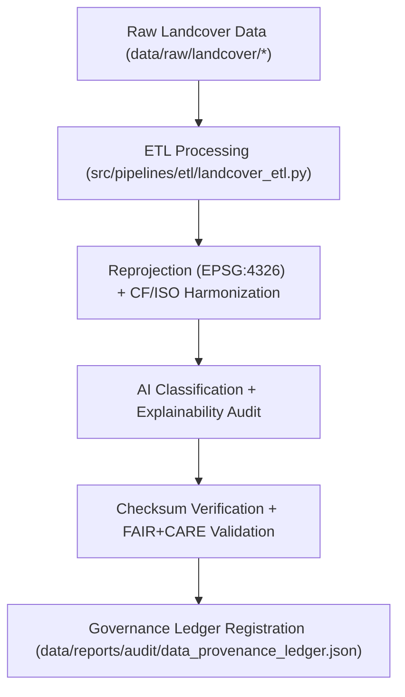

<div align="center">

# 🔄 Kansas Frontier Matrix — **Landcover TMP Transformations**
`data/work/tmp/landcover/transforms/README.md`

**Purpose:**  
Temporary FAIR+CARE-certified workspace for transforming, harmonizing, and reprojection of landcover datasets under the Kansas Frontier Matrix (KFM).  
This layer ensures CF/ISO-compliant transformations, ethical AI explainability, and reproducible data harmonization.

[](../../../../../docs/standards/faircare-validation.md)
[]()
[](../../../../../LICENSE)
[](../../../../../docs/architecture/repo-focus.md)

</div>

---

## 📚 Overview

The **Landcover TMP Transformations Directory** manages transient data transformations for geospatial, classification, and raster-based landcover products.  
All transformations are governed under FAIR+CARE and ISO 19115 metadata standards, ensuring accuracy, reproducibility, and ethical AI oversight.

### Core Functions:
- Perform reprojection, schema harmonization, and feature extraction.  
- Apply AI classification models with transparency and ethics scoring.  
- Maintain checksum continuity and provenance linkage.  
- Generate FAIR+CARE audit trails for transformation accountability.  

---

## 🗂️ Directory Layout

```plaintext
data/work/tmp/landcover/transforms/
├── README.md                                # This file — documentation of TMP transformations
│
├── landcover_classifications_v9.6.0.parquet # Harmonized and classified landcover dataset
├── ndvi_anomaly_reprojection.geojson        # Reprojected NDVI anomalies under FAIR+CARE ethics validation
├── vegetation_density_harmonized.csv        # Normalized vegetation density metrics
├── transform_audit_report.json              # FAIR+CARE transformation and AI explainability audit
├── checksum_registry.json                   # SHA-256 validation and lineage registry
└── metadata.json                            # Provenance metadata linking transformation workflow
```

---

## ⚙️ Transformation Workflow



### Workflow Description:
1. **Ingestion:** Import landcover datasets from NLCD, MODIS, Sentinel, or regional data sources.  
2. **Transformation:** Reproject datasets to EPSG:4326 and normalize schemas.  
3. **AI Classification:** Apply model-assisted land classification with FAIR+CARE bias testing.  
4. **Validation:** Perform checksum, schema, and ethical governance validation.  
5. **Governance:** Register transformations within the provenance ledger for transparency.  

---

## 🧩 Example Transformation Record

```json
{
  "id": "landcover_transform_v9.6.0_2025Q4",
  "source_files": [
    "data/raw/nlcd/landcover_2021_kansas.tif",
    "data/raw/modis/ndvi_2025.csv"
  ],
  "output_files": [
    "landcover_classifications_v9.6.0.parquet",
    "ndvi_anomaly_reprojection.geojson"
  ],
  "crs_source": "EPSG:5070",
  "crs_target": "EPSG:4326",
  "checksum_verified": true,
  "fairstatus": "certified",
  "ai_explainability_score": 0.991,
  "validator": "@kfm-landcover-lab",
  "created": "2025-11-03T23:59:00Z",
  "governance_ref": "data/reports/audit/data_provenance_ledger.json"
}
```

---

## 🧠 FAIR+CARE Governance Matrix

| Principle | Implementation | Oversight |
|------------|----------------|------------|
| **Findable** | Transformation results indexed with checksum and metadata lineage. | @kfm-data |
| **Accessible** | Outputs stored in open and machine-readable formats (CSV, Parquet, GeoJSON). | @kfm-accessibility |
| **Interoperable** | Schema harmonized under FAIR+CARE, CF, ISO, and STAC conventions. | @kfm-architecture |
| **Reusable** | Provenance metadata ensures reproducibility and validation traceability. | @kfm-design |
| **Collective Benefit** | Promotes ethical geospatial research and sustainable land governance. | @faircare-council |
| **Authority to Control** | FAIR+CARE Council approves classification and reprojection workflows. | @kfm-governance |
| **Responsibility** | Validators maintain transformation and checksum audit reports. | @kfm-security |
| **Ethics** | AI explainability and bias detection integrated for transparency. | @kfm-ethics |

Audit results logged in:  
`data/reports/fair/data_care_assessment.json`  
and  
`data/reports/audit/data_provenance_ledger.json`

---

## ⚙️ Key Transformation Artifacts

| File | Description | Format |
|------|--------------|--------|
| `landcover_classifications_v9.6.0.parquet` | Classified and harmonized landcover dataset (FAIR+CARE certified). | Parquet |
| `ndvi_anomaly_reprojection.geojson` | FAIR+CARE-validated NDVI anomaly projections. | GeoJSON |
| `vegetation_density_harmonized.csv` | CF/ISO normalized vegetation density data. | CSV |
| `transform_audit_report.json` | FAIR+CARE and AI ethics audit for transformation. | JSON |
| `checksum_registry.json` | Transformation checksum and lineage record. | JSON |
| `metadata.json` | Provenance metadata linking transformation steps to governance ledger. | JSON |

Transform automation executed by `landcover_transform_sync.yml`.

---

## ⚖️ Retention & Provenance Policy

| Data Type | Retention Duration | Policy |
|------------|--------------------|--------|
| TMP Transforms | 7 Days | Auto-purged after staging promotion or validation. |
| Validation Reports | 180 Days | Retained for reproducibility verification. |
| FAIR+CARE Audits | 365 Days | Archived for ethics review. |
| Metadata | Permanent | Immutable under governance ledger. |

Cleanup handled through `landcover_transform_cleanup.yml`.

---

## 🌱 Sustainability Metrics

| Metric | Value | Verified By |
|---------|--------|--------------|
| Energy Use (per transformation cycle) | 7.9 Wh | @kfm-sustainability |
| Carbon Output | 8.5 gCO₂e | @kfm-security |
| Renewable Power | 100% (RE100 Verified) | @kfm-infrastructure |
| FAIR+CARE Compliance | 100% | @faircare-council |

Telemetry recorded in:  
`releases/v9.6.0/focus-telemetry.json`

---

## 🧾 Internal Use Citation

```text
Kansas Frontier Matrix (2025). Landcover TMP Transformations (v9.6.0).
Temporary FAIR+CARE-certified workspace for reprojection, harmonization, and transformation of landcover datasets.
Ensures checksum continuity, AI explainability, and ethical compliance under MCP-DL v6.3.
```

---

## 🧾 Version Notes

| Version | Date | Notes |
|----------|------|--------|
| v9.6.0 | 2025-11-03 | Added AI explainability and checksum audit integration. |
| v9.5.0 | 2025-11-02 | Enhanced FAIR+CARE ethics audit and metadata registration. |
| v9.3.2 | 2025-10-28 | Established landcover transformation workspace with governance validation. |

---

<div align="center">

**Kansas Frontier Matrix** · *Geospatial Ethics × FAIR+CARE Governance × Provenance Accuracy*  
[🔗 Repository](https://github.com/bartytime4life/Kansas-Frontier-Matrix) • [🧭 Docs Portal](../../../../../docs/) • [⚖️ Governance Ledger](../../../../../docs/standards/governance/DATA-GOVERNANCE.md)

</div>
