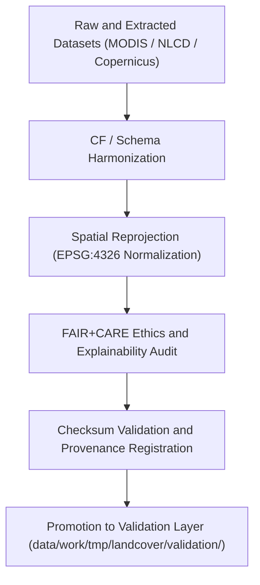

<div align="center">

# 🔄 Kansas Frontier Matrix — **Landcover TMP Transforms**
`data/work/tmp/landcover/transforms/README.md`

**Purpose:**  
Temporary FAIR+CARE-governed workspace for **landcover data transformation, CF harmonization, reprojection, and feature normalization** within the Kansas Frontier Matrix (KFM).  
Ensures every transformation adheres to open standards (ISO, CF, FAIR+CARE) while maintaining transparency and checksum-traceable provenance.

[](../../../../../docs/standards/faircare-validation.md)
[](../../../../../LICENSE)
[](../../../../../docs/architecture/repo-focus.md)

</div>

---

## 📚 Overview

The `data/work/tmp/landcover/transforms/` directory contains all intermediate **landcover transformation outputs**, including normalization, harmonization, reprojection, and FAIR+CARE audit logs.  
It bridges the ETL Transform Layer and Validation Layer, ensuring ethical and reproducible operations before staging promotion.

### Core Responsibilities
- Perform spatial reprojection and CF/ISO harmonization of datasets.  
- Run AI-driven validation for bias detection and metadata consistency.  
- Maintain checksum verification and FAIR+CARE certification records.  
- Register all transformations in KFM’s governance and provenance ledgers.  

---

## 🗂️ Directory Layout

```plaintext
data/work/tmp/landcover/transforms/
├── README.md                               # This file — documentation for Landcover TMP Transforms
│
├── landcover_normalized.parquet            # Schema-harmonized landcover dataset (tabular)
├── ndvi_index_resampled.tif                # Reprojected NDVI raster (EPSG:4326)
├── vegetation_classification_audit.json    # AI explainability and FAIR+CARE ethics audit
├── cf_compliance_report.json               # CF conventions and metadata harmonization record
├── checksum_registry.json                  # Checksum list for all transformation outputs
└── metadata.json                           # Provenance and governance registration metadata
```

---

## ⚙️ Transformation Workflow



### Workflow Description
1. **Schema Harmonization:** Align dataset fields, formats, and metadata under a unified schema.  
2. **Spatial Reprojection:** Convert rasters and vectors into EPSG:4326 for interoperability.  
3. **Ethical Review:** Conduct FAIR+CARE ethics validation and AI explainability audits.  
4. **Checksum Validation:** Confirm data reproducibility and structural integrity.  
5. **Governance Registration:** Log transformations in provenance and checksum registries.  

---

## 🧩 Example Transformation Metadata Record

```json
{
  "id": "landcover_transforms_v9.5.0_2025Q4",
  "transformations_applied": [
    "CF Harmonization",
    "Spatial Reprojection",
    "Normalization",
    "Checksum Validation"
  ],
  "datasets_transformed": [
    "modis_ndvi_composite_2025.tif",
    "nlcd_kansas_2021.tif",
    "vegetation_cover_2025.geojson"
  ],
  "records_transformed": 814205,
  "checksum_verified": true,
  "ai_explainability_score": 0.986,
  "fairstatus": "certified",
  "governance_registered": true,
  "telemetry_ref": "releases/v9.5.0/focus-telemetry.json",
  "governance_ref": "reports/audit/ai_landcover_ledger.json",
  "created": "2025-11-02T23:59:00Z",
  "validator": "@kfm-landcover-transforms"
}
```

---

## 🧠 FAIR+CARE Governance Matrix

| Principle | Implementation |
|------------|----------------|
| **Findable** | Transformation artifacts indexed with unique IDs and checksums. |
| **Accessible** | Stored as open FAIR+CARE-certified JSON, Parquet, and GeoTIFF files. |
| **Interoperable** | Aligned with STAC 1.0, DCAT 3.0, and ISO 19115 lineage metadata. |
| **Reusable** | Includes provenance metadata, schema alignment, and CF compliance. |
| **Collective Benefit** | Supports transparent and equitable land governance data use. |
| **Authority to Control** | FAIR+CARE Council validates harmonization and AI audits. |
| **Responsibility** | Validators log transformation events and checksum results. |
| **Ethics** | Ensures landcover data transformations respect ecological context and avoid bias. |

Governance and audit results logged in:  
`reports/audit/ai_landcover_ledger.json` • `reports/fair/landcover_transforms_summary.json`

---

## ⚙️ Validation & QA Artifacts

| File | Description | Format |
|------|--------------|--------|
| `landcover_normalized.parquet` | Schema-aligned and harmonized tabular dataset. | Parquet |
| `ndvi_index_resampled.tif` | CF-compliant NDVI raster after reprojection. | GeoTIFF |
| `vegetation_classification_audit.json` | FAIR+CARE and AI audit for landcover classification. | JSON |
| `cf_compliance_report.json` | CF/ISO 19115 compliance validation report. | JSON |
| `checksum_registry.json` | Hash registry for transformation outputs. | JSON |
| `metadata.json` | Provenance and governance registration metadata. | JSON |

Automation synchronized via `landcover_transforms_sync.yml`.

---

## 🧾 Retention Policy

| File Type | Retention Duration | Policy |
|------------|--------------------|--------|
| TMP Transform Files | 14 days | Purged after validation promotion. |
| FAIR+CARE Audits | 365 days | Retained for ethics and governance reviews. |
| Metadata | Permanent | Stored in provenance and checksum registries. |
| CF Compliance Reports | Permanent | Maintained under governance for reproducibility. |

Cleanup handled by `landcover_transforms_cleanup.yml`.

---

## 🧾 Internal Use Citation

```text
Kansas Frontier Matrix (2025). Landcover TMP Transforms (v9.5.0).
FAIR+CARE-certified workspace for reprojection, CF harmonization, and AI ethics validation of landcover datasets.
Supports reproducibility, transparency, and open governance under MCP-DL v6.3 compliance.
```

---

## 🧾 Version Notes

| Version | Date | Notes |
|----------|------|--------|
| v9.5.0 | 2025-11-02 | Added AI explainability audit integration and CF harmonization improvements. |
| v9.3.2 | 2025-10-28 | Enhanced checksum and FAIR+CARE compliance logging. |
| v9.3.0 | 2025-10-26 | Established transformation workspace for landcover TMP pipeline. |

---

<div align="center">

**Kansas Frontier Matrix** · *Transformation Integrity × FAIR+CARE Ethics × Provenance Continuity*  
[🔗 Repository](https://github.com/bartytime4life/Kansas-Frontier-Matrix) • [🧭 Docs Portal](../../../../../docs/) • [⚖️ Governance Ledger](../../../../../docs/standards/governance/)

</div>