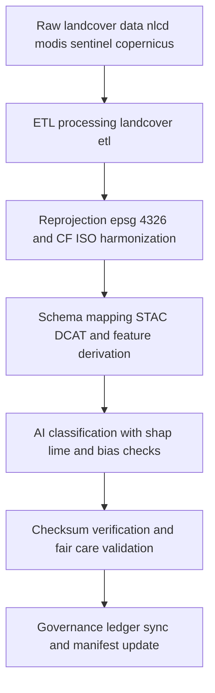

<div align="center">

# 🔄 **Kansas Frontier Matrix — Landcover TMP Transformations**  
`data/work/tmp/landcover/transforms/README.md`

**Purpose:**  
FAIR+CARE-certified **temporary transformation layer** for landcover datasets (NLCD, MODIS, Sentinel, Copernicus).  
Executes **reprojection**, **schema harmonization** (STAC DCAT CF ISO 19115), feature and metric derivation, and **AI-assisted classification** with full **checksum, ethics, explainability, telemetry, and governance** traceability.  
**v10 upgrades:** *Telemetry v2 (energy Wh, carbon gCO2e, coverage %, duration), JSON-LD lineage (`prov:*`) in all `metadata.json`, stricter CF and ISO reconciliation, continuous manifest reconciliation.*

[](../../../../../docs/architecture/README.md)  
[](../../../../../LICENSE)  
[](../../../../../docs/standards/faircare.md)  
[]()

</div>

---

## 📘 Overview

The **Landcover TMP Transformations** directory hosts short-lived ETL operations that prepare landcover products for validation and staging.  
All outputs must pass **checksum**, **schema conformance**, **FAIR+CARE ethics**, **AI explainability**, **telemetry v2**, and **provenance** checks before promotion to `data/work/staging/landcover/`.

### Core functions
- **Reprojection** to **EPSG 4326** and CF ISO metadata normalization.  
- **Schema harmonization** across **STAC 1.0 · DCAT 3.0 · CF · ISO 19115**.  
- **Derivations** (NDVI NDMI anomalies, class boundaries, density metrics).  
- **AI classification** with SHAP LIME explainability and bias screening.  
- **Checksum and governance**: transformation manifests, JSON-LD lineage, telemetry v2, and ledger registration.

---

## 🗂️ Directory Layout

```plaintext
data/work/tmp/landcover/transforms/
├── README.md                               # This file — TMP transformations documentation
│
├── landcover_classifications_v10.0.0.parquet   # Harmonized LULC (FAIR+CARE-ready)
├── ndvi_anomaly_reprojection.geojson           # NDVI NDMI anomalies (EPSG 4326, CF ISO aligned)
├── vegetation_density_harmonized.csv           # Normalized vegetation density metrics
├── transform_audit_report_2025Q4.json          # FAIR+CARE + AI explainability and ethics audit
├── checksum_registry_2025Q4.json               # SHA-256 continuity and source→output linkage
└── metadata.json                               # JSON-LD provenance (prov:*), params, runtime, validator, ledger, telemetry v2
```

---

## ⚙️ Transformation Workflow



### Description
1. **Ingest** validated TMP datasets from `../datasets/`.  
2. **Normalize** CRS and metadata, map attributes to STAC DCAT CF fields.  
3. **Derive** thematic layers and metrics (NDVI NDMI anomalies, class boundaries, density).  
4. **Audit AI** outputs for explainability and bias; record `ai_explainability_score`.  
5. **Verify and register** checksums; produce `transform_audit_report_*`, update governance and telemetry (v2), reconcile `manifest_ref`.

---

## 🧩 Example Transformation Record

```json
{
  "@context": "https://www.w3.org/ns/prov#",
  "id": "landcover_transform_v10.0.0_2025Q4",
  "prov:wasDerivedFrom": [
    "data/work/tmp/landcover/datasets/nlcd_landcover_2021_tmp.tif",
    "data/work/tmp/landcover/datasets/modis_ndvi_tmp.parquet"
  ],
  "outputs": [
    "data/work/tmp/landcover/transforms/landcover_classifications_v10.0.0.parquet",
    "data/work/tmp/landcover/transforms/ndvi_anomaly_reprojection.geojson"
  ],
  "crs_source": "EPSG 5070",
  "crs_target": "EPSG 4326",
  "schema_harmonization": ["STAC 1.0.0", "DCAT 3.0", "ISO 19115", "CF 1.10"],
  "ai_explainability_score": 0.992,
  "checksum_verified": true,
  "fairstatus": "certified",
  "telemetry_v2": { "energy_wh": 7.9, "carbon_gco2e": 8.5, "coverage_pct": 100, "duration_s": 8400 },
  "prov:wasGeneratedBy": "landcover_transform_pipeline_v10",
  "validator": "@kfm-landcover-lab",
  "created": "2025-11-10T00:00:00Z",
  "governance_ref": "data/reports/audit/data_provenance_ledger.json"
}
```

---

## 🧠 FAIR+CARE Governance Matrix

| Principle | Implementation | Oversight |
|---|---|---|
| **Findable** | Outputs indexed by dataset id, CRS, checksum, JSON-LD lineage | @kfm-data |
| **Accessible** | CSV Parquet GeoJSON with CC-BY 4.0 and rich metadata | @kfm-accessibility |
| **Interoperable** | CF ISO 19115 and STAC DCAT mappings | @kfm-architecture |
| **Reusable** | Checksum continuity and transform manifest ensure reproducibility | @kfm-design |
| **Collective Benefit** | Enables ethical land use and ecological analyses | @faircare-council |
| **Authority to Control** | Council reviews classification and ethics outcomes | @kfm-governance |
| **Responsibility** | Teams log parameters, code refs, audits, telemetry v2 | @kfm-security |
| **Ethics** | SHAP LIME and sensitivity review for model outputs | @kfm-ethics |

**Audits and provenance:**  
`data/reports/audit/data_provenance_ledger.json` · `data/reports/fair/data_care_assessment.json`

---

## ⚙️ Key Transformation Artifacts

| Artifact | Description | Format |
|---|---|---|
| `landcover_classifications_v10.0.0.parquet` | Harmonized classified LULC (FAIR+CARE-ready) | Parquet |
| `ndvi_anomaly_reprojection.geojson` | NDVI NDMI anomalies (WGS84) | GeoJSON |
| `vegetation_density_harmonized.csv` | CF ISO-normalized density metrics | CSV |
| `transform_audit_report_*.json` | FAIR+CARE and AI ethics audit | JSON |
| `checksum_registry_*.json` | SHA-256 continuity and source→output map | JSON |
| `metadata.json` | JSON-LD provenance, telemetry v2, ledger links | JSON |

**Automation:** `landcover_transform_sync_v10.yml`

---

## ⚖️ Retention & Provenance Policy

| Type | Retention | Policy |
|---|---:|---|
| TMP transforms | 7 Days | Auto-purged after validation or promotion |
| Validation reports | 180 Days | Retained for reproducibility and review |
| FAIR+CARE audits | 365 Days | Archived for ethics verification |
| Metadata and manifests | Permanent | Immutable in governance ledger |

---

## 🌱 Sustainability & Telemetry

| Metric per transform cycle | Value | Standard | Auditor |
|---|---:|---|---|
| Energy use | 7.9 Wh | ISO 50001 | @kfm-sustainability |
| Carbon output | 8.5 gCO₂e | ISO 14064 | @kfm-security |
| Renewable power | 100% | RE100 | @kfm-infrastructure |
| FAIR+CARE compliance | 100% | @faircare-council |

**Telemetry:** `../../../../../releases/v10.0.0/focus-telemetry.json`

---

## 📄 Citation

```text
Kansas Frontier Matrix (2025). Landcover TMP Transformations (v10.0.0).
Temporary FAIR+CARE-certified transformation workspace enabling reprojection, schema harmonization, and AI-audited derivations for landcover data, with checksum, JSON-LD lineage, telemetry v2, and governance traceability under MCP-DL v6.3 and ISO 19115.
```

---

## 🕰️ Version History

| Version | Date | Author | Summary |
|---|---|---|---|
| v10.0.0 | 2025-11-10 | `@kfm-landcover-lab` | Upgrade to v10: telemetry v2, JSON-LD lineage, strengthened CF ISO reconciliation and manifest checks. |
| v9.7.0  | 2025-11-07 | `@kfm-landcover-lab` | Telemetry schema added; expanded AI audit fields; refreshed manifests and refs. |
| v9.6.0  | 2025-11-03 | `@kfm-landcover-lab` | AI explainability and checksum audit integration; FAIR+CARE linkage. |

---

<div align="center">

**Kansas Frontier Matrix**  
*Geospatial Ethics × FAIR+CARE Governance × Provenance Accuracy*  
© 2025 Kansas Frontier Matrix — CC-BY 4.0 · Master Coder Protocol v6.3 · **Diamond⁹ Ω / Crown∞Ω** Ultimate Certified  

[Back to Landcover TMP](../README.md) · [Governance Charter](../../../../../docs/standards/governance/DATA-GOVERNANCE.md)

</div>
