<div align="center">

# 🔄 Kansas Frontier Matrix — **Landcover TMP Transformations**
`data/work/tmp/landcover/transforms/README.md`

**Purpose:**  
FAIR+CARE-certified **temporary transformation layer** for landcover datasets (NLCD, MODIS, Sentinel, Copernicus).  
Executes **reprojection, schema harmonization (STAC/DCAT/CF/ISO 19115)**, feature/metric extraction, and AI-assisted classification with full **checksum, ethics, explainability, and governance** traceability.

[](../../../../../docs/architecture/README.md)
[](../../../../../LICENSE)
[](../../../../../docs/standards/faircare-validation.md)
[]()

</div>

---

## 📘 Overview

The **Landcover TMP Transformations** directory hosts short-lived ETL operations that prepare landcover products for validation and staging.  
All outputs must pass **checksum**, **schema conformance**, **FAIR+CARE ethics**, **AI explainability**, and **provenance** checks before promotion to `data/work/staging/landcover/`.

### Core Functions
- **Reprojection** to **EPSG:4326** and CF/ISO metadata normalization.  
- **Schema harmonization** across **STAC 1.0 / DCAT 3.0 / CF / ISO 19115**.  
- **Derivations** (e.g., NDVI/NDMI anomalies, class boundaries, density metrics).  
- **AI classification** with SHAP/LIME explainability & bias screening.  
- **Checksum & governance**: register transformation lineage and telemetry.

---

## 🗂️ Directory Layout

```plaintext
data/work/tmp/landcover/transforms/
├── README.md                                  # This file — documentation for TMP transformations
│
├── landcover_classifications_v9.7.0.parquet   # Harmonized classified LULC (FAIR+CARE-ready)
├── ndvi_anomaly_reprojection.geojson          # NDVI/NDMI anomalies (EPSG:4326, CF/ISO aligned)
├── vegetation_density_harmonized.csv          # Normalized vegetation density metrics
├── transform_audit_report.json                # FAIR+CARE + AI explainability & ethics audit
├── checksum_registry.json                     # SHA-256 continuity and source→output linkage
└── metadata.json                              # Provenance (sources, params, runtime, validator, ledger)
```

---

## ⚙️ Transformation Workflow

```mermaid
flowchart TD
    A["Raw Landcover Data (NLCD · MODIS · Sentinel · Copernicus)"] --> B["ETL Processing (landcover_etl.py)"]
    B --> C["Reprojection (EPSG:4326) & CF/ISO Harmonization"]
    C --> D["Schema Mapping (STAC/DCAT) & Feature/Index Derivation"]
    D --> E["AI Classification + SHAP/LIME Explainability & Bias Checks"]
    E --> F["Checksum Verification + FAIR·CARE Ethics Validation"]
    F --> G["Governance Ledger Sync (data/reports/audit/data_provenance_ledger.json)"]
```



### Description
1. **Ingest** validated TMP datasets from `../datasets/`.  
2. **Normalize** CRS/metadata and map attributes to STAC/DCAT/CF fields.  
3. **Derive** thematic layers (NDVI anomalies, class boundaries, density).  
4. **Audit AI** outputs for explainability and bias; record *ai_explainability_score*.  
5. **Verify & Register** checksums, produce `transform_audit_report.json`, update governance & telemetry.

---

## 🧩 Example Transformation Record

```json
{
  "id": "landcover_transform_v9.7.0_2025Q4",
  "source_files": [
    "data/work/tmp/landcover/datasets/nlcd_landcover_2021_tmp.tif",
    "data/work/tmp/landcover/datasets/modis_ndvi_tmp.parquet"
  ],
  "outputs": [
    "data/work/tmp/landcover/transforms/landcover_classifications_v9.7.0.parquet",
    "data/work/tmp/landcover/transforms/ndvi_anomaly_reprojection.geojson"
  ],
  "crs_source": "EPSG:5070",
  "crs_target": "EPSG:4326",
  "schema_harmonization": ["STAC:1.0.0", "DCAT:3.0", "ISO:19115", "CF:1.10"],
  "ai_explainability_score": 0.991,
  "checksum_verified": true,
  "fairstatus": "certified",
  "telemetry": { "energy_wh": 7.9, "carbon_gco2e": 8.5 },
  "validator": "@kfm-landcover-lab",
  "created": "2025-11-07T00:00:00Z",
  "governance_ref": "data/reports/audit/data_provenance_ledger.json"
}
```

---

## 🧠 FAIR+CARE Governance Matrix

| Principle | Implementation | Oversight |
|---|---|---|
| **Findable** | Outputs indexed by dataset ID, CRS & checksum | @kfm-data |
| **Accessible** | CSV/Parquet/GeoJSON with CC-BY 4.0 & rich metadata | @kfm-accessibility |
| **Interoperable** | CF/ISO 19115 + STAC/DCAT mappings | @kfm-architecture |
| **Reusable** | Checksum lineage & transform manifest ensure reproducibility | @kfm-design |
| **Collective Benefit** | Supports ethical land-use & ecological analyses | @faircare-council |
| **Authority to Control** | Council reviews classification & ethics outcomes | @kfm-governance |
| **Responsibility** | Teams log parameters, code refs, and audits | @kfm-security |
| **Ethics** | SHAP/LIME & sensitivity review for model outputs | @kfm-ethics |

**Audits & Provenance:**  
`data/reports/fair/data_care_assessment.json` · `data/reports/audit/data_provenance_ledger.json`

---

## ⚙️ Key Transformation Artifacts

| Artifact | Description | Format |
|---|---|---|
| `landcover_classifications_v9.7.0.parquet` | Harmonized, classified LULC (FAIR+CARE-ready) | Parquet |
| `ndvi_anomaly_reprojection.geojson` | NDVI/NDMI anomalies (WGS84) | GeoJSON |
| `vegetation_density_harmonized.csv` | CF/ISO-normalized density metrics | CSV |
| `transform_audit_report.json` | FAIR+CARE + AI ethics audit | JSON |
| `checksum_registry.json` | SHA-256 continuity & source→output map | JSON |
| `metadata.json` | Provenance (ETL refs, params, runtime, validator, ledger) | JSON |

**Automation:** `landcover_transform_sync.yml`

---

## ⚖️ Retention & Provenance Policy

| Type | Retention | Policy |
|---|---:|---|
| TMP Transforms | 7 Days | Auto-purged after validation/promotion |
| Validation Reports | 180 Days | Retained for reproducibility & review |
| FAIR+CARE Audits | 365 Days | Archived for ethics verification |
| Metadata (Provenance) | Permanent | Immutable in governance ledger |

---

## 🌱 Sustainability & Telemetry

| Metric (per transform cycle) | Value | Standard | Auditor |
|---|---:|---|---|
| Energy Use | 7.9 Wh | ISO 50001 | @kfm-sustainability |
| Carbon Output | 8.5 gCO₂e | ISO 14064 | @kfm-security |
| Renewable Power | 100% | RE100 | @kfm-infrastructure |
| FAIR+CARE Compliance | 100% | MCP-DL v6.3 | @faircare-council |

**Telemetry:** `../../../../../releases/v9.7.0/focus-telemetry.json`

---

## 📄 Citation

```text
Kansas Frontier Matrix (2025). Landcover TMP Transformations (v9.7.0).
FAIR+CARE-certified transformation workspace enabling reprojection, schema harmonization, and AI-audited derivations for landcover data, with checksum and governance lineage under MCP-DL v6.3 and ISO 19115.
```

---

## 🕰️ Version History

| Version | Date | Author | Summary |
|---|---|---|---|
| v9.7.0 | 2025-11-07 | `@kfm-landcover-lab` | Bumped to v9.7.0; added telemetry schema, expanded AI audit fields, refreshed manifests/refs. |
| v9.6.0 | 2025-11-03 | `@kfm-landcover-lab` | AI explainability + checksum audit integration; FAIR+CARE linkage. |

---

<div align="center">

**Kansas Frontier Matrix**  
*Geospatial Ethics × FAIR+CARE Governance × Provenance Accuracy*  
© 2025 Kansas Frontier Matrix — CC-BY 4.0 · Master Coder Protocol v6.3 · **Diamond⁹ Ω / Crown∞Ω** Ultimate Certified  

[Back to Landcover TMP](../README.md) · [Governance Charter](../../../../../docs/standards/governance/DATA-GOVERNANCE.md)

</div>