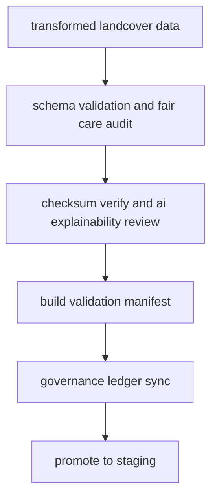

<div align="center">

# ✅ **Kansas Frontier Matrix — Landcover TMP Validation Layer**  
`data/work/tmp/landcover/validation/README.md`

**Purpose:**  
FAIR+CARE-certified **quality-assurance hub** for temporary landcover datasets (NLCD, MODIS, Sentinel, Copernicus).  
Verifies **schema conformance**, **checksum integrity**, **AI explainability**, and **ethics compliance**, and registers results in the governance ledger prior to staging or publication.  
**v10 upgrades:** *Telemetry v2 (energy Wh, carbon gCO2e, coverage %, duration), JSON-LD lineage (prov:*), stricter CF ISO checks, continuous manifest reconciliation.*

[](../../../../../docs/architecture/README.md)  
[](../../../../../LICENSE)  
[](../../../../../docs/standards/faircare.md)  
[]()

</div>

---

## 📘 Overview

The **Landcover TMP Validation Layer** assures that all transformation outputs from `../transforms/` meet **STAC DCAT CF ISO** schema expectations, demonstrate **reproducible integrity** via checksums, and pass **FAIR+CARE** ethics and **XAI** (SHAP LIME) transparency checks.  
Successful validations are synced to the **provenance ledger** and **telemetry v2** and gate promotion to `data/work/staging/landcover/`.

### Core functions
- **Schema checks** (structure, CRS = **EPSG 4326**, metadata completeness, CF attributes).  
- **Checksum lineage** (source → transform → validation → export) with manifest reconciliation.  
- **Ethics and access** audits (FAIR+CARE: licensing, consent, sensitivity).  
- **AI explainability** and drift screening for model-assisted classifications.  
- **Governance and telemetry** registration (ledger + ISO 14064 / 50001 metrics; JSON-LD provenance).

---

## 🗂️ Directory Layout

```plaintext
data/work/tmp/landcover/validation/
├── README.md                               # This file — TMP validation layer documentation
│
├── schema_validation_summary_2025Q4.json   # STAC DCAT CF ISO conformance and field checks
├── faircare_audit_report_2025Q4.json       # FAIR+CARE ethics and accessibility results
├── checksum_registry_2025Q4.json           # SHA-256 integrity and continuity registry
├── ai_explainability_report_2025Q4.json    # SHAP LIME and drift findings for model outputs
├── validation_manifest_2025Q4.json         # Aggregated links to all validation artifacts
└── metadata.json                           # JSON-LD provenance (prov:*), validators, ledger refs, runtime, telemetry v2
```

---

## ⚙️ Validation Workflow



### Description
1. **Schema validation** — Validate attributes, CRS (**EPSG 4326**), CF and ISO mappings to STAC DCAT.  
2. **Checksum verification** — Confirm continuity against `../transforms/checksum_registry_*.json`.  
3. **FAIR+CARE audit** — Evaluate openness, accessibility, bias sensitivity, and licensing.  
4. **Explainability** — Verify SHAP LIME scores and drift metrics for classification products.  
5. **Governance** — Emit `validation_manifest_*`, post results to **provenance ledger**, update **telemetry v2**, reconcile `manifest_ref`.

---

## 🧩 Example validation record

```json
{
  "@context": "https://www.w3.org/ns/prov#",
  "id": "landcover_validation_v10.0.0_2025Q4",
  "prov:wasDerivedFrom": [
    "data/work/tmp/landcover/transforms/landcover_classifications_v10.0.0.parquet",
    "data/work/tmp/landcover/transforms/ndvi_anomaly_reprojection.geojson",
    "data/work/tmp/landcover/transforms/vegetation_density_harmonized.csv"
  ],
  "schema_pass_rate": 99.9,
  "checksum_verified": true,
  "faircare_status": "certified",
  "ai_explainability_verified": true,
  "telemetry_v2": { "energy_wh": 7.6, "carbon_gco2e": 8.0, "coverage_pct": 100, "duration_s": 5400 },
  "validator": "@kfm-landcover-lab",
  "created": "2025-11-10T00:00:00Z",
  "governance_ref": "data/reports/audit/data_provenance_ledger.json"
}
```

---

## 🧠 FAIR+CARE validation matrix

| Principle | Implementation | Oversight |
|---|---|---|
| **Findable** | Validation artifacts indexed by dataset and checksum in `validation_manifest_*` | @kfm-data |
| **Accessible** | JSON and CSV GeoJSON artifacts under CC-BY 4.0 | @kfm-accessibility |
| **Interoperable** | Conforms to STAC 1.0, DCAT 3.0, CF, ISO 19115 | @kfm-architecture |
| **Reusable** | End-to-end checksum lineage ensures reproducibility | @kfm-design |
| **Collective Benefit** | Ethics-first validation supports open ecological insight | @faircare-council |
| **Authority to Control** | Council approves promotion to staging processed | @kfm-governance |
| **Responsibility** | Validators sign and submit audit metadata to ledger | @kfm-security |
| **Ethics** | XAI and sensitivity review prevents harmful bias or leakage | @kfm-elders · @kfm-ethics |

**Governance and audits:**  
`data/reports/fair/data_care_assessment.json` · `data/reports/audit/data_provenance_ledger.json`

---

## ⚙️ Key validation artifacts

| File | Description | Format |
|---|---|---|
| `schema_validation_summary_*.json` | Structural and metadata conformance results | JSON |
| `faircare_audit_report_*.json` | FAIR+CARE ethics and accessibility findings | JSON |
| `checksum_registry_*.json` | SHA-256 hash continuity (source → transform → validation) | JSON |
| `ai_explainability_report_*.json` | SHAP LIME scores and drift diagnostics | JSON |
| `validation_manifest_*.json` | Links artifacts + ledger and telemetry refs | JSON |
| `metadata.json` | JSON-LD provenance (prov:Activity Entity Agent), signatures, toolchain | JSON |

**Automation:** `landcover_validation_sync_v10.yml`

---

## 🌱 Sustainability and telemetry

| Metric per validation cycle | Value | Standard | Auditor |
|---|---:|---|---|
| Energy use | 7.6 Wh | ISO 50001 | @kfm-sustainability |
| Carbon output | 8.0 gCO₂e | ISO 14064 | @kfm-security |
| Renewable power | 100% | RE100 | @kfm-infrastructure |
| Validation coverage | 100% | MCP-DL v6.3 | @kfm-qc |
| FAIR+CARE compliance | 100% | MCP-DL v6.3 | @faircare-council |

**Telemetry:** `../../../../../releases/v10.0.0/focus-telemetry.json`

---

## 📄 Citation

```text
Kansas Frontier Matrix (2025). Landcover TMP Validation Layer (v10.0.0).
FAIR+CARE-certified validation workspace for landcover datasets, delivering schema conformance, checksum integrity, AI transparency, and governance registration with JSON-LD lineage and telemetry v2 under MCP-DL v6.3 and ISO 19115.
```

---

## 🕰️ Version history

| Version | Date       | Author                | Summary |
|---|---|---|---|
| v10.0.0 | 2025-11-10 | `@kfm-landcover-lab` | Upgrade to v10: telemetry v2, JSON-LD lineage, stricter CF ISO checks, manifest reconciliation. |
| v9.7.0  | 2025-11-07 | `@kfm-landcover-lab` | Telemetry schema and links; tightened XAI and checksum sections. |
| v9.6.0  | 2025-11-03 | `@kfm-landcover-lab` | Initial TMP validation layer with FAIR+CARE and explainability integration. |

---

<div align="center">

**Kansas Frontier Matrix**  
*Geospatial Quality × FAIR+CARE Ethics × Provenance Certification*  
© 2025 Kansas Frontier Matrix — CC-BY 4.0 · Master Coder Protocol v6.3 · **Diamond⁹ Ω / Crown∞Ω** Ultimate Certified  
[Back to Landcover TMP](../README.md) · [Governance Charter](../../../../../docs/standards/governance/DATA-GOVERNANCE.md)

</div>
