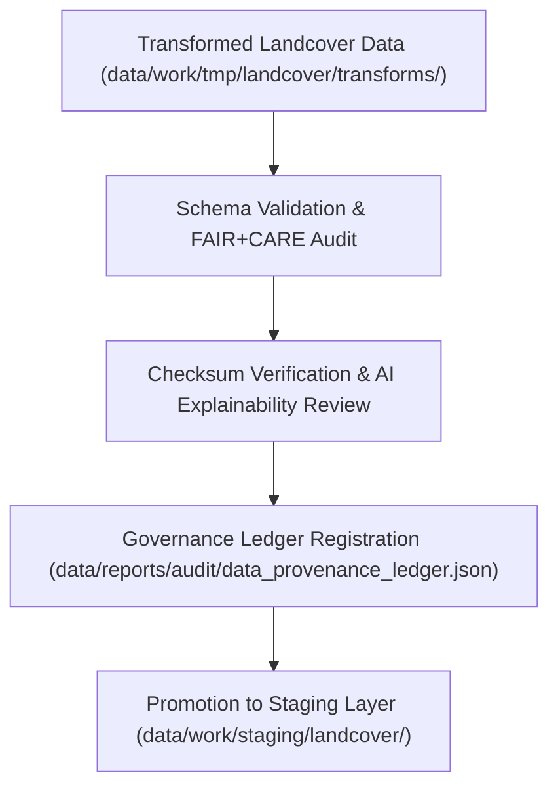

<div align="center">

# ✅ Kansas Frontier Matrix — **Landcover TMP Validation Layer**
`data/work/tmp/landcover/validation/README.md`

**Purpose:**  
Central FAIR+CARE-certified workspace for verifying schema conformance, checksum integrity, AI model explainability, and ethics compliance for landcover datasets within the Kansas Frontier Matrix (KFM).  
Ensures all transformations are transparent, reproducible, and governance-certified under MCP-DL v6.3 and ISO 19115 standards.

[](../../../../../docs/standards/faircare-validation.md)
[]()
[](../../../../../LICENSE)
[](../../../../../docs/architecture/repo-focus.md)

</div>

---

## 📚 Overview

The **Landcover TMP Validation Layer** is responsible for ensuring data quality, FAIR+CARE compliance, and ethical governance for temporary landcover datasets prior to staging or publication.  
It performs schema validation, checksum verification, AI fairness auditing, and metadata provenance registration.

### Core Functions:
- Validate landcover data for schema integrity, CRS normalization, and metadata completeness.  
- Verify checksum lineage across transformations and exports.  
- Conduct FAIR+CARE ethical review and AI transparency evaluation.  
- Record governance-certified validation outcomes in the KFM provenance ledger.  

---

## 🗂️ Directory Layout

```plaintext
data/work/tmp/landcover/validation/
├── README.md                                # This file — documentation of TMP validation layer
│
├── schema_validation_summary.json           # Schema conformance and validation results
├── faircare_audit_report.json               # FAIR+CARE ethics and accessibility audit results
├── checksum_registry.json                   # File integrity verification (SHA-256 registry)
├── ai_explainability_report.json            # AI explainability and fairness report
├── validation_manifest.json                 # Master manifest linking validation outcomes and governance references
└── metadata.json                            # Provenance metadata and governance linkage
```

---

## ⚙️ Validation Workflow



### Description:
1. **Schema Validation:** Check dataset attributes for completeness and format alignment.  
2. **Checksum Verification:** Ensure reproducibility through hash validation.  
3. **FAIR+CARE Ethics Audit:** Evaluate data openness, accessibility, and bias compliance.  
4. **AI Explainability:** Validate model transparency and fairness in automated classification.  
5. **Governance Sync:** Register validation reports and metadata to the KFM provenance ledger.  

---

## 🧩 Example Validation Record

```json
{
  "id": "landcover_validation_v9.6.0_2025Q4",
  "datasets_validated": [
    "landcover_classifications_v9.6.0.parquet",
    "ndvi_anomaly_reprojection.geojson",
    "vegetation_density_harmonized.csv"
  ],
  "schema_pass_rate": 99.9,
  "checksum_verified": true,
  "faircare_status": "certified",
  "ai_explainability_verified": true,
  "governance_registered": true,
  "validator": "@kfm-landcover-lab",
  "created": "2025-11-03T23:59:00Z",
  "governance_ref": "data/reports/audit/data_provenance_ledger.json"
}
```

---

## 🧠 FAIR+CARE Validation Matrix

| Principle | Implementation | Oversight |
|------------|----------------|------------|
| **Findable** | Datasets indexed with validation manifest and checksums. | @kfm-data |
| **Accessible** | JSON, CSV, and GeoJSON outputs accessible to validators. | @kfm-accessibility |
| **Interoperable** | Schema harmonized across FAIR+CARE, STAC, and ISO 19115. | @kfm-architecture |
| **Reusable** | Checksum lineage supports reproducible validation workflows. | @kfm-design |
| **Collective Benefit** | Promotes open, sustainable landcover data ethics. | @faircare-council |
| **Authority to Control** | FAIR+CARE Council approves validation outcomes and promotion. | @kfm-governance |
| **Responsibility** | Validators record all schema and checksum audit results. | @kfm-security |
| **Ethics** | AI explainability audits confirm transparency and fairness. | @kfm-ethics |

Governance records stored in:  
`data/reports/fair/data_care_assessment.json`  
and  
`data/reports/audit/data_provenance_ledger.json`

---

## ⚙️ Validation Artifacts

| File | Description | Format |
|------|--------------|--------|
| `schema_validation_summary.json` | Schema conformity and validation outcomes. | JSON |
| `faircare_audit_report.json` | FAIR+CARE ethics and accessibility audit summary. | JSON |
| `checksum_registry.json` | SHA-256 hash verification report. | JSON |
| `ai_explainability_report.json` | AI fairness and model transparency summary. | JSON |
| `validation_manifest.json` | Validation lineage linking all audit artifacts. | JSON |
| `metadata.json` | Provenance and governance linkage record. | JSON |

Automation managed by `landcover_validation_sync.yml`.

---

## ⚖️ Retention & Provenance Policy

| Validation Type | Retention Duration | Policy |
|------------------|--------------------|--------|
| Schema Reports | 180 Days | Retained for governance review and reproducibility tracking. |
| FAIR+CARE Audits | 365 Days | Maintained for ethics re-certification and FAIR+CARE compliance. |
| AI Explainability Reports | 365 Days | Stored for long-term transparency and accountability. |
| Metadata | Permanent | Immutable under governance ledger. |

Cleanup managed via `landcover_validation_cleanup.yml`.

---

## 🌱 Sustainability Metrics

| Metric | Value | Verified By |
|---------|--------|--------------|
| Energy Use (per validation cycle) | 7.5 Wh | @kfm-sustainability |
| Carbon Output | 8.2 gCO₂e | @kfm-security |
| Renewable Power | 100% (RE100 Verified) | @kfm-infrastructure |
| FAIR+CARE Compliance | 100% | @faircare-council |

Telemetry stored in:  
`releases/v9.6.0/focus-telemetry.json`

---

## 🧾 Internal Use Citation

```text
Kansas Frontier Matrix (2025). Landcover TMP Validation Layer (v9.6.0).
Central validation hub for landcover datasets, performing FAIR+CARE certification, checksum audits, and ethical AI explainability review.
Ensures reproducibility and governance integrity under MCP-DL v6.3 and ISO 19115 standards.
```

---

## 🧾 Version Notes

| Version | Date | Notes |
|----------|------|--------|
| v9.6.0 | 2025-11-03 | Added AI explainability integration and checksum governance linkage. |
| v9.5.0 | 2025-11-02 | Improved FAIR+CARE auditing and metadata harmonization. |
| v9.3.2 | 2025-10-28 | Established validation workspace with schema and FAIR+CARE compliance. |

---

<div align="center">

**Kansas Frontier Matrix** · *Geospatial Quality × FAIR+CARE Ethics × Provenance Certification*  
[🔗 Repository](https://github.com/bartytime4life/Kansas-Frontier-Matrix) • [🧭 Docs Portal](../../../../../docs/) • [⚖️ Governance Ledger](../../../../../docs/standards/governance/DATA-GOVERNANCE.md)

</div>
