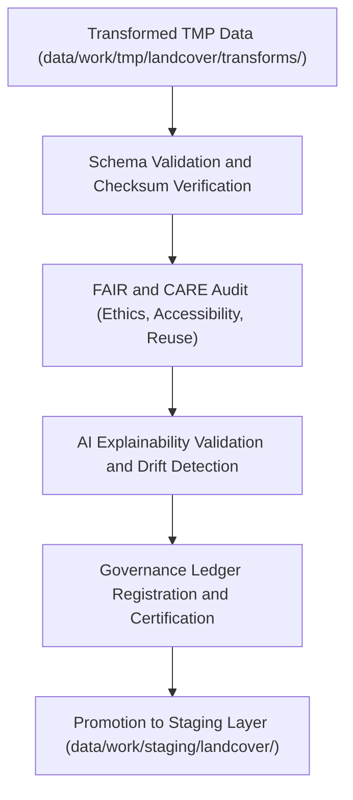

<div align="center">

# ✅ Kansas Frontier Matrix — **Landcover TMP Validation Workspace**
`data/work/tmp/landcover/validation/README.md`

**Purpose:**  
FAIR+CARE-certified quality assurance hub for **schema validation, checksum verification, and AI explainability auditing** of landcover datasets in the Kansas Frontier Matrix (KFM).  
This layer ensures all TMP transformations, exports, and AI outputs meet governance and reproducibility standards before staging promotion.

[](../../../../../docs/standards/faircare-validation.md)
[](../../../../../LICENSE)
[](../../../../../docs/architecture/repo-focus.md)

</div>

---

## 📚 Overview

The `data/work/tmp/landcover/validation/` directory serves as the **final QA checkpoint** for all temporary landcover processing workflows.  
It combines FAIR+CARE compliance testing, schema validation, checksum auditing, and explainability analysis to certify datasets for staging integration and open publication.

### Core Responsibilities
- Validate schema structure and alignment with data contracts.  
- Verify checksums and metadata consistency for reproducibility.  
- Conduct FAIR+CARE audits for ethics, accessibility, and transparency.  
- Perform AI explainability verification and governance registration.  

---

## 🗂️ Directory Layout

```plaintext
data/work/tmp/landcover/validation/
├── README.md                                # This file — documentation for Landcover TMP validation layer
│
├── schema_validation_summary.json           # Structural validation and schema compliance report
├── faircare_audit_report.json               # FAIR+CARE ethics and accessibility compliance audit
├── checksum_registry.json                   # Checksum results for all validated TMP files
├── ai_explainability_report.json            # AI interpretability validation and bias analysis
├── governance_review.json                   # Human oversight and governance review summary
└── metadata.json                            # Validation runtime metadata and provenance linkage
```

---

## ⚙️ Validation Workflow



### Workflow Description
1. **Schema Validation:** Ensure compliance with KFM’s standardized data contracts.  
2. **Checksum Verification:** Confirm integrity for all transformed and exported files.  
3. **FAIR+CARE Audit:** Review datasets for transparency, equity, and accessibility.  
4. **AI Explainability:** Validate interpretability of AI-derived features or classifications.  
5. **Governance Registration:** Log validation results and certification in provenance ledgers.  

---

## 🧩 Example Validation Metadata Record

```json
{
  "id": "landcover_tmp_validation_v9.5.0_2025Q4",
  "datasets_validated": [
    "landcover_normalized.parquet",
    "ndvi_index_resampled.tif",
    "vegetation_cover_2025.geojson"
  ],
  "records_validated": 984231,
  "schema_validation_passed": true,
  "checksum_verified": true,
  "fairstatus": "certified",
  "ai_explainability_score": 0.991,
  "governance_registered": true,
  "telemetry_ref": "releases/v9.5.0/focus-telemetry.json",
  "governance_ref": "reports/audit/ai_landcover_ledger.json",
  "created": "2025-11-02T23:59:00Z",
  "validator": "@kfm-landcover-validation"
}
```

---

## 🧠 FAIR+CARE Governance Matrix

| Principle | Implementation |
|------------|----------------|
| **Findable** | Validation results indexed with checksums and dataset IDs. |
| **Accessible** | Stored in open JSON formats under governance-compliant access controls. |
| **Interoperable** | Conforms to STAC 1.0, DCAT 3.0, ISO 19115, and CF Conventions. |
| **Reusable** | Validation metadata and ethics audit ensure reusability and accountability. |
| **Collective Benefit** | Promotes transparent, ethical data validation workflows. |
| **Authority to Control** | FAIR+CARE Council authorizes certification prior to staging. |
| **Responsibility** | Validators log schema, checksum, and FAIR+CARE results. |
| **Ethics** | Enforces ethical integrity and explainability for AI and data outputs. |

Governance and ethics results logged in:  
`reports/audit/ai_landcover_ledger.json` • `reports/fair/landcover_validation_summary.json`

---

## ⚙️ Validation & QA Artifacts

| File | Description | Format |
|------|--------------|--------|
| `schema_validation_summary.json` | Field-level validation and type checking results. | JSON |
| `faircare_audit_report.json` | FAIR+CARE governance and accessibility audit. | JSON |
| `checksum_registry.json` | Checksum and reproducibility tracking for validated files. | JSON |
| `ai_explainability_report.json` | Explainable AI validation and ethics scoring report. | JSON |
| `governance_review.json` | Governance council’s ethical and technical approval log. | JSON |
| `metadata.json` | Provenance, checksum, and validation runtime metadata. | JSON |

Synchronization managed by `landcover_validation_sync.yml`.

---

## 🧾 Retention Policy

| File Type | Retention Duration | Policy |
|------------|--------------------|--------|
| Validation Reports | 365 days | Archived under FAIR+CARE governance for audit. |
| FAIR+CARE Audits | Permanent | Maintained indefinitely for ethics and provenance traceability. |
| Checksum Logs | Permanent | Retained for reproducibility assurance. |
| Metadata | Permanent | Stored under provenance lineage registry. |

Cleanup handled via `landcover_validation_cleanup.yml`.

---

## 🧾 Internal Use Citation

```text
Kansas Frontier Matrix (2025). Landcover TMP Validation Workspace (v9.5.0).
FAIR+CARE-certified environment for schema validation, checksum verification, and AI explainability auditing of landcover datasets.
Supports transparent, ethical, and reproducible QA processes under MCP-DL v6.3 standards.
```

---

## 🧾 Version Notes

| Version | Date | Notes |
|----------|------|--------|
| v9.5.0 | 2025-11-02 | Added AI explainability validation and checksum registry integration. |
| v9.3.2 | 2025-10-28 | Enhanced FAIR+CARE audit schema for reproducibility tracking. |
| v9.3.0 | 2025-10-26 | Established validation layer for landcover TMP governance certification. |

---

<div align="center">

**Kansas Frontier Matrix** · *Validation Precision × FAIR+CARE Ethics × Provenance Integrity*  
[🔗 Repository](https://github.com/bartytime4life/Kansas-Frontier-Matrix) • [🧭 Docs Portal](../../../../../docs/) • [⚖️ Governance Ledger](../../../../../docs/standards/governance/)

</div>