<div align="center">

# ✅ Kansas Frontier Matrix — **Landcover TMP Validation Layer**
`data/work/tmp/landcover/validation/README.md`

**Purpose:**  
FAIR+CARE-certified **quality-assurance hub** for temporary landcover datasets (NLCD, MODIS, Sentinel, Copernicus).  
Verifies **schema conformance, checksum integrity, AI explainability**, and **ethics compliance**, and registers results in the governance ledger prior to staging or publication.

[](../../../../../docs/architecture/README.md)
[](../../../../../LICENSE)
[](../../../../../docs/standards/faircare-validation.md)
[]()

</div>

---

## 📘 Overview

The **Landcover TMP Validation Layer** assures that all transformation outputs from `../transforms/` meet **STAC/DCAT/CF/ISO** schema expectations, demonstrate **reproducible integrity** via checksums, and pass **FAIR+CARE** ethics and **XAI** (SHAP/LIME) transparency checks. Successful validations are synced to the **provenance ledger** and **telemetry**.

### Core Functions
- **Schema checks** (structure, CRS = **EPSG:4326**, metadata completeness).  
- **Checksum lineage** (source→transform→validation→export).  
- **Ethics & access** audits (FAIR+CARE, licensing, sensitive content review).  
- **AI explainability** & drift screening for model-assisted classifications.  
- **Governance & telemetry** registration (ledger + ISO 14064/50001 metrics).

---

## 🗂️ Directory Layout

```plaintext
data/work/tmp/landcover/validation/
├── README.md                                # This file — TMP validation layer documentation
│
├── schema_validation_summary.json           # STAC/DCAT/CF/ISO conformance & field checks
├── faircare_audit_report.json               # FAIR+CARE ethics & accessibility results
├── checksum_registry.json                   # SHA-256 integrity & continuity registry
├── ai_explainability_report.json            # SHAP/LIME & drift findings for model outputs
├── validation_manifest.json                 # Aggregated links to all validation artifacts
└── metadata.json                            # Provenance (sources, validators, ledger refs, runtime)
```

---

## ⚙️ Validation Workflow

```mermaid
flowchart TD
    A["Transformed Landcover Data (data/work/tmp/landcover/transforms/)"] --> B["Schema Validation & FAIR·CARE Audit"]
    B --> C["Checksum Verification & AI Explainability Review"]
    C --> D["Validation Manifest Build → validation_manifest.json"]
    D --> E["Governance Ledger Sync (data/reports/audit/data_provenance_ledger.json)"]
    E --> F["Promotion to Staging (data/work/staging/landcover/)"]
```



### Description
1. **Schema Validation** — Validate attributes, CRS (**EPSG:4326**), CF/ISO/STAC/DCAT mappings.  
2. **Checksum Verification** — Confirm reproducibility against `../transforms/checksum_registry.json`.  
3. **FAIR+CARE Audit** — Evaluate openness, accessibility, bias/sensitivity, and licensing.  
4. **Explainability** — Verify SHAP/LIME scores and drift metrics for classification products.  
5. **Governance** — Emit `validation_manifest.json`, post results to **provenance ledger**, update **telemetry**.

---

## 🧩 Example Validation Record

```json
{
  "id": "landcover_validation_v9.7.0_2025Q4",
  "datasets_validated": [
    "landcover_classifications_v9.7.0.parquet",
    "ndvi_anomaly_reprojection.geojson",
    "vegetation_density_harmonized.csv"
  ],
  "schema_pass_rate": 99.9,
  "checksum_verified": true,
  "faircare_status": "certified",
  "ai_explainability_verified": true,
  "telemetry": { "energy_wh": 7.5, "carbon_gco2e": 8.2 },
  "validator": "@kfm-landcover-lab",
  "created": "2025-11-07T00:00:00Z",
  "governance_ref": "data/reports/audit/data_provenance_ledger.json"
}
```

---

## 🧠 FAIR+CARE Validation Matrix

| Principle | Implementation | Oversight |
|---|---|---|
| **Findable** | Validation artifacts indexed by dataset & checksum in `validation_manifest.json` | @kfm-data |
| **Accessible** | JSON/CSV/GeoJSON artifacts under CC-BY 4.0 for council review | @kfm-accessibility |
| **Interoperable** | STAC 1.0 / DCAT 3.0 / CF / ISO 19115 alignment verified | @kfm-architecture |
| **Reusable** | End-to-end checksum lineage ensures reproducibility | @kfm-design |
| **Collective Benefit** | Ethics-first validation supports open ecological insights | @faircare-council |
| **Authority to Control** | Council approves promotion to staging/processed | @kfm-governance |
| **Responsibility** | Validators sign & submit audit metadata to ledger | @kfm-security |
| **Ethics** | XAI + sensitivity review prevents harmful bias/leakage | @kfm-ethics |

**Governance & Audits:**  
`data/reports/fair/data_care_assessment.json` · `data/reports/audit/data_provenance_ledger.json`

---

## ⚙️ Key Validation Artifacts

| File | Description | Format |
|---|---|---|
| `schema_validation_summary.json` | Structural & metadata conformance results | JSON |
| `faircare_audit_report.json` | FAIR+CARE ethics & accessibility findings | JSON |
| `checksum_registry.json` | SHA-256 hash continuity (source→transform→validation) | JSON |
| `ai_explainability_report.json` | SHAP/LIME scores & drift diagnostics | JSON |
| `validation_manifest.json` | Links all artifacts + ledger & telemetry refs | JSON |
| `metadata.json` | Provenance (inputs, toolchain, runtime, sign-offs) | JSON |

**Automation:** `landcover_validation_sync.yml`

---

## 🌱 Sustainability & Telemetry

| Metric (per validation cycle) | Value | Standard | Auditor |
|---|---:|---|---|
| Energy Use | 7.5 Wh | ISO 50001 | @kfm-sustainability |
| Carbon Output | 8.2 gCO₂e | ISO 14064 | @kfm-security |
| Renewable Power | 100% | RE100 | @kfm-infrastructure |
| FAIR+CARE Compliance | 100% | MCP-DL v6.3 | @faircare-council |

**Telemetry:** `../../../../../releases/v9.7.0/focus-telemetry.json`

---

## 📄 Citation

```text
Kansas Frontier Matrix (2025). Landcover TMP Validation Layer (v9.7.0).
FAIR+CARE-certified validation workspace for landcover datasets, delivering schema conformance, checksum integrity, AI explainability, and governance registration under MCP-DL v6.3 and ISO 19115.
```

---

## 🕰️ Version History

| Version | Date | Author | Summary |
|---|---|---|---|
| v9.7.0 | 2025-11-07 | `@kfm-landcover-lab` | Upgraded to v9.7.0; added telemetry schema & links; refreshed badges/refs; tightened XAI & checksum sections. |
| v9.6.0 | 2025-11-03 | `@kfm-landcover-lab` | Initial TMP validation layer with FAIR+CARE & explainability integration. |

---

<div align="center">

**Kansas Frontier Matrix**  
*Geospatial Quality × FAIR+CARE Ethics × Provenance Certification*  
© 2025 Kansas Frontier Matrix — CC-BY 4.0 · Master Coder Protocol v6.3 · **Diamond⁹ Ω / Crown∞Ω** Ultimate Certified  

[Back to Landcover TMP](../README.md) · [Governance Charter](../../../../../docs/standards/governance/DATA-GOVERNANCE.md)

</div>