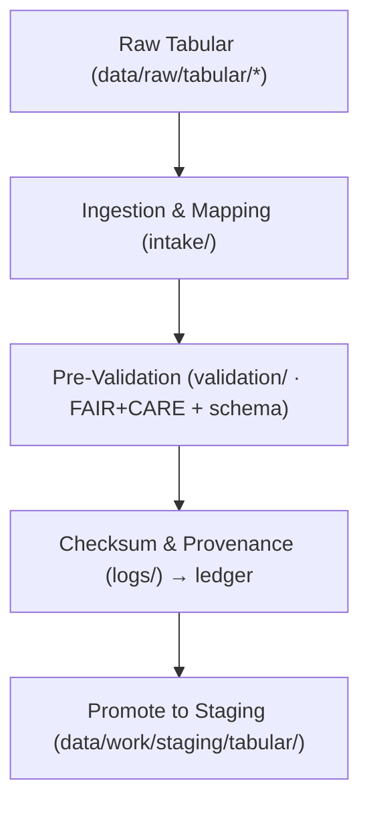

<div align="center">

# 📊 **Kansas Frontier Matrix — Tabular TMP Workspace**  
`data/work/tmp/tabular/README.md`

**Purpose:**  
FAIR+CARE-certified **transient staging area** for ingesting, normalizing, and pre-validating tabular datasets (census, economic, historical, scientific) before they advance to `data/work/staging/tabular/`.  
This layer enforces **schema contracts, ethics pre-audits, checksum lineage**, and **governance telemetry** for reproducible ETL.  
**v10 upgrades:** Telemetry v2 fields (energy Wh, carbon gCO₂e, duration, coverage), JSON-LD provenance (prov:*), stricter `data-contract-v3` rule checks, and continuous manifest reconciliation.

[](../../../../docs/architecture/README.md)  
[](../../../../LICENSE)  
[](../../../../docs/standards/faircare-validation.md)  
[]()

</div>

---

## 📘 Overview

The **Tabular TMP** layer is optimized for high-throughput, short-lived processing of CSV/Parquet/JSON tables.  
All runs emit **validation artifacts** and **provenance signals** to the governance ledger and **work-tabular-tmp v10** telemetry stream for continuous compliance (ISO 50001/14064) and auditability.

### Core Functions
- **Ingest** heterogeneous tabular sources (Census, BEA, NCEI, BLM, KHS/NARA).  
- **Normalize** structures to `data-contract-v3` (types, constraints, code lists).  
- **Pre-validate** with FAIR+CARE ethics checks & PII/redaction gates.  
- **Verify integrity** with SHA-256 lineage (raw → intake → tmp → staging).  
- **Sync governance**: emit metadata and run stats to `data_provenance_ledger.json`.

---

## 🗂️ Directory Layout

```plaintext
data/work/tmp/tabular/
├── README.md                       # This file — Tabular TMP specification
│
├── intake/                         # Initial ingestion & schema mapping
│   ├── tabular_intake_2025Q4.csv
│   ├── treaties_intake.csv
│   └── metadata.json
│
├── validation/                     # Pre-FAIR+CARE & schema checks
│   ├── schema_preview.json
│   ├── faircare_pre_audit.json
│   └── metadata.json
│
├── logs/                           # ETL & governance telemetry
│   ├── etl_tmp_run.log
│   ├── validation_summary.log
│   ├── governance_sync.log
│   └── metadata.json
│
└── tmp/                            # Transient normalized artifacts
    ├── tabular_tmp_summary.parquet
    ├── data_contract_check.json
    └── metadata.json
```

---

## ⚙️ Workflow (TMP → Staging)



### Step Details
1. **Ingestion** — Load CSV/Parquet/JSON; detect types, encodings, null semantics, PK/FK.  
2. **Schema Mapping** — Conform to `data-contract-v3` (field specs, codelists, units).  
3. **Pre-Validation** — Run `schema_preview` + `faircare_pre_audit` (PII, bias, license).  
4. **Integrity & Ledger** — Write `data_contract_check.json`, SHA-256 to `governance_ref`; reconcile against `manifest_ref`.  
5. **Promotion** — Only green-lit artifacts move to `data/work/staging/tabular/`.

---

## 🧩 Example TMP Metadata Record

```json
{
  "@context": "https://www.w3.org/ns/prov#",
  "id": "tabular_tmp_v10.0.0_2025Q4",
  "datasets_processed": ["tabular_intake_2025Q4.csv", "treaties_intake.csv"],
  "records_total": 128940,
  "schema_compliance": 0.999,
  "checksum_verified": true,
  "faircare_status": "compliant",
  "telemetry_v2": { "energy_wh": 6.2, "carbon_gco2e": 7.1, "duration_s": 3100, "coverage_pct": 100 },
  "validator": "@kfm-tabular-lab",
  "created": "2025-11-10T00:00:00Z",
  "governance_registered": true,
  "governance_ref": "data/reports/audit/data_provenance_ledger.json"
}
```

---

## 🧠 FAIR+CARE Governance Matrix

| Principle | Implementation | Owner |
|---|---|---|
| **Findable** | Versioned checksum IDs & JSON-LD provenance (prov:Activity/Entity/Agent) | @kfm-data |
| **Accessible** | Open CSV/Parquet; MD/JSON audit artifacts | @kfm-accessibility |
| **Interoperable** | `data-contract-v3`, DCAT 3.0; consistent code lists | @kfm-architecture |
| **Reusable** | Lineage + checksums in `metadata.json` & ledger | @kfm-design |
| **Collective Benefit** | Equitable access to environmental & historical stats | @faircare-council |
| **Authority to Control** | Council reviews PII, licenses, sensitivity flags | @kfm-governance |
| **Responsibility** | Operators sign validation & sync to ledger | @kfm-security |
| **Ethics** | Pre-publication redaction & bias screens | @kfm-ethics |

**Audits:** `data/reports/fair/data_care_assessment.json` · `data/reports/audit/data_provenance_ledger.json`

---

## 📦 Key TMP Artifacts

| Artifact | Purpose | Format |
|---|---|---|
| `intake/*.csv|parquet|json` | Raw → normalized inputs | CSV/Parquet/JSON |
| `validation/schema_preview.json` | Field types, constraints, nullability, enums | JSON |
| `validation/faircare_pre_audit.json` | Ethics/accessibility pre-check | JSON |
| `logs/validation_summary.log` | Pre-validation & checksum outcomes | Text |
| `tmp/tabular_tmp_summary.parquet` | Normalized, deduped, typed staging table | Parquet |
| `tmp/data_contract_check.json` | Contract deltas & rule conformance | JSON |
| `metadata.json` | Provenance & checksum lineage | JSON |

**Automation:** `tabular_tmp_sync_v10.yml`

---

## 🌱 Telemetry & Sustainability (per run)

| Metric | Value | Standard | Auditor |
|---|---:|---|---|
| Energy Use | 6.2 Wh | ISO 50001 | @kfm-sustainability |
| Carbon Output | 7.1 gCO₂e | ISO 14064 | @kfm-security |
| Renewable Power | 100% | RE100 | @kfm-infrastructure |
| FAIR+CARE Pre-Compliance | 100% | MCP-DL v6.3 | @faircare-council |

**Telemetry:** `../../../../releases/v10.0.0/focus-telemetry.json`

---

## 📄 Citation

```text
Kansas Frontier Matrix (2025). Tabular TMP Workspace (v10.0.0).
FAIR+CARE-certified transient layer for tabular ingestion, normalization, and pre-validation, delivering structured, ethical, and reproducible inputs to staging under MCP-DL v6.3 and ISO 19115 with telemetry v2 and JSON-LD provenance.
```

---

## 🕰️ Version History

| Version | Date       | Author            | Summary |
|---|---|---|---|
| v10.0.0 | 2025-11-10 | `@kfm-tabular-lab` | Upgrade to v10: telemetry v2, JSON-LD provenance, continuous manifest reconciliation, stricter contract checks. |
| v9.7.0  | 2025-11-07 | `@kfm-tabular-lab` | Telemetry schema & governance sync; refined layout & artifacts. |
| v9.6.0  | 2025-11-03 | `@kfm-tabular-lab` | Introduced checksum lineage & FAIR+CARE pre-audit; initial TMP spec. |

---

<div align="center">

**Kansas Frontier Matrix**  
*Structured Intelligence × FAIR+CARE Ethics × Provenance Governance*  
© 2025 Kansas Frontier Matrix — CC-BY 4.0 · Master Coder Protocol v6.3 · **Diamond⁹ Ω / Crown∞Ω** Ultimate Certified  
[Back to Work Layer](../README.md) · [Governance Charter](../../../../docs/standards/governance/DATA-GOVERNANCE.md)

</div>
