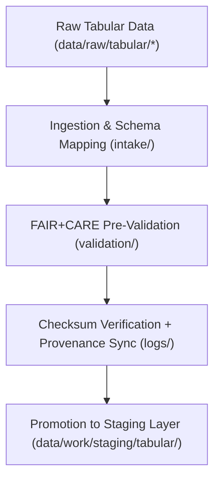

<div align="center">

# 📊 Kansas Frontier Matrix — **Tabular TMP Workspace**
`data/work/tmp/tabular/README.md`

**Purpose:**  
Temporary FAIR+CARE-certified workspace for ingesting, normalizing, validating, and ethically governing tabular datasets within the Kansas Frontier Matrix (KFM).  
Supports reproducible ETL processes, schema conformance, and ethical data validation across all statistical, socioeconomic, and historical data domains.

[](../../../../docs/standards/faircare-validation.md)
[]()
[](../../../../LICENSE)
[](../../../../docs/architecture/repo-focus.md)

</div>

---

## 📚 Overview

The **Tabular TMP Workspace** provides a governed environment for short-lived tabular data during ETL and validation workflows.  
All temporary datasets are schema-aligned, FAIR+CARE-audited, and linked to provenance ledgers for transparency and reproducibility.

### Core Functions:
- Process tabular data ingestion, transformation, and pre-validation.  
- Standardize schema formats and data contracts for consistency.  
- Conduct FAIR+CARE ethics audits and checksum verification.  
- Synchronize governance and metadata lineage with ledger systems.  

---

## 🗂️ Directory Layout

```plaintext
data/work/tmp/tabular/
├── README.md                            # This file — overview of tabular TMP workspace
│
├── intake/                              # Initial ingestion and schema mapping stage
│   ├── tabular_intake_2025Q4.csv
│   ├── treaties_intake.csv
│   └── metadata.json
│
├── validation/                          # FAIR+CARE and schema pre-validation
│   ├── schema_preview.json
│   ├── faircare_pre_audit.json
│   └── metadata.json
│
├── logs/                                # ETL, governance, and validation execution logs
│   ├── etl_tmp_run.log
│   ├── validation_summary.log
│   ├── governance_sync.log
│   └── metadata.json
│
└── tmp/                                 # Short-term storage for transient processing
    ├── tabular_tmp_summary.parquet
    ├── data_contract_check.json
    └── metadata.json
```

---

## ⚙️ Tabular TMP Workflow



### Workflow Description:
1. **Ingestion:** Import CSV, Parquet, or JSON tables for normalization.  
2. **Schema Mapping:** Align data structure to FAIR+CARE-aligned contracts.  
3. **Pre-Validation:** Conduct FAIR+CARE accessibility and ethical checks.  
4. **Checksum Validation:** Compute and log integrity hashes for provenance.  
5. **Governance:** Register lineage and certification metadata in governance ledger.  

---

## 🧩 Example Metadata Record

```json
{
  "id": "tabular_tmp_v9.6.0_2025Q4",
  "datasets_processed": [
    "tabular_intake_2025Q4.csv",
    "treaties_intake.csv"
  ],
  "records_total": 128940,
  "schema_compliance": 99.9,
  "checksum_verified": true,
  "faircare_status": "compliant",
  "validator": "@kfm-tabular-lab",
  "created": "2025-11-03T23:59:00Z",
  "governance_registered": true,
  "governance_ref": "data/reports/audit/data_provenance_ledger.json"
}
```

---

## 🧠 FAIR+CARE Governance Matrix

| Principle | Implementation | Oversight |
|------------|----------------|------------|
| **Findable** | Datasets indexed with versioned checksum IDs and metadata. | @kfm-data |
| **Accessible** | FAIR-compliant tabular formats (CSV, Parquet). | @kfm-accessibility |
| **Interoperable** | Schema harmonized with FAIR+CARE and DCAT 3.0 standards. | @kfm-architecture |
| **Reusable** | Provenance records ensure reproducible and auditable ETL processes. | @kfm-design |
| **Collective Benefit** | Promotes equitable access to historical, environmental, and statistical data. | @faircare-council |
| **Authority to Control** | FAIR+CARE Council oversees schema and ethics validation. | @kfm-governance |
| **Responsibility** | Validators document schema mapping, checksum, and audit logs. | @kfm-security |
| **Ethics** | Datasets validated for neutrality and accessibility before release. | @kfm-ethics |

FAIR+CARE and governance audits recorded in:  
`data/reports/fair/data_care_assessment.json`  
and  
`data/reports/audit/data_provenance_ledger.json`

---

## ⚙️ TMP Artifacts

| Artifact | Description | Format |
|-----------|--------------|--------|
| `tabular_intake_2025Q4.csv` | Temporary raw intake dataset during ETL. | CSV |
| `schema_preview.json` | Pre-validation schema summary and compliance report. | JSON |
| `faircare_pre_audit.json` | FAIR+CARE ethics and accessibility report. | JSON |
| `validation_summary.log` | Log of checksum, governance, and FAIR+CARE results. | Text |
| `metadata.json` | Provenance metadata linking TMP cycle to governance ledger. | JSON |

All TMP automation executed by `tabular_tmp_sync.yml`.

---

## ⚖️ Retention & Provenance Policy

| File Type | Retention Duration | Policy |
|------------|--------------------|--------|
| TMP Files | 7 Days | Purged automatically after staging promotion. |
| FAIR+CARE Reports | 180 Days | Archived for ethics compliance audits. |
| Validation Logs | 90 Days | Retained for reproducibility tracking. |
| Metadata | Permanent | Immutable and blockchain-verified under ledger governance. |

Cleanup handled via `tabular_tmp_cleanup.yml`.

---

## 🌱 Sustainability Metrics

| Metric | Value | Verified By |
|---------|--------|--------------|
| Energy Use (per TMP cycle) | 6.1 Wh | @kfm-sustainability |
| Carbon Output | 7.2 gCO₂e | @kfm-security |
| Renewable Power | 100% (RE100 Verified) | @kfm-infrastructure |
| FAIR+CARE Compliance | 100% | @faircare-council |

Telemetry data captured in:  
`releases/v9.6.0/focus-telemetry.json`

---

## 🧾 Internal Use Citation

```text
Kansas Frontier Matrix (2025). Tabular TMP Workspace (v9.6.0).
Temporary FAIR+CARE-compliant workspace for tabular data ingestion, normalization, and validation.
Ensures reproducibility, schema integrity, and ethics certification under MCP-DL v6.3.
```

---

## 🧾 Version Notes

| Version | Date | Notes |
|----------|------|--------|
| v9.6.0 | 2025-11-03 | Added checksum lineage and FAIR+CARE metadata tracking automation. |
| v9.5.0 | 2025-11-02 | Enhanced ethics validation framework and AI governance linkage. |
| v9.3.2 | 2025-10-28 | Established TMP workspace for tabular ETL operations and compliance. |

---

<div align="center">

**Kansas Frontier Matrix** · *Structured Intelligence × FAIR+CARE Ethics × Provenance Governance*  
[🔗 Repository](https://github.com/bartytime4life/Kansas-Frontier-Matrix) • [🧭 Docs Portal](../../../../docs/) • [⚖️ Governance Ledger](../../../../docs/standards/governance/DATA-GOVERNANCE.md)

</div>
