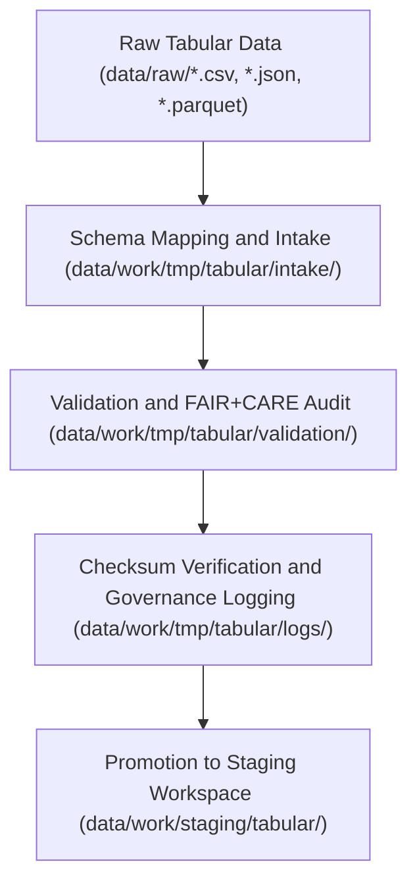

<div align="center">

# 📊 Kansas Frontier Matrix — **Tabular TMP Workspace**
`data/work/tmp/tabular/README.md`

**Purpose:**  
Temporary FAIR+CARE-certified workspace for **tabular dataset ingestion, schema normalization, validation, and FAIR+CARE pre-certification** within the Kansas Frontier Matrix (KFM).  
This layer ensures that every CSV, JSON, and Parquet dataset processed during ETL meets the standards of reproducibility, ethics, and open data interoperability.

[](../../../../docs/standards/faircare-validation.md)
[](../../../../LICENSE)
[](../../../../docs/architecture/repo-focus.md)

</div>

---

## 📚 Overview

The `data/work/tmp/tabular/` directory serves as a **transient environment for tabular data transformation, quality assurance, and FAIR+CARE ethics validation**.  
All files within this workspace are short-lived, version-tracked, checksum-verified, and fully auditable under MCP-DL governance.

### Core Responsibilities
- Manage tabular ingestion from raw data repositories.  
- Apply schema harmonization and metadata enrichment.  
- Conduct FAIR+CARE pre-audits and validation reporting.  
- Record provenance and lineage for governance synchronization.  

---

## 🗂️ Directory Layout

```plaintext
data/work/tmp/tabular/
├── README.md                             # This file — overview of Tabular TMP Workspace
│
├── intake/                               # Raw ingestion and schema mapping workspace
│   ├── hazards_intake_2025.csv
│   ├── climate_indices_intake.parquet
│   ├── treaties_intake.csv
│   └── metadata.json
│
├── validation/                           # Schema pre-validation and FAIR+CARE audit layer
│   ├── schema_preview.json
│   ├── field_normalization_summary.json
│   ├── faircare_pre_audit.json
│   └── metadata.json
│
├── logs/                                 # Temporary execution and provenance logs
│   ├── etl_tmp_run.log
│   ├── data_contract_check.log
│   ├── governance_sync.log
│   └── metadata.json
│
└── metadata.json                         # TMP session metadata and checksum registration
```

---

## ⚙️ TMP Workflow



### Workflow Description
1. **Ingestion:** Raw tabular files are imported into intake for field mapping and metadata capture.  
2. **Validation:** Apply JSON schema checks, normalization, and FAIR+CARE ethics review.  
3. **Checksum Audit:** Ensure data consistency and lineage reproducibility.  
4. **Governance Registration:** Log metadata and results in provenance ledgers.  
5. **Promotion:** Transfer validated tabular datasets to staging for long-term certification.  

---

## 🧩 Example TMP Metadata Record

```json
{
  "id": "tabular_tmp_v9.5.0_2025Q4",
  "source_files": [
    "data/raw/noaa/temperature_anomalies/kansas_temp_anomalies_2025.csv",
    "data/raw/noaa/drought_monitor/drought_monitor_2025.csv"
  ],
  "records_processed": 54231,
  "schema_version": "v3.0.1",
  "validation_status": "passed",
  "checksum_verified": true,
  "fairstatus": "certified",
  "governance_registered": true,
  "telemetry_ref": "releases/v9.5.0/focus-telemetry.json",
  "governance_ref": "reports/audit/ai_tabular_ledger.json",
  "created": "2025-11-02T23:50:00Z",
  "validator": "@kfm-tabular-etl"
}
```

---

## 🧠 FAIR+CARE Governance Matrix

| Principle | Implementation |
|------------|----------------|
| **Findable** | Datasets indexed via metadata and checksum registry. |
| **Accessible** | Stored in open CSV, Parquet, and JSON formats under FAIR+CARE governance. |
| **Interoperable** | Schema aligned with DCAT 3.0, STAC 1.0, and ISO 19115 lineage standards. |
| **Reusable** | Metadata includes provenance, schema mapping, and audit trail. |
| **Collective Benefit** | Enables equitable reuse of structured environmental datasets. |
| **Authority to Control** | FAIR+CARE Council validates schema harmonization and audit results. |
| **Responsibility** | ETL engineers document normalization and checksum verifications. |
| **Ethics** | Ensures ethical representation and anonymization in tabular datasets. |

Audit and governance records stored in:  
`reports/audit/ai_tabular_ledger.json` • `reports/fair/tabular_tmp_summary.json`

---

## ⚙️ Validation & QA Artifacts

| File / Folder | Description | Format |
|----------------|--------------|--------|
| `intake/` | Raw ingestion and schema mapping artifacts. | CSV / Parquet / JSON |
| `validation/` | FAIR+CARE audit results and schema conformance reports. | JSON |
| `logs/` | Execution traces and governance synchronization logs. | Text / JSON |
| `metadata.json` | Session metadata, checksum, and governance registry linkage. | JSON |

Automation synchronized by `tabular_tmp_sync.yml`.

---

## 🧾 Retention Policy

| File Type | Retention Duration | Policy |
|------------|--------------------|--------|
| TMP Files | 14 days | Purged after validation and promotion to staging. |
| Logs | 30 days | Archived for audit and reproducibility reviews. |
| Metadata | 365 days | Retained for provenance continuity. |
| FAIR+CARE Reports | Permanent | Maintained under governance and certification ledgers. |

Cleanup handled by `tabular_tmp_cleanup.yml`.

---

## 🧾 Internal Use Citation

```text
Kansas Frontier Matrix (2025). Tabular TMP Workspace (v9.5.0).
FAIR+CARE-certified workspace for ingestion, schema normalization, and pre-validation of tabular datasets.
Supports ethical, reproducible, and transparent ETL governance under MCP-DL v6.3 compliance.
```

---

## 🧾 Version Notes

| Version | Date | Notes |
|----------|------|--------|
| v9.5.0 | 2025-11-02 | Added schema validation logging and expanded FAIR+CARE integration. |
| v9.3.2 | 2025-10-28 | Improved checksum tracking and metadata governance registration. |
| v9.3.0 | 2025-10-26 | Established tabular TMP workspace for FAIR+CARE-certified ingestion. |

---

<div align="center">

**Kansas Frontier Matrix** · *Tabular Integrity × FAIR+CARE Ethics × Provenance Assurance*  
[🔗 Repository](https://github.com/bartytime4life/Kansas-Frontier-Matrix) • [🧭 Docs Portal](../../../../docs/) • [⚖️ Governance Ledger](../../../../docs/standards/governance/)

</div>