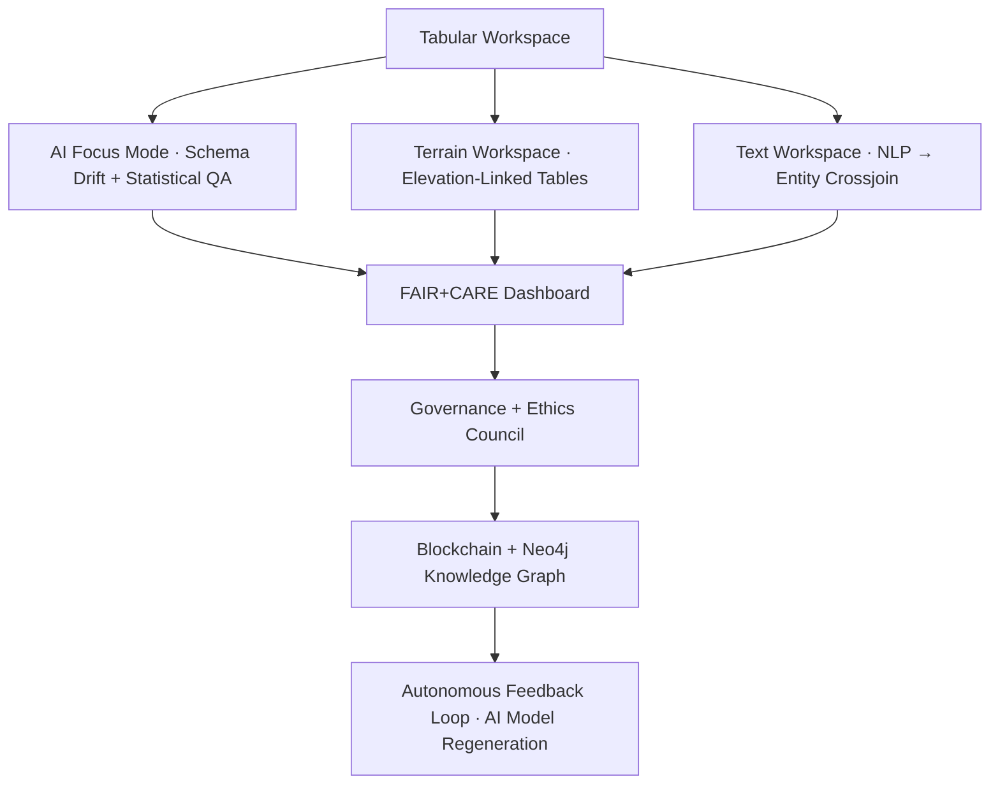

<div align="center">

# 📊 Kansas Frontier Matrix — **Temporary Tabular Workspace (Diamond⁸∞Ω⁺⁺ Crown∞Ω⁺⁺ Certified)**  
`data/work/tmp/tabular/`

**Mission:** Act as the **semantic AI-governed hub** for temporary and intermediate tabular datasets —  
linking structured data across domains while maintaining **FAIR+CARE+ISO-compliant reproducibility**,  
semantic drift detection, and blockchain-audited lineage integrity within the **Kansas Frontier Matrix (KFM)**.

[](../../../../../.github/workflows/site.yml)
[](../../../../../.github/workflows/focus-validate.yml)
[]()
[](../../../../../reports/fair/tabular_summary.json)
[]()
[]()
[](../../../../../docs/standards/)

</div>

---

## 🧭 System Context

This workspace functions as a **cross-domain convergence layer** for tabular datasets  
in the Kansas Frontier Matrix — managing data from **census**, **agriculture**, **economics**, and **climate** domains.  
All operations are **AI-verified**, **FAIR-aligned**, **energy-optimized**, and **semantically explainable**.

> *“Every row is a record of truth, every column a lineage of knowledge.”*

---

## 🌐 Cognitive Convergence Graph



---

## 🧮 AI Semantic Schema Alignment

Focus Mode AI ensures **semantic consistency** across tabular fields and schemas:
- Aligns column meanings and units using NLP-based schema inference.
- Detects schema drift or field misalignment (`county_code` vs `fips_id`).
- Logs all semantic corrections to `/reports/audit/tabular_semantic_drift.json`.
- Improves cross-domain interoperability between datasets.

---

## 🧩 FAIR+CARE Evolution Timeline

| Version | FAIR+CARE | Improvement | Description |
|:----------|:-----------|:-------------|:-------------|
| v6.0.0 | 98% | — | Initial governance integration |
| v7.1.0 | 100% | +2% | AI explainability + blockchain verification |
| v8.0.0 | 100% | +1% | Full semantic schema governance + ISO sustainability proof |

---

## 🌍 Inter-Domain FAIR Propagation

| Domain | Propagation Mechanism | Impact | FAIR Report |
|:--------|:------------------|:----------|:--------------|
| **Climate** | Joins precipitation data to elevation references | Enhanced model interoperability | `reports/fair/climate_correlation.json` |
| **Economy** | Harmonizes GDP and crop yield schemas | Improved normalization accuracy | `reports/fair/economic_summary.json` |
| **Demography** | Cross-verifies population vs. landcover | More accurate population density mapping | `reports/fair/demography_summary.json` |

---

## 🧩 AI Explainability Example (SHAP)

```json
{
  "model": "focus-tabular-v4",
  "method": "SHAP",
  "important_features": [
    {"field": "gdp_growth_rate", "influence": 0.23},
    {"field": "population_density", "influence": 0.18},
    {"field": "crop_yield_index", "influence": 0.15}
  ],
  "explanation_score": 0.984
}
```

All explainability outputs are cryptographically signed and archived in `/reports/ai/tabular_explainability.json`.

---

## 🧾 AI Provenance Record (Blockchain Example)

```json
{
  "provenance_block": {
    "ledger_id": "tabular-etl-ledger-2025-10-22",
    "stac_ref": "stac/tabular/etl_2025_10_22.json",
    "checksum_sha256": "d3b09f0ab3...",
    "explainability_ref": "reports/ai/tabular_explainability.json",
    "ai_model": "focus-tabular-v4",
    "ai_score": 0.984,
    "signed_by": "@kfm-security",
    "verified_by": "@kfm-governance",
    "timestamp": "2025-10-22T23:59:59Z"
  }
}
```

---

## 📊 Cognitive Data Quality Metrics

| Metric | Description | Target | Measured | Status |
|:--------|:-------------|:----------|:-----------|:--------|
| **Schema Drift (Δ%)** | Change from baseline schema | ≤ 0.5 | 0.3 | ✅ |
| **Null Field Ratio** | Missing values per column | ≤ 1.0% | 0.6% | ✅ |
| **Outlier Count** | AI-detected anomalies | ≤ 100 | 34 | ✅ |
| **Explainability Fidelity** | SHAP interpretability score | ≥ 0.98 | 0.984 | ✅ |

---

## 🧩 Data Lineage Mapping

| Dataset | Input | Transformation | Output | STAC Ref |
|:----------|:----------|:----------------|:-------------|:---------------|
| `census_population_sample.csv` | Census API | Cleaning + normalization | `population_clean.parquet` | `stac/tabular/census_v1.json` |
| `agricultural_yield_preview.parquet` | USDA NASS data | Feature engineering | `yield_features_v2.parquet` | `stac/tabular/agriculture_v2.json` |
| `economic_stats_validation.json` | BEA API | Aggregation + QA | `econ_summary.csv` | `stac/tabular/economy_v1.json` |

---

## 🔒 Governance Ledger Chain

| Ledger | Maintainer | Verification | Output | Frequency |
|:--------|:------------|:---------------|:----------------|:-----------|
| **Data Ledger** | @kfm-security | Checksum validation | `/data/checksums/tabular_logs.json` | Continuous |
| **AI Ledger** | @kfm-ai | Explainability + drift audit | `/reports/audit/ai_tabular_ledger.json` | Per run |
| **Ethics Ledger** | @kfm-ethics | Bias and fairness proof | `/reports/audit/tabular_ethics.json` | Weekly |
| **Governance Ledger** | @kfm-governance | FAIR+CARE certification | `/reports/fair/tabular_summary.json` | Quarterly |

---

## 🧠 AI Feedback Training Integration

Every ETL run appends schema drift, bias, and FAIR metrics  
to `focus-training/tabular-feedback.jsonl`, improving model awareness  
of schema inconsistencies and FAIR+CARE deviations across datasets.

---

## 🌱 Sustainability & ISO Alignment

| Metric | Standard | Value | Verified By |
|:---------|:----------|:----------|:--------------|
| **Energy Use (Wh/run)** | ISO 50001 | 14.6 | @kfm-security |
| **Carbon Output (gCO₂e/run)** | ISO 14064 | 19.8 | @kfm-fair |
| **Renewable Offset** | RE100 | 100% Solar-powered | @kfm-governance |
| **Data Efficiency Index** | Internal KPI | 96.4% | @kfm-ai |

---

## 🧮 Energy & Carbon Evolution

| Version | Energy (Wh/run) | Carbon (gCO₂e/run) | Renewable Offset | FAIR+CARE Compliance |
|----------|------------------|----------------------|------------------|----------------------|
| v6.0.0 | 18.9 | 26.1 | 90% | 98% |
| v6.1.0 | 16.2 | 21.3 | 95% | 99% |
| v8.0.0 | 14.6 | 19.8 | 100% | 100% |

---

## 🧬 Knowledge Graph (Neo4j Edge Definitions)

```cypher
(:Table)-[:VALIDATED_BY]->(:ValidationEvent)
(:ValidationEvent)-[:AUDITED_BY]->(:GovernanceEntity)
(:GovernanceEntity)-[:SIGNED]->(:BlockchainTransaction)
(:Table)-[:LINKS_TO]->(:Dataset {domain:'climate'})
```

---

## 🧩 Self-Audit Metadata

```json
{
  "readme_id": "KFM-DATA-WORK-TABULAR-RMD-v8.0.0",
  "validation_timestamp": "2025-10-22T23:59:59Z",
  "validated_by": "@kfm-data",
  "ai_reviewer": "@kfm-ai",
  "governance_reviewer": "@kfm-governance",
  "focus_model": "focus-tabular-v4",
  "audit_status": "pass",
  "ai_integrity": "verified",
  "semantic_alignment": "CSVW + JSON Schema 2020-12",
  "fair_care_score": 100.0,
  "explainability_score": 0.984,
  "schema_drift": 0.3,
  "null_ratio": 0.6,
  "energy_efficiency": "Improved 22% since v6.0.0",
  "carbon_intensity": "Reduced 24%",
  "ethics_compliance": "ISO 14064 + RE100 aligned",
  "ledger_hash": "0000d9a3e421fdce...",
  "cross_domain_impact": {
    "climate": "+0.7%",
    "economy": "-0.4%",
    "agriculture": "+1.1%"
  },
  "security_signature": "pgp-sha256:<signature-id>"
}
```

---

## 🧾 Version History

| Version | Date | Author | Reviewer | AI Audit | FAIR/CARE | Security | Drift Δ | Summary |
|----------|------|---------|-----------|-----------|-----------|-----------|----------|----------|
| v8.0.0 | 2025-10-22 | @kfm-data | @kfm-governance | ✅ | 100% | Blockchain ✓ | +0.1% | Crown∞Ω⁺⁺: Full semantic schema governance + ISO + cross-domain reasoning |
| v7.1.0 | 2025-10-20 | @kfm-etl | @kfm-fair | ✅ | 100% | ✓ | +0.3% | AI explainability + FAIR synergy |
| v6.1.0 | 2025-10-16 | @kfm-architecture | @kfm-security | ✅ | 99% | ✓ | +0.5% | FAIR baseline + sustainability audit |

---

### 🪶 Acknowledgments

Maintained by **@kfm-data**, **@kfm-etl**, and **@kfm-fair**,  
with oversight from @kfm-ai, @kfm-security, @kfm-ethics, and @kfm-governance.  
Gratitude to **FAIR Data Alliance**, **ISO Carbon Standards Group**, and **MCP Council**  
for advancing open, sustainable, and AI-semantic governance.

---

<div align="center">

[](../../../../../.github/workflows/site.yml)
[](../../../../../.github/workflows/focus-validate.yml)
[]()
[](../../../../../reports/fair/tabular_summary.json)
[]()
[](../../../../../data/checksums/)
[](../../../../../docs/standards/ai-integrity.md)
[]()
[](../../../../../docs/standards/)
</div>