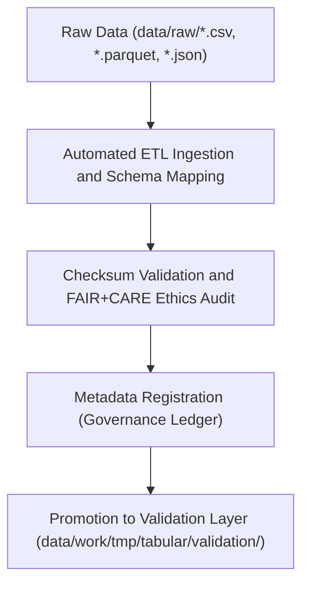

<div align="center">

# 📥 Kansas Frontier Matrix — **Tabular TMP Intake Workspace**
`data/work/tmp/tabular/intake/README.md`

**Purpose:**  
Governed FAIR+CARE-certified environment for **tabular dataset ingestion, schema mapping, and metadata extraction** in the Kansas Frontier Matrix (KFM).  
This layer acts as the controlled entry point for tabular ETL workflows, enabling structured ingestion, schema alignment, and ethical governance verification.

[](../../../../../docs/standards/faircare-validation.md)
[](../../../../../LICENSE)
[](../../../../../docs/architecture/repo-focus.md)

</div>

---

## 📚 Overview

The `data/work/tmp/tabular/intake/` directory captures **raw tabular ingestion events** and performs the first level of **schema detection, metadata harmonization, and checksum validation**.  
All data processed here must pass initial quality and FAIR+CARE checks before advancing to normalization and validation layers.

### Core Responsibilities
- Ingest tabular datasets from raw repositories or external sources.  
- Map field structures to KFM schema contracts (`data-contract-v3.json`).  
- Validate encoding, delimiter, and type consistency.  
- Register provenance metadata for governance and checksum traceability.  

---

## 🗂️ Directory Layout

```plaintext
data/work/tmp/tabular/intake/
├── README.md                              # This file — documentation for Tabular TMP Intake workspace
│
├── hazards_intake_2025.csv                # Hazard dataset ingested from FEMA/NOAA sources
├── climate_indices_intake.parquet         # Climate indices (NOAA CPC/NIDIS)
├── treaties_intake.csv                    # Historical treaty datasets
├── checksum_validation_intake.json        # Hash registry for ingested tabular datasets
└── metadata.json                          # Provenance metadata and governance linkage
```

---

## ⚙️ Intake Workflow



### Workflow Description
1. **Ingestion:** Raw files imported from KFM’s `data/raw/` repository or approved data endpoints.  
2. **Schema Mapping:** Fields aligned with KFM’s schema contracts using AI-assisted detection.  
3. **Checksum Audit:** Verify dataset integrity and reproducibility.  
4. **FAIR+CARE Audit:** Ensure ethical and transparent data sourcing.  
5. **Governance Sync:** Log metadata and audit outcomes to provenance ledgers.  

---

## 🧩 Example Metadata Record

```json
{
  "id": "tabular_intake_v9.5.0_2025Q4",
  "datasets_ingested": [
    "hazards_intake_2025.csv",
    "climate_indices_intake.parquet"
  ],
  "records_processed": 121304,
  "schema_detected": true,
  "checksum_verified": true,
  "fairstatus": "certified",
  "governance_registered": true,
  "telemetry_ref": "releases/v9.5.0/focus-telemetry.json",
  "governance_ref": "reports/audit/ai_tabular_ledger.json",
  "created": "2025-11-02T22:35:00Z",
  "validator": "@kfm-tabular-intake"
}
```

---

## 🧠 FAIR+CARE Governance Matrix

| Principle | Implementation |
|------------|----------------|
| **Findable** | Datasets indexed by intake metadata and checksum registry. |
| **Accessible** | Stored in open formats (CSV, Parquet, JSON) with transparent provenance. |
| **Interoperable** | Schema mappings conform to DCAT 3.0 and JSON Schema standards. |
| **Reusable** | Metadata includes provenance, schema linkage, and checksum validation. |
| **Collective Benefit** | Ensures public, ethical, and equitable dataset accessibility. |
| **Authority to Control** | FAIR+CARE Council certifies intake processes and schema accuracy. |
| **Responsibility** | Validators document ingestion and verification outcomes. |
| **Ethics** | Data sources validated for open, public domain, and unbiased origin. |

Audit results maintained in:  
`reports/audit/ai_tabular_ledger.json` • `reports/fair/tabular_intake_summary.json`

---

## ⚙️ QA & Validation Artifacts

| File | Description | Format |
|------|--------------|--------|
| `*_intake.*` | Tabular data files ingested and pre-validated. | CSV / Parquet |
| `checksum_validation_intake.json` | Checksum validation and hash registry for integrity review. | JSON |
| `metadata.json` | Provenance and governance record for intake session. | JSON |

All intake operations automated by `tabular_intake_sync.yml`.

---

## 🧾 Retention Policy

| File Type | Retention Duration | Policy |
|------------|--------------------|--------|
| Intake Files | 14 days | Cleared after validation and staging promotion. |
| FAIR+CARE Logs | 90 days | Archived for ethics compliance review. |
| Metadata | 365 days | Retained for provenance continuity. |
| Checksum Reports | Permanent | Stored under governance for reproducibility. |

Cleanup managed by `tabular_intake_cleanup.yml`.

---

## 🧾 Internal Use Citation

```text
Kansas Frontier Matrix (2025). Tabular TMP Intake Workspace (v9.5.0).
FAIR+CARE-certified workspace for ethical ingestion, schema detection, and provenance registration of tabular datasets.
Supports transparent, reproducible ETL workflows under MCP-DL v6.3 compliance.
```

---

## 🧾 Version Notes

| Version | Date | Notes |
|----------|------|--------|
| v9.5.0 | 2025-11-02 | Added AI schema mapping and checksum registry synchronization. |
| v9.3.2 | 2025-10-28 | Enhanced FAIR+CARE governance registration and ethics audit. |
| v9.3.0 | 2025-10-26 | Established TMP intake workspace for tabular data ingestion under governance. |

---

<div align="center">

**Kansas Frontier Matrix** · *Ethical Data Ingestion × FAIR+CARE Governance × Provenance Integrity*  
[🔗 Repository](https://github.com/bartytime4life/Kansas-Frontier-Matrix) • [🧭 Docs Portal](../../../../../docs/) • [⚖️ Governance Ledger](../../../../../docs/standards/governance/)

</div>