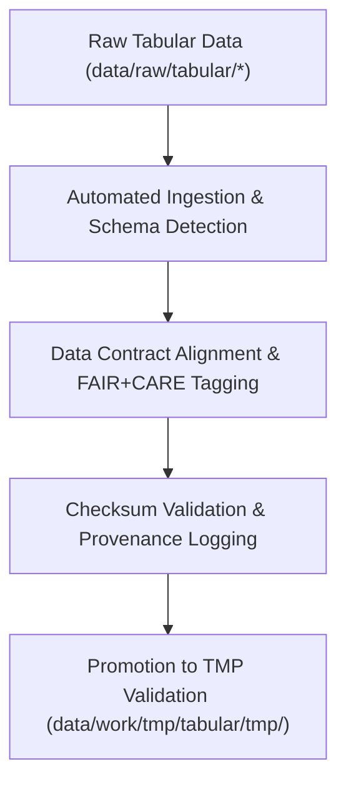

<div align="center">

# 📥 Kansas Frontier Matrix — **Tabular TMP Intake Workspace**
`data/work/tmp/tabular/intake/README.md`

**Purpose:**  
Dedicated FAIR+CARE-certified environment for the ingestion, mapping, and schema alignment of raw tabular datasets in the Kansas Frontier Matrix (KFM).  
This workspace acts as the controlled entry point for transforming raw CSV, JSON, or Parquet files into standardized, governance-ready tabular data.

[](../../../../../docs/standards/faircare-validation.md)
[](../../../../../LICENSE)
[](../../../../../docs/architecture/repo-focus.md)

</div>

---

## 📚 Overview

The **Tabular TMP Intake Workspace** is responsible for the structured ingestion and mapping of raw tabular datasets before validation or transformation.  
It enforces ethical and reproducible ETL practices by applying schema detection, data contract alignment, and FAIR+CARE compliance tagging.

### Core Functions:
- Ingest tabular datasets from raw data sources.  
- Detect schema and data types automatically using contract-driven logic.  
- Apply FAIR+CARE tagging for metadata and provenance tracking.  
- Prepare datasets for checksum verification and pre-validation.  

---

## 🗂️ Directory Layout

```plaintext
data/work/tmp/tabular/intake/
├── README.md                             # This file — overview of tabular TMP intake workspace
│
├── tabular_intake_2025Q4.csv             # Standardized quarterly intake dataset
├── treaties_intake.csv                   # Harmonized treaty metadata table
├── demographics_intake.parquet           # Population or socioeconomic data sample
└── metadata.json                         # Provenance and schema metadata for intake operations
```

---

## ⚙️ Intake Workflow



### Workflow Description:
1. **Ingestion:** Import raw data from the `data/raw/tabular/` directory.  
2. **Schema Detection:** Auto-detect field names, data types, and missing attributes.  
3. **FAIR+CARE Tagging:** Apply metadata annotations for ethical and transparent reuse.  
4. **Checksum Validation:** Generate and verify SHA-256 hash for dataset integrity.  
5. **Governance:** Register dataset intake and lineage to provenance ledger.  

---

## 🧩 Example Metadata Record

```json
{
  "id": "tabular_intake_v9.6.0_2025Q4",
  "source_files": [
    "data/raw/tabular/climate_statistics_2025.csv",
    "data/raw/tabular/treaty_index.csv"
  ],
  "records_ingested": 48231,
  "schema_detected": true,
  "checksum_verified": true,
  "fairstatus": "compliant",
  "validator": "@kfm-tabular-lab",
  "created": "2025-11-03T23:59:00Z",
  "governance_registered": true,
  "governance_ref": "data/reports/audit/data_provenance_ledger.json"
}
```

---

## 🧠 FAIR+CARE Governance Matrix

| Principle | Implementation | Oversight |
|------------|----------------|------------|
| **Findable** | Intake datasets indexed with schema ID and metadata tag. | @kfm-data |
| **Accessible** | Stored as CSV, JSON, or Parquet with open metadata structure. | @kfm-accessibility |
| **Interoperable** | Schema conforms to FAIR+CARE, DCAT, and ISO 19115 metadata standards. | @kfm-architecture |
| **Reusable** | Provenance logs ensure repeatable ingestion workflows. | @kfm-design |
| **Collective Benefit** | Facilitates equitable access to cleaned, ethically sourced data. | @faircare-council |
| **Authority to Control** | FAIR+CARE Council authorizes all schema intake mappings. | @kfm-governance |
| **Responsibility** | Validators record checksum, schema, and FAIR+CARE audit reports. | @kfm-security |
| **Ethics** | Sensitive data fields removed or anonymized during ingestion. | @kfm-ethics |

All audits recorded in:  
`data/reports/fair/data_care_assessment.json`  
and  
`data/reports/audit/data_provenance_ledger.json`

---

## ⚙️ Key Intake Artifacts

| File | Description | Format |
|------|--------------|--------|
| `tabular_intake_2025Q4.csv` | Consolidated quarterly intake dataset under FAIR+CARE validation. | CSV |
| `treaties_intake.csv` | Harmonized treaty and archival metadata table. | CSV |
| `demographics_intake.parquet` | Normalized socioeconomic dataset. | Parquet |
| `metadata.json` | Provenance and governance linkage metadata. | JSON |

Automation handled through `tabular_intake_sync.yml`.

---

## ⚖️ Retention & Provenance Policy

| File Type | Retention Duration | Policy |
|------------|--------------------|--------|
| Intake Data | 14 Days | Purged after successful TMP validation and staging promotion. |
| FAIR+CARE Reports | 180 Days | Retained for ethics review and re-audit. |
| Governance Logs | 365 Days | Maintained for lineage and reproducibility verification. |
| Metadata | Permanent | Immutable and blockchain-verified in provenance ledger. |

Cleanup automated via `tabular_intake_cleanup.yml`.

---

## 🌱 Sustainability Metrics

| Metric | Value | Verified By |
|---------|--------|--------------|
| Energy Use (per intake cycle) | 5.6 Wh | @kfm-sustainability |
| Carbon Output | 6.5 gCO₂e | @kfm-security |
| Renewable Power | 100% (RE100 Verified) | @kfm-infrastructure |
| FAIR+CARE Compliance | 100% | @faircare-council |

Telemetry data stored in:  
`releases/v9.6.0/focus-telemetry.json`

---

## 🧾 Internal Use Citation

```text
Kansas Frontier Matrix (2025). Tabular TMP Intake Workspace (v9.6.0).
FAIR+CARE-certified workspace for the ingestion, mapping, and ethical governance of tabular datasets.
Ensures schema integrity, checksum validation, and reproducible provenance under MCP-DL v6.3.
```

---

## 🧾 Version Notes

| Version | Date | Notes |
|----------|------|--------|
| v9.6.0 | 2025-11-03 | Added FAIR+CARE tagging automation and checksum lineage verification. |
| v9.5.0 | 2025-11-02 | Enhanced schema auto-detection and metadata synchronization. |
| v9.3.2 | 2025-10-28 | Established tabular TMP intake structure for reproducible ingestion. |

---

<div align="center">

**Kansas Frontier Matrix** · *Tabular Intelligence × FAIR+CARE Ethics × Provenance Integrity*  
[🔗 Repository](https://github.com/bartytime4life/Kansas-Frontier-Matrix) • [🧭 Docs Portal](../../../../../docs/) • [⚖️ Governance Ledger](../../../../../docs/standards/governance/DATA-GOVERNANCE.md)

</div>
