<div align="center">

# 📥 **Kansas Frontier Matrix — Tabular TMP Intake Workspace**  
`data/work/tmp/tabular/intake/README.md`

**Purpose:**  
FAIR+CARE-certified environment for **ingestion, mapping, and contract alignment** of raw tabular datasets before pre-validation and normalization in the Kansas Frontier Matrix (KFM).  
Acts as the controlled entry point for transforming raw **CSV / JSON / Parquet** into standardized, governance-ready tabular data.

**v10 upgrades:** Telemetry v2 (energy Wh, carbon gCO₂e, duration_s, coverage_pct), JSON-LD provenance (PROV), continuous manifest reconciliation, stricter `data-contract-v3` conformance.

[](../../../../../docs/standards/faircare-validation.md)
[](../../../../../LICENSE)
[](../../../../../docs/architecture/repo-focus.md)

</div>

---

## 📚 Overview

The **Tabular TMP Intake Workspace** performs structured ingestion and schema detection, aligns fields to `data-contract-v3`, and annotates FAIR+CARE metadata prior to TMP validation. It emits governance-linked provenance and telemetry for reproducible ETL.

### Core Functions
- Ingest tabular datasets from trusted raw sources.  
- Auto-detect schema & types with contract-aware inference.  
- Apply FAIR+CARE tagging (license, sensitivity, reuse) and JSON-LD provenance.  
- Prepare datasets for checksum verification and TMP pre-validation.

---

## 🗂️ Directory Layout

```plaintext
data/work/tmp/tabular/intake/
├── README.md                             # This file — overview of tabular TMP intake workspace
│
├── tabular_intake_2025Q4.csv             # Standardized quarterly intake dataset
├── treaties_intake.csv                   # Harmonized treaty metadata table
├── demographics_intake.parquet           # Population / socioeconomic sample
└── metadata.json                         # Provenance, schema, checksums, telemetry refs
```

---

## ⚙️ Intake Workflow

```mermaid
flowchart TD
    A["Raw Tabular Data (data/raw/tabular/*)"] --> B["Automated Ingestion & Schema Detection"]
    B --> C["Data Contract Alignment & FAIR·CARE Tagging"]
    C --> D["Checksum Validation & Provenance Logging"]
    D --> E["Promotion → TMP Validation (data/work/tmp/tabular/validation/)"]
```



### Workflow Description
1. **Ingestion:** Import raw data from `data/raw/tabular/`.  
2. **Schema Detection:** Auto-detect fields, types, nullability, and constraints.  
3. **FAIR+CARE Tagging:** Annotate ethical metadata and reuse restrictions.  
4. **Checksum Validation:** Generate/verify SHA-256; reconcile with `manifest_ref`.  
5. **Governance:** Register intake lineage in the provenance ledger; forward to TMP validation.

---

## 🧩 Example Metadata Record

```json
{
  "@context": "https://www.w3.org/ns/prov#",
  "id": "tabular_intake_v10.0.0_2025Q4",
  "source_files": [
    "data/raw/tabular/climate_statistics_2025.csv",
    "data/raw/tabular/treaty_index.csv"
  ],
  "records_ingested": 48231,
  "schema_detected": true,
  "checksum_verified": true,
  "fairstatus": "compliant",
  "telemetry_v2": { "energy_wh": 5.7, "carbon_gco2e": 6.4, "duration_s": 2405, "coverage_pct": 100 },
  "validator": "@kfm-tabular-lab",
  "created": "2025-11-10T00:00:00Z",
  "governance_registered": true,
  "governance_ref": "data/reports/audit/data_provenance_ledger.json"
}
```

---

## 🧠 FAIR+CARE Governance Matrix

| Principle | Implementation | Oversight |
|---|---|---|
| **Findable** | Intake datasets indexed with schema ID & checksum | @kfm-data |
| **Accessible** | CSV/JSON/Parquet with open metadata structure | @kfm-accessibility |
| **Interoperable** | Conforms to FAIR+CARE, DCAT 3.0, ISO 19115 | @kfm-architecture |
| **Reusable** | Provenance logs & checksums enable repeatable ingestion | @kfm-design |
| **Collective Benefit** | Equitable access to cleaned, ethically sourced data | @faircare-council |
| **Authority to Control** | Council authorizes schema intake mappings | @kfm-governance |
| **Responsibility** | Validators record checksum, schema, FAIR+CARE reports | @kfm-security |
| **Ethics** | Sensitive fields removed/anonymized at intake | @kfm-ethics |

**Audits recorded in:**  
`data/reports/fair/data_care_assessment.json` · `data/reports/audit/data_provenance_ledger.json`

---

## ⚙️ Key Intake Artifacts

| File | Description | Format |
|---|---|---|
| `tabular_intake_2025Q4.csv` | Consolidated quarterly intake dataset | CSV |
| `treaties_intake.csv` | Harmonized treaty & archival metadata | CSV |
| `demographics_intake.parquet` | Normalized socioeconomic dataset | Parquet |
| `metadata.json` | Provenance & governance linkage metadata | JSON |

**Automation:** `tabular_intake_sync_v10.yml`

---

## ⚖️ Retention & Provenance Policy

| File Type | Retention | Policy |
|---|---:|---|
| Intake Data | 14 Days | Purged after TMP validation & staging promotion |
| FAIR+CARE Reports | 180 Days | Retained for ethics re-audit |
| Governance Logs | 365 Days | Maintained for lineage & reproducibility |
| Metadata | Permanent | Immutable, blockchain-verified provenance |

Cleanup automated via `tabular_intake_cleanup.yml`.

---

## 🌱 Sustainability Metrics

| Metric | Value | Verified By |
|---|---:|---|
| Energy Use (per intake cycle) | 5.7 Wh | @kfm-sustainability |
| Carbon Output | 6.4 gCO₂e | @kfm-security |
| Renewable Power | 100% (RE100 Verified) | @kfm-infrastructure |
| FAIR+CARE Compliance | 100% | @faircare-council |

**Telemetry:** `../../../../../releases/v10.0.0/focus-telemetry.json`

---

## 🧾 Internal Use Citation

```text
Kansas Frontier Matrix (2025). Tabular TMP Intake Workspace (v10.0.0).
FAIR+CARE-certified workspace for ingestion, mapping, and ethical governance of tabular datasets with telemetry v2 and JSON-LD provenance. Ensures schema integrity, checksum validation, and reproducible provenance under MCP-DL v6.3.
```

---

## 🕰️ Version History

| Version | Date       | Author           | Summary |
|---|---|---|---|
| v10.0.0 | 2025-11-10 | `@kfm-tabular-lab` | Upgrade to v10: telemetry v2, JSON-LD provenance, manifest reconciliation, stricter contract checks. |
| v9.6.0  | 2025-11-03 | `@kfm-tabular-lab` | Added FAIR+CARE tagging automation & checksum lineage verification. |
| v9.5.0  | 2025-11-02 | `@kfm-tabular-lab` | Enhanced schema auto-detection and metadata synchronization. |
| v9.3.2  | 2025-10-28 | `@kfm-core`       | Established TMP intake structure for reproducible ingestion. |

---

<div align="center">

**Kansas Frontier Matrix** · *Tabular Intelligence × FAIR+CARE Ethics × Provenance Integrity*  
© 2025 Kansas Frontier Matrix — Internal Workspace · **Diamond⁹ Ω / Crown∞Ω** Ultimate Certified  
[🔗 Repository](https://github.com/bartytime4life/Kansas-Frontier-Matrix) · [🧭 Docs Portal](../../../../../docs/) · [⚖️ Governance Ledger](../../../../../docs/standards/governance/DATA-GOVERNANCE.md)

</div>
