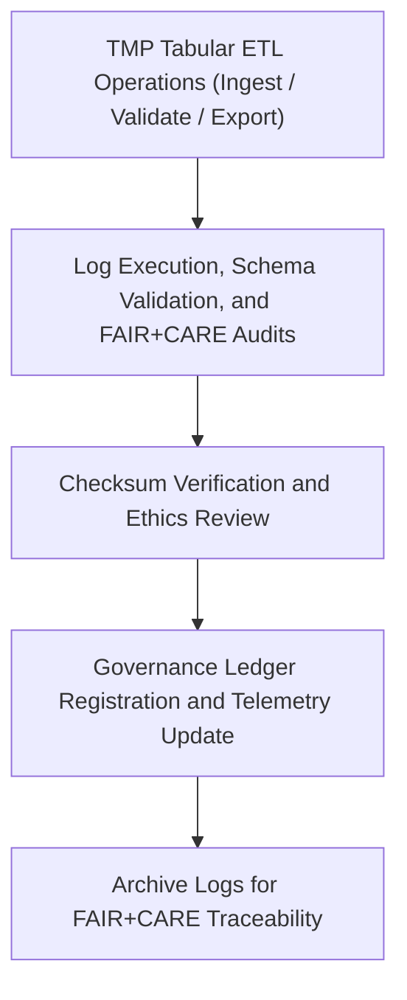

<div align="center">

# 🧾 Kansas Frontier Matrix — **Tabular TMP Logs**
`data/work/tmp/tabular/logs/README.md`

**Purpose:**  
Central FAIR+CARE-certified logging workspace for **ETL operations, schema validation, checksum verification, and governance synchronization** within the Tabular TMP environment of the Kansas Frontier Matrix (KFM).  
Ensures all tabular ETL workflows are transparent, traceable, and ethically auditable under FAIR+CARE and MCP-DL v6.3 compliance.

[](../../../../../docs/standards/faircare-validation.md)
[](../../../../../LICENSE)
[](../../../../../docs/architecture/repo-focus.md)

</div>

---

## 📚 Overview

The `data/work/tmp/tabular/logs/` directory documents **runtime activity, validation events, and governance linkage** for all tabular TMP workflows.  
Logs in this layer support checksum verification, schema tracking, and FAIR+CARE ethics compliance reporting.

### Core Responsibilities
- Record all tabular ETL execution traces and error handling logs.  
- Maintain checksum and validation audit histories.  
- Synchronize logs with FAIR+CARE governance ledgers and Focus Telemetry.  
- Archive provenance information for reproducibility and audit traceability.  

---

## 🗂️ Directory Layout

```plaintext
data/work/tmp/tabular/logs/
├── README.md                              # This file — overview of Tabular TMP Logs
│
├── etl_tmp_run.log                        # Execution trace for TMP ETL processes
├── schema_validation_trace.log             # Schema-level audit and conformance trace
├── faircare_pre_audit.log                 # FAIR+CARE compliance audit log
├── governance_sync.log                    # Ledger synchronization and governance review record
└── metadata.json                          # Log metadata and checksum linkage for governance
```

---

## ⚙️ Logging Workflow



### Workflow Description
1. **Logging:** Record all ETL, validation, and checksum activities in dedicated trace logs.  
2. **FAIR+CARE Audit:** Run ethics and accessibility verification.  
3. **Checksum Verification:** Ensure file and log integrity before governance upload.  
4. **Governance Sync:** Register all audit outcomes into provenance and telemetry ledgers.  
5. **Archival:** Store validated logs for reproducibility and ethics accountability.  

---

## 🧩 Example Log Metadata Record

```json
{
  "id": "tabular_tmp_logs_v9.5.0_2025Q4",
  "log_categories": ["etl", "schema", "faircare", "governance"],
  "entries_recorded": 19452,
  "checksum_verified": true,
  "governance_synced": true,
  "fairstatus": "compliant",
  "telemetry_ref": "releases/v9.5.0/focus-telemetry.json",
  "governance_ref": "reports/audit/ai_tabular_ledger.json",
  "created": "2025-11-02T23:55:00Z",
  "validator": "@kfm-tabular-etl"
}
```

---

## 🧠 FAIR+CARE Governance Matrix

| Principle | Implementation |
|------------|----------------|
| **Findable** | Logs indexed by ETL phase, validation ID, and checksum registry. |
| **Accessible** | Stored as open text and JSON logs for internal FAIR+CARE access. |
| **Interoperable** | Conforms to DCAT 3.0, ISO 19115 lineage, and FAIR data principles. |
| **Reusable** | Logs retain provenance metadata for reproducibility and ethics tracking. |
| **Collective Benefit** | Supports ethical accountability and open reproducibility standards. |
| **Authority to Control** | FAIR+CARE Council certifies governance ledger synchronization. |
| **Responsibility** | Validators maintain checksum verification and schema traceability. |
| **Ethics** | Logs redacted to ensure anonymized and ethical data use. |

Audit and certification results stored in:  
`reports/audit/ai_tabular_ledger.json` • `reports/fair/tabular_logs_summary.json`

---

## ⚙️ QA & Validation Artifacts

| File | Description | Format |
|------|--------------|--------|
| `etl_tmp_run.log` | Full ETL execution trace including ingestion and transformation details. | Text |
| `schema_validation_trace.log` | Records schema validation checks and type conformity. | Text |
| `faircare_pre_audit.log` | FAIR+CARE ethics and accessibility pre-validation trace. | Text |
| `governance_sync.log` | Records synchronization events with governance ledgers. | Text |
| `metadata.json` | Provenance and checksum linkage metadata for TMP operations. | JSON |

Automation handled via `tabular_logs_sync.yml`.

---

## 🧾 Retention Policy

| Log Type | Retention Duration | Policy |
|-----------|--------------------|--------|
| ETL and Validation Logs | 90 days | Archived following staging verification. |
| FAIR+CARE Audits | 365 days | Retained for ethics and provenance review. |
| Governance Logs | Permanent | Maintained indefinitely for certification traceability. |
| Metadata | Permanent | Stored in provenance registry for checksum continuity. |

Cleanup managed by `tabular_logs_cleanup.yml`.

---

## 🧾 Internal Use Citation

```text
Kansas Frontier Matrix (2025). Tabular TMP Logs (v9.5.0).
Central FAIR+CARE-certified logging workspace for ETL, validation, and governance synchronization in tabular data workflows.
Ensures traceability, ethics compliance, and reproducibility under MCP-DL v6.3 governance standards.
```

---

## 🧾 Version Notes

| Version | Date | Notes |
|----------|------|--------|
| v9.5.0 | 2025-11-02 | Added FAIR+CARE pre-audit and governance synchronization automation. |
| v9.3.2 | 2025-10-28 | Enhanced checksum traceability and schema conformance tracking. |
| v9.3.0 | 2025-10-26 | Established TMP Logs directory for tabular data FAIR+CARE validation. |

---

<div align="center">

**Kansas Frontier Matrix** · *Data Transparency × FAIR+CARE Ethics × Provenance Assurance*  
[🔗 Repository](https://github.com/bartytime4life/Kansas-Frontier-Matrix) • [🧭 Docs Portal](../../../../../docs/) • [⚖️ Governance Ledger](../../../../../docs/standards/governance/)

</div>