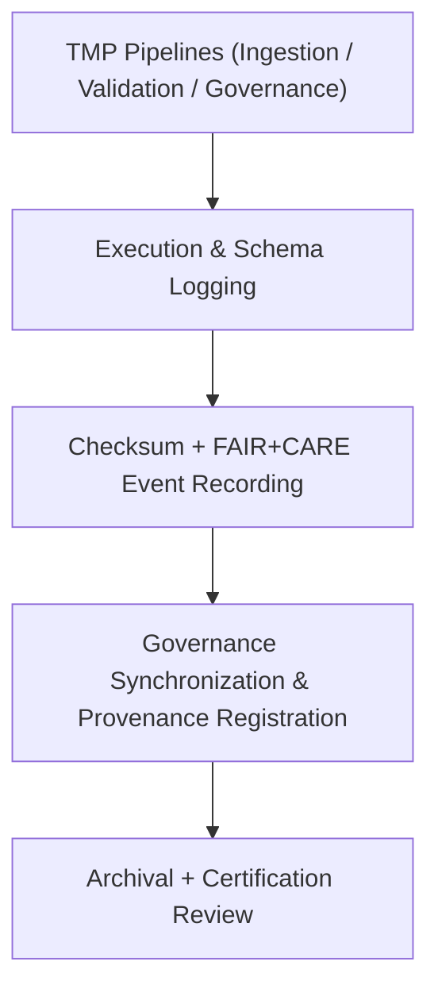

<div align="center">

# 🧾 Kansas Frontier Matrix — **Tabular TMP Logs**
`data/work/tmp/tabular/logs/README.md`

**Purpose:**  
Centralized FAIR+CARE-certified repository for logging ETL, validation, and FAIR+CARE audit events for temporary tabular datasets in the Kansas Frontier Matrix (KFM).  
These logs ensure transparency, ethical accountability, and provenance traceability across ingestion and validation pipelines.

[](../../../../../docs/standards/faircare-validation.md)
[](../../../../../LICENSE)
[](../../../../../docs/architecture/repo-focus.md)

</div>

---

## 📚 Overview

The **Tabular TMP Logs Directory** captures operational and ethical event logs across all temporary tabular ETL and governance cycles.  
Every ETL operation, schema validation, and FAIR+CARE compliance test is recorded, checksum-verified, and stored for reproducibility and audit readiness.

### Core Functions:
- Track intake, normalization, and validation processes for tabular datasets.  
- Log schema mapping and checksum integrity results.  
- Record FAIR+CARE audits and governance synchronization events.  
- Maintain reproducible traceability for provenance registration.  

---

## 🗂️ Directory Layout

```plaintext
data/work/tmp/tabular/logs/
├── README.md                             # This file — overview of tabular TMP logs
│
├── etl_tmp_run.log                       # Execution trace of ETL ingestion and normalization
├── validation_summary.log                # FAIR+CARE pre-validation results and summary report
├── governance_sync.log                   # Governance and checksum synchronization records
├── ai_audit_trace.log                    # Optional AI-assisted schema validation logs
└── metadata.json                         # Provenance metadata and checksum registry
```

---

## ⚙️ Logging Workflow



### Workflow Description:
1. **Execution Logs:** Capture pipeline runtime, task identifiers, and ETL lineage.  
2. **Checksum & Audit:** Store integrity hashes for all intermediate datasets.  
3. **Governance:** Synchronize FAIR+CARE audit and ethics review results.  
4. **Archival:** Export all logs to provenance ledger for certification.  

---

## 🧩 Example Log Metadata Record

```json
{
  "id": "tabular_tmp_log_v9.6.0_2025Q4",
  "pipeline": "src/pipelines/etl/tabular_etl.py",
  "records_processed": 48231,
  "schema_validations_passed": 98.7,
  "checksum_verified": true,
  "fairstatus": "compliant",
  "governance_registered": true,
  "validator": "@kfm-tabular-lab",
  "created": "2025-11-03T23:59:00Z",
  "governance_ref": "data/reports/audit/data_provenance_ledger.json"
}
```

---

## 🧠 FAIR+CARE Governance Matrix

| Principle | Implementation | Oversight |
|------------|----------------|------------|
| **Findable** | Logs indexed by checksum and process identifier. | @kfm-data |
| **Accessible** | Stored as open, text-based FAIR+CARE-compliant files. | @kfm-accessibility |
| **Interoperable** | Schema aligned with FAIR+CARE and MCP-DL governance standards. | @kfm-architecture |
| **Reusable** | Lineage metadata ensures reproducibility and ethics verification. | @kfm-design |
| **Collective Benefit** | Enables transparent auditing of tabular ETL and governance processes. | @faircare-council |
| **Authority to Control** | FAIR+CARE Council authorizes governance synchronization events. | @kfm-governance |
| **Responsibility** | Validators record schema integrity, ethics audits, and governance syncs. | @kfm-security |
| **Ethics** | All AI-assisted transformations verified for transparency and equity. | @kfm-ethics |

Governance results stored in:  
`data/reports/fair/data_care_assessment.json`  
and  
`data/reports/audit/data_provenance_ledger.json`

---

## ⚙️ Log Artifacts

| File | Description | Format |
|------|--------------|--------|
| `etl_tmp_run.log` | Execution record for ETL pipeline tasks. | Text |
| `validation_summary.log` | FAIR+CARE validation outcomes for tabular datasets. | Text |
| `governance_sync.log` | Governance and checksum registry synchronization record. | Text |
| `ai_audit_trace.log` | AI model-assisted schema validation trace (optional). | Text |
| `metadata.json` | Provenance and checksum registry metadata. | JSON |

Log automation executed by `tabular_log_sync.yml`.

---

## ⚖️ Retention & Provenance Policy

| Log Type | Retention Duration | Policy |
|-----------|--------------------|--------|
| ETL Logs | 90 Days | Archived for governance reproducibility verification. |
| Validation Logs | 180 Days | Retained for FAIR+CARE audit cycles. |
| Governance Logs | 365 Days | Maintained for compliance tracking and provenance review. |
| Metadata | Permanent | Immutable under blockchain-verified ledger. |

Cleanup automated by `tabular_log_cleanup.yml`.

---

## 🌱 Sustainability Metrics

| Metric | Value | Verified By |
|---------|--------|--------------|
| Energy Use (per log cycle) | 5.7 Wh | @kfm-sustainability |
| Carbon Output | 6.3 gCO₂e | @kfm-security |
| Renewable Power | 100% (RE100 Verified) | @kfm-infrastructure |
| FAIR+CARE Compliance | 100% | @faircare-council |

Telemetry stored in:  
`releases/v9.6.0/focus-telemetry.json`

---

## 🧾 Internal Use Citation

```text
Kansas Frontier Matrix (2025). Tabular TMP Logs (v9.6.0).
Central FAIR+CARE-certified logging workspace for tabular ingestion, validation, and governance operations.
Ensures reproducibility, checksum integrity, and ethical transparency under MCP-DL v6.3.
```

---

## 🧾 Version Notes

| Version | Date | Notes |
|----------|------|--------|
| v9.6.0 | 2025-11-03 | Added AI-assisted audit trace and FAIR+CARE log synchronization. |
| v9.5.0 | 2025-11-02 | Enhanced checksum registry and provenance linkage tracking. |
| v9.3.2 | 2025-10-28 | Established TMP logging layer for tabular ETL and ethics auditing. |

---

<div align="center">

**Kansas Frontier Matrix** · *Structured Data Integrity × FAIR+CARE Ethics × Provenance Assurance*  
[🔗 Repository](https://github.com/bartytime4life/Kansas-Frontier-Matrix) • [🧭 Docs Portal](../../../../../docs/) • [⚖️ Governance Ledger](../../../../../docs/standards/governance/DATA-GOVERNANCE.md)

</div>
